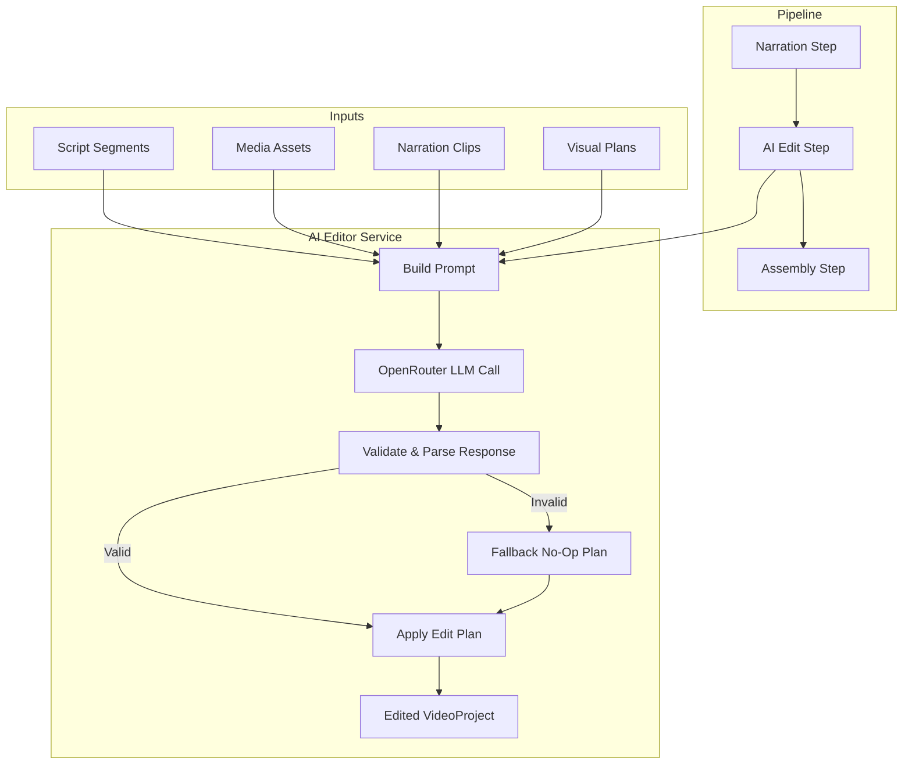

# Design Document: AI Editor Layer

## Overview

The AI Editor Layer introduces a new pipeline step (`ai_edit`) between narration and assembly that uses an LLM to review the fully assembled plan (script + media + narration + visual plans) and produce creative editing decisions. Instead of the renderer mechanically executing the plan as-is, the AI Editor analyzes pacing, visual flow, transitions, and media quality to generate an **Edit Plan** — a structured JSON object describing shot reordering, timing adjustments, transition selections, Ken Burns parameters, caption optimization, and media replacement suggestions.

The design follows the existing service architecture: a new `src/services/aiEditor.ts` module that mirrors the patterns in `llm.ts` and `llmVisualDirector.ts` (OpenRouter calls via `fetchWithTimeout`, JSON response parsing, runtime validation, graceful fallbacks). The Edit Plan is applied to the VideoProject via a **pure function** (`applyEditPlan`), making the transformation fully testable and predictable.

Key design decisions:
- **Non-destructive**: The AI edit step never removes media assets or segments — it only reorders, adjusts timing, and annotates.
- **Graceful degradation**: If the LLM fails or returns invalid JSON, the pipeline falls back to a no-op Edit Plan and proceeds to assembly unchanged.
- **Pure transformation**: `applyEditPlan` is a pure function with no side effects, enabling property-based testing.
- **Skippable**: Users can bypass the AI edit step entirely and proceed directly to assembly.

## Architecture



The AI Editor sits as a service layer consumed by the store (`useVideoProject` hook). The store orchestrates the pipeline step transitions, progress reporting, and error handling — consistent with how `generateScript`, `sourceMedia`, and `generateNarration` are already wired.

### Integration Points

1. **`src/types.ts`** — New types: `EditPlan`, `SegmentEditEntry`, `KenBurnsParams`, `TransitionType`, updated `PipelineStep` union to include `'ai_edit'`
2. **`src/services/aiEditor.ts`** — New service: prompt construction, LLM call, response validation, plan application
3. **`src/store.ts`** — New `runAIEdit` callback wired into the pipeline between narration and assembly
4. **`src/components/AIEditStep.tsx`** — New UI component showing progress and edit summary (Requirement 11)

## Components and Interfaces

### `src/services/aiEditor.ts`

```typescript
// ── Public API ──

/**
 * Runs the full AI editing pass on a VideoProject.
 * Returns the edited project and the edit plan for UI display.
 */
export async function runAIEditPass(
  project: VideoProject,
  apiKey: string,
  options?: AIEditOptions,
): Promise<{ editedProject: VideoProject; editPlan: EditPlan }>;

/**
 * Pure function: applies an EditPlan to a VideoProject.
 * Never mutates inputs. Returns a new VideoProject.
 */
export function applyEditPlan(project: VideoProject, plan: EditPlan): VideoProject;

/**
 * Generates a default no-op EditPlan that preserves the project unchanged.
 */
export function createDefaultEditPlan(project: VideoProject): EditPlan;

/**
 * Validates raw LLM JSON output against the EditPlan schema.
 * Returns a validated EditPlan or null if validation fails.
 */
export function validateEditPlanResponse(raw: unknown, project: VideoProject): EditPlan | null;

/**
 * Constructs the LLM prompt from a VideoProject.
 */
export function buildEditPrompt(project: VideoProject): { system: string; user: string };

/**
 * Summarizes an EditPlan into a human-readable change summary.
 */
export function summarizeEditPlan(plan: EditPlan, project: VideoProject): string;
```

### `AIEditOptions`

```typescript
export interface AIEditOptions {
  /** External AbortSignal for cancellation. */
  signal?: AbortSignal;
  /** Progress callback: phase description + percentage. */
  onProgress?: (pct: number, message: string) => void;
  /** LLM model override. Default: google/gemini-2.0-flash-001 */
  model?: string;
  /** Relevance threshold for media replacement flagging (0-100). Default: 40 */
  relevanceThreshold?: number;
  /** Padding seconds added to narration-matched durations. Default: 0.5 */
  timingPadding?: number;
}
```

### Store Integration

The `useVideoProject` hook gains a new `runAIEdit` callback:

```typescript
const runAIEdit = useCallback(async (projectOverride?: VideoProject) => {
  const activeProject = projectOverride ?? project;
  if (!activeProject) return null;

  updateStepStatus('ai_edit', 'processing');
  setCurrentStep('ai_edit');
  // ... LLM call with progress reporting ...
  // On success: store editedProject + editPlan, advance to assembly
  // On error: log, preserve original, allow skip to assembly
}, [project, appConfig, updateStepStatus]);
```

## Data Models

### EditPlan (new type in `src/types.ts`)

```typescript
export type TransitionType = 'crossfade' | 'cut' | 'dissolve' | 'wipe';

export interface KenBurnsParams {
  zoomStart: number;    // [1.0, 1.25]
  zoomEnd: number;      // [1.0, 1.25]
  panDirectionX: number; // [-1, 1] where -1=left, 0=center, 1=right
  panDirectionY: number; // [-1, 1] where -1=up, 0=center, 1=down
}

export interface MediaReplacementSuggestion {
  assetId: string;
  reason: string;
  alternativeQueries: string[];
}

export interface CaptionSettings {
  wordsPerWindow: number;
  displayDurationMs: number;
  isFastPaced: boolean;
}

export interface SegmentEditEntry {
  segmentId: string;
  /** Reordered asset IDs (same set, different order). */
  shotOrder: string[];
  /** Adjusted duration in seconds (null = no change). */
  adjustedDuration: number | null;
  /** Original duration for audit trail. */
  originalDuration: number;
  /** Transition to use BEFORE this segment (null for first segment). */
  transition: { type: TransitionType; durationMs: number } | null;
  /** Ken Burns params keyed by asset ID. */
  kenBurns: Record<string, KenBurnsParams>;
  /** Caption optimization for this segment. */
  captionSettings: CaptionSettings;
  /** Media assets flagged for replacement. */
  replacementSuggestions: MediaReplacementSuggestion[];
  /** Human-readable rationale for changes. */
  rationale: string;
}

export interface EditPlan {
  /** Per-segment editing decisions. */
  segments: SegmentEditEntry[];
  /** Global summary of changes. */
  summary: string;
  /** Whether this is a default no-op plan. */
  isDefault: boolean;
}
```

### Updated `VideoProject` (additions)

```typescript
export interface VideoProject {
  // ... existing fields ...
  /** The AI-generated edit plan (stored for UI display). */
  editPlan?: EditPlan;
}
```

### Updated `PipelineStep`

```typescript
export type PipelineStep =
  | 'topic'
  | 'script'
  | 'media'
  | 'narration'
  | 'ai_edit'
  | 'assembly'
  | 'preview';
```


## Correctness Properties

*A property is a characteristic or behavior that should hold true across all valid executions of a system — essentially, a formal statement about what the system should do. Properties serve as the bridge between human-readable specifications and machine-verifiable correctness guarantees.*

### Property 1: Asset Set Preservation

*For any* valid VideoProject and EditPlan, calling `applyEditPlan(project, plan)` SHALL produce a VideoProject containing exactly the same set of MediaAsset objects (by ID) as the input — no assets added, removed, or duplicated, and each asset's `segmentId` remains unchanged.

**Validates: Requirements 2.2, 2.3, 9.3**

### Property 2: Immutability of Inputs

*For any* valid VideoProject and EditPlan, calling `applyEditPlan(project, plan)` SHALL NOT mutate the input `project` or `plan` objects. A deep comparison of the inputs before and after the call must show no changes.

**Validates: Requirements 9.2**

### Property 3: No-Op Plan Identity

*For any* valid VideoProject, applying a default (no-op) EditPlan via `applyEditPlan(project, createDefaultEditPlan(project))` SHALL produce a VideoProject whose script durations, media asset order, and narration clips are equivalent to the input.

**Validates: Requirements 9.5**

### Property 4: EditPlan JSON Round-Trip

*For any* valid EditPlan object, `JSON.parse(JSON.stringify(plan))` SHALL produce an object deeply equal to the original plan.

**Validates: Requirements 8.5**

### Property 5: Total Duration Bounded Within 10%

*For any* valid VideoProject and EditPlan, the sum of all segment durations in the output of `applyEditPlan(project, plan)` SHALL be within 10% of the sum of all segment durations in the input project.

**Validates: Requirements 3.3, 9.4**

### Property 6: Timing Adjustment Matches Narration Plus Padding

*For any* segment whose narration clip duration differs from the segment duration by more than 1 second, the EditPlan's `adjustedDuration` for that segment SHALL equal the narration clip duration plus the configured padding value.

**Validates: Requirements 3.2**

### Property 7: No-Narration Duration Preservation

*For any* segment that has no corresponding NarrationClip, the EditPlan's `adjustedDuration` for that segment SHALL be null (preserving the original duration).

**Validates: Requirements 3.5**

### Property 8: Ken Burns Zoom Range Constraint

*For any* valid EditPlan, all `zoomStart` and `zoomEnd` values in every `KenBurnsParams` entry SHALL be in the range [1.0, 1.25].

**Validates: Requirements 6.4**

### Property 9: Consecutive Shots Have Distinct Ken Burns Motion

*For any* valid EditPlan and any segment's shot order, no two consecutive assets SHALL share identical `panDirectionX` AND `panDirectionY` values in their KenBurnsParams.

**Validates: Requirements 6.2, 6.3**

### Property 10: Transition Variety Constraint

*For any* valid EditPlan with more than 4 segments, no more than 3 consecutive segment boundaries SHALL use the same transition type.

**Validates: Requirements 4.4**

### Property 11: Caption Window Size Matches Word Count Range

*For any* segment in a valid EditPlan: if the segment's narration contains more than 100 words, `captionSettings.wordsPerWindow` SHALL be in [8, 12]; if the narration contains 50 words or fewer, `captionSettings.wordsPerWindow` SHALL be in [4, 8].

**Validates: Requirements 7.2, 7.3**

### Property 12: Fast-Paced Flagging

*For any* segment whose narration pacing exceeds 4 words per second (wordCount / narrationDuration > 4), the EditPlan's `captionSettings.isFastPaced` SHALL be true.

**Validates: Requirements 7.5**

### Property 13: Prompt Completeness

*For any* valid VideoProject with at least one segment, one media asset, and one narration clip, `buildEditPrompt(project)` SHALL produce a prompt string that contains at least one segment title, at least one asset ID, and at least one narration duration value.

**Validates: Requirements 10.1**

### Property 14: Partial JSON Merge Produces Valid Plan

*For any* partial EditPlan JSON (valid JSON object with some fields missing), `validateEditPlanResponse(partial, project)` SHALL either return null (if completely invalid) or return a fully valid EditPlan with default values filled in for all missing fields.

**Validates: Requirements 10.5**

### Property 15: Fallback Assets Flagged as Replacement Candidates

*For any* VideoProject containing MediaAssets with `isFallback === true`, a valid EditPlan produced by the editor SHALL include those asset IDs in the `replacementSuggestions` of their respective segment entries.

**Validates: Requirements 5.4**

### Property 16: Replacement Suggestions Have Sufficient Queries

*For any* valid EditPlan, every `MediaReplacementSuggestion` entry SHALL have an `alternativeQueries` array with at least 2 elements.

**Validates: Requirements 5.3**

## Error Handling

### LLM Failures

| Failure Mode | Handling Strategy |
|---|---|
| Network timeout / 5xx | `fetchWithTimeout` retries up to 2 times with exponential backoff (30s per attempt) |
| 4xx client error (except 429) | Immediate failure — log error, return default no-op EditPlan |
| Invalid JSON response | Log warning, return default no-op EditPlan |
| Partial JSON response | Merge valid fields with defaults, proceed with merged plan |
| External AbortSignal | Propagate cancellation immediately, reset step to 'active' |

### Validation Failures

- **Schema mismatch**: `validateEditPlanResponse` returns null → `createDefaultEditPlan` is used
- **Out-of-range Ken Burns values**: Clamp to [1.0, 1.25] during validation
- **Invalid transition types**: Replace with 'crossfade' default
- **Shot order references non-existent asset IDs**: Fall back to original asset order for that segment
- **Total duration exceeds 10% bound**: Scale all adjusted durations proportionally to fit within bounds

### Pipeline-Level Error Handling

- If `runAIEditPass` throws, the store catches the error, logs it via `logger.error`, preserves the original VideoProject, sets step status to 'error', and enables a "Skip to Assembly" action.
- The user can always skip the AI edit step (Requirement 11.4/11.5), which sets `ai_edit` status to 'complete' and advances to assembly without modification.

## Testing Strategy

### Property-Based Tests (fast-check)

The project already uses `fast-check` (v4.7.0) for property-based testing. Each correctness property above maps to a property-based test in `src/services/__tests__/aiEditor.property.test.ts`.

**Configuration:**
- Minimum 100 iterations per property test
- Each test tagged with: `Feature: ai-editor-layer, Property {N}: {title}`
- Custom arbitraries for `VideoProject`, `EditPlan`, `ScriptSegment`, `MediaAsset`, `NarrationClip`

**Key arbitraries to build:**
- `arbScriptSegment`: Random segment with valid type, title, narration (variable word count), duration
- `arbMediaAsset`: Random asset with valid URL, segmentId, shotType, isFallback flag
- `arbNarrationClip`: Random clip with valid segmentId, duration, word count
- `arbVideoProject`: Composed from the above with consistent segmentId references
- `arbEditPlan`: Valid EditPlan with proper shot orders (permutations of actual asset IDs), valid Ken Burns ranges, valid transitions

### Unit Tests (vitest)

Example-based tests in `src/services/__tests__/aiEditor.test.ts`:

- `buildEditPrompt` includes all project data in the prompt string
- `validateEditPlanResponse` rejects completely invalid JSON (returns null)
- `validateEditPlanResponse` merges partial JSON with defaults
- `createDefaultEditPlan` produces a plan with `isDefault: true` and no modifications
- `applyEditPlan` with a real EditPlan produces expected reordering
- `summarizeEditPlan` produces human-readable change counts
- Error path: LLM returns garbage → default plan used
- Error path: LLM timeout → default plan used after retries

### Integration Tests

- Pipeline step transitions: narration → ai_edit → assembly
- Skip functionality: ai_edit skipped → assembly with original project
- Progress reporting: onProgress called with phase messages
- Store state: editPlan stored on project after successful edit

### Test Commands

```bash
# Run all unit tests including property tests
npm run test:unit

# Run only AI editor tests
npx vitest run src/services/__tests__/aiEditor.test.ts
npx vitest run src/services/__tests__/aiEditor.property.test.ts
```
