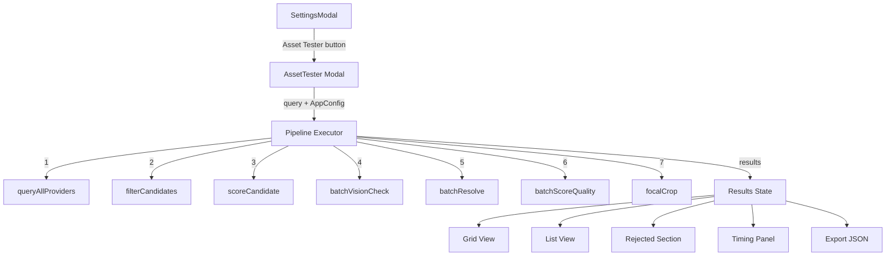

# Design Document: Asset Tester

## Overview

The Asset Tester is a standalone developer tool that runs the full media acquisition pipeline in isolation for any search query. It surfaces every candidate found, every rejection with its reason, score breakdowns, vision check outcomes, resolution resolver results, quality factor scores, focal crop previews, and per-stage timing — all in a single full-screen modal accessible from the Settings panel.

The component (`src/components/AssetTester.tsx`) is entirely self-contained: it imports harvester functions directly from the service layer and manages all state locally via `useState`. No store integration is needed. The UI follows the existing industrial theme — hard edges, `font-mono`, `border-2`, `bg-brand-500` buttons, no rounded corners, no transitions.

## Architecture



The pipeline executor is an async function inside the component that calls each harvester stage sequentially, wrapping each in `performance.now()` timing. An `AbortController` is created per run and threaded through all stages via the `signal` option.

### Key Design Decisions

1. **Direct imports, no store**: The component imports `queryAllProviders`, `filterCandidates`, `scoreCandidate`, `batchVisionCheck`, `batchResolve`, `batchScoreQuality`, `focalCrop`, and `needsCropping` directly. It reads `AppConfig` from the store only to get the API key and source type — it does not write to the store.

2. **Local state only**: All pipeline results, UI state (sort, filter, view mode), and timing data live in `useState` hooks. This keeps the component isolated and disposable.

3. **Sequential stage execution with timing**: Each pipeline stage runs sequentially (not the parallel cascade used in `media.ts`) so we can measure individual stage timings accurately. This is intentional — the tester prioritizes observability over speed.

4. **AbortController per run**: A new `AbortController` is created for each Test_Run. Clicking "Cancel" calls `abort()` on the controller, which propagates to all in-flight `fetchWithTimeout` calls.

## Components and Interfaces

### AssetTester Component

**File**: `src/components/AssetTester.tsx`

```typescript
interface AssetTesterProps {
  isOpen: boolean;
  onClose: () => void;
  appConfig: AppConfig;
}
```

The component receives `appConfig` from the parent (SettingsModal passes it through) so it can check for the OpenRouter API key and source type without importing the store hook.

### Internal State

```typescript
// Pipeline execution state
type RunStatus = 'idle' | 'running' | 'complete' | 'error';

interface StageTimingEntry {
  stage: string;
  durationMs: number | null; // null = skipped
}

interface RejectedCandidate {
  candidate: MediaCandidate;
  reason: 'domain-filter' | 'vision-check';
  pattern?: string;        // domain filter: matched pattern
  category?: string;       // domain filter: blocklist category
  issues?: string[];       // vision check: blocking issues
}

interface TestRunResult {
  query: string;
  accepted: MediaCandidate[];
  rejected: RejectedCandidate[];
  timing: StageTimingEntry[];
  totalTimeMs: number;
  timestamp: string;
}

// UI state
type SortKey = 'finalScore' | 'baseScore' | 'resolution' | 'source';
type ViewMode = 'grid' | 'list';

interface FilterState {
  source: string | null;   // null = all sources
  mediaType: 'image' | 'video' | null; // null = all types
}
```

### Pipeline Executor

The pipeline executor is an internal async function, not exported. It follows this sequence:

```
1. Search         → queryAllProviders(query, appConfig, signal)
2. Domain Filter  → filterCandidates(rawCandidates)
3. Score          → accepted.map(c => scoreCandidate(c, topicContext, undefined, appConfig.sourceType))
4. Vision Check   → batchVisionCheck(top3, apiKey, { signal })  [if API key present]
5. Resolve        → batchResolve(top3, { signal })
6. Quality Score  → batchScoreQuality(top3, '', apiKey, { signal })  [if API key present]
7. Focal Crop     → focalCrop(url, w, h, apiKey, { signal })  [for candidates needing cropping, if API key present]
```

Each stage is wrapped:
```typescript
const t0 = performance.now();
// ... stage work ...
const t1 = performance.now();
timing.push({ stage: 'Search', durationMs: t1 - t0 });
```

For step 3 (scoring), the component constructs a minimal `TopicContext` from the query string since we don't have a full topic research context in the tester:

```typescript
const minimalTopicContext: TopicContext = {
  topic: query,
  coreSubject: query,
  subjectCandidates: [query],
  kind: 'concept',
  description: query,
  entities: query.split(/\s+/).filter(w => w.length > 2),
  parseReasoning: 'Asset Tester — minimal context',
};
```

### SettingsModal Integration

A new button is added to `SettingsModal.tsx` at the bottom of the form, before the action buttons:

```typescript
<button
  type="button"
  onClick={() => setShowAssetTester(true)}
  className="flex items-center gap-2 border-2 border-surface-700 px-4 py-2 text-xs font-mono font-semibold text-surface-400 hover:bg-brand-500 hover:text-black"
  data-testid="open-asset-tester"
>
  Asset Tester
</button>
```

The AssetTester modal is rendered conditionally alongside the SettingsModal.

## Data Models

### TestRunResult (JSON Export Schema)

The exported JSON follows this structure:

```typescript
{
  query: string;
  timestamp: string;                    // ISO 8601
  totalTimeMs: number;
  timing: Array<{
    stage: string;
    durationMs: number | null;
  }>;
  summary: {
    totalCandidates: number;
    acceptedCount: number;
    rejectedCount: number;
    rejectedByCategory: Record<string, number>;
  };
  accepted: Array<{
    url: string;
    thumbnailUrl?: string;
    alt: string;
    source: string;
    sourceUrl?: string;
    width?: number;
    height?: number;
    baseScore: number;
    finalScore: number;
    type: 'image' | 'video';
    resolvedUrl?: string;
    resolvedWidth?: number;
    resolvedHeight?: number;
    qualityFactors?: QualityFactors;
    qualityCompositeScore?: number;
    cropMetadata?: CropMetadata;
    visionResult?: {
      pass: boolean;
      confidence: number;
      issues: string[];
      qualitySignals: string[];
      qualityScore: number;
    };
    selectionStatus: 'primary' | 'secondary' | 'candidate';
  }>;
  rejected: Array<{
    url: string;
    thumbnailUrl?: string;
    alt: string;
    source: string;
    sourceUrl?: string;
    baseScore: number;
    reason: 'domain-filter' | 'vision-check';
    pattern?: string;
    category?: string;
    issues?: string[];
  }>;
}
```

### Sorting and Filtering

Sorting is applied client-side on the `accepted` array:

| Sort Key | Comparator |
|---|---|
| `finalScore` | `b.finalScore - a.finalScore` (descending) |
| `baseScore` | `b.baseScore - a.baseScore` (descending) |
| `resolution` | `(b.width??0)*(b.height??0) - (a.width??0)*(a.height??0)` (descending) |
| `source` | `a.source.localeCompare(b.source)` (alphabetical) |

Filtering is applied before sorting:
- Source filter: `candidate.source.includes(filterSource)`
- Type filter: `candidate.type === filterType`

## Correctness Properties

*A property is a characteristic or behavior that should hold true across all valid executions of a system — essentially, a formal statement about what the system should do. Properties serve as the bridge between human-readable specifications and machine-verifiable correctness guarantees.*

### Property 1: Composite quality score equals weighted factor sum

*For any* set of quality factors where each factor (sharpness, lighting, composition, vibrancy, relevance) is an integer in [0, 10], the composite quality score SHALL equal `(sharpness × 0.25 + lighting × 0.20 + composition × 0.15 + vibrancy × 0.15 + relevance × 0.25) × 20`, matching the output of `computeCompositeScore()`.

**Validates: Requirements 3.4**

### Property 2: Candidate categorization completeness

*For any* set of raw candidates partitioned by `filterCandidates` into accepted and rejected arrays, the sum `accepted.length + rejected.length` SHALL equal the original candidates array length. Furthermore, for any set of rejected candidates grouped by category, the sum of per-category counts SHALL equal the total rejected count.

**Validates: Requirements 3.8, 4.5**

### Property 3: Rejected candidate metadata completeness

*For any* candidate rejected by the domain filter, the rejection record SHALL contain a non-empty `pattern` string and a `category` from the set `{propaganda, watermarked-stock, low-quality, adult-content}`. *For any* candidate rejected by the vision check, the rejection record SHALL contain a non-empty `issues` array.

**Validates: Requirements 4.2, 4.3**

### Property 4: Sorting correctness

*For any* list of accepted candidates and any sort key (finalScore, baseScore, resolution, source), applying the sort function SHALL produce a list where each element is ordered correctly relative to its successor according to the sort key's comparator.

**Validates: Requirements 5.1**

### Property 5: Filtering correctness

*For any* list of accepted candidates and any source filter value, applying the filter SHALL produce a list where every element's source contains the filter string. *For any* type filter value, every element's type SHALL equal the filter value. The filtered list length SHALL be ≤ the original list length.

**Validates: Requirements 5.2, 5.6**

### Property 6: Pipeline timing validity

*For any* completed pipeline execution, each stage timing value SHALL be non-negative (≥ 0). The total elapsed time SHALL be ≥ the maximum of any individual stage timing value.

**Validates: Requirements 6.1, 6.2**

### Property 7: JSON export round-trip

*For any* `TestRunResult` object, `JSON.parse(JSON.stringify(result))` SHALL produce an object containing the same `query`, the same number of accepted candidates, the same number of rejected candidates, and the same timing entries. Each accepted candidate's `finalScore`, `baseScore`, `url`, and `source` SHALL survive the round-trip unchanged.

**Validates: Requirements 8.3**

## Error Handling

| Scenario | Behavior |
|---|---|
| Empty query submitted | "Test Harvest" button is disabled when input is empty/whitespace. No pipeline execution. |
| Network failure in any stage | The failing stage catches the error, logs it, and continues. Results show partial data with a warning banner indicating which stage(s) failed. |
| AbortController signal fired | All in-flight `fetchWithTimeout` calls throw `AbortError`. The pipeline executor catches this, sets status to `idle`, and clears partial results. |
| No OpenRouter API key | Vision check, quality scoring, and focal crop stages are skipped. Timing shows "Skipped" for those stages. A notice banner explains which stages require an API key. |
| Clipboard API unavailable | Falls back to rendering a read-only `<textarea>` containing the JSON string. |
| Stage returns empty results | Pipeline continues with empty arrays. Summary shows 0 candidates for that stage. |
| Individual candidate fails in batch operation | `Promise.allSettled` ensures other candidates in the batch still complete. Failed candidates are omitted from that stage's results. |

## Testing Strategy

### Property-Based Tests (fast-check)

The project already uses `fast-check` (v4.7.0) with Vitest. Each property test runs a minimum of 100 iterations.

| Property | Test File | What It Generates |
|---|---|---|
| P1: Composite score invariant | `qualityScorer.pbt.test.ts` | Random QualityFactors (5 integers 0-10) |
| P2: Categorization completeness | `assetTester.pbt.test.ts` | Random arrays of MediaCandidates with random URLs (some matching blocklist patterns) |
| P3: Rejected metadata completeness | `assetTester.pbt.test.ts` | Random candidates run through `filterCandidates` and mock vision check |
| P4: Sorting correctness | `assetTester.pbt.test.ts` | Random arrays of candidates with random scores/dimensions/sources, random sort keys |
| P5: Filtering correctness | `assetTester.pbt.test.ts` | Random arrays of candidates with random sources/types, random filter values |
| P6: Timing validity | `assetTester.pbt.test.ts` | Random arrays of non-negative timing values |
| P7: JSON round-trip | `assetTester.pbt.test.ts` | Random TestRunResult objects with random candidates, scores, and timing |

Each test is tagged: `Feature: asset-tester, Property {N}: {title}`

Configuration: `{ numRuns: 100 }` per property.

### Unit Tests (example-based)

| Test | What It Verifies |
|---|---|
| Settings button renders | "Asset Tester" button exists in SettingsModal |
| Modal opens on click | Clicking the button renders the AssetTester modal |
| Input autofocus | Search input has focus on mount |
| Enter triggers run | Pressing Enter with non-empty query starts pipeline |
| Cancel aborts | Clicking Cancel calls abort() and returns to idle |
| Progress indicator | Running state shows current stage name |
| Grid/list toggle | View mode switches between card and table layouts |
| Skipped stages notice | Missing API key shows "Skipped" and notice banner |
| Export button state | Disabled when no results, enabled when results exist |
| Clipboard fallback | When clipboard API throws, textarea fallback renders |
| Re-run clears results | Starting new run clears previous results |
| Settings preserved | Sort/filter/view mode persist across re-runs |

### Test File Locations

- `src/services/__tests__/qualityScorer.pbt.test.ts` — Property 1 (composite score)
- `src/components/__tests__/assetTester.pbt.test.ts` — Properties 2-7
- `src/components/__tests__/AssetTester.test.tsx` — Unit tests for UI behavior
