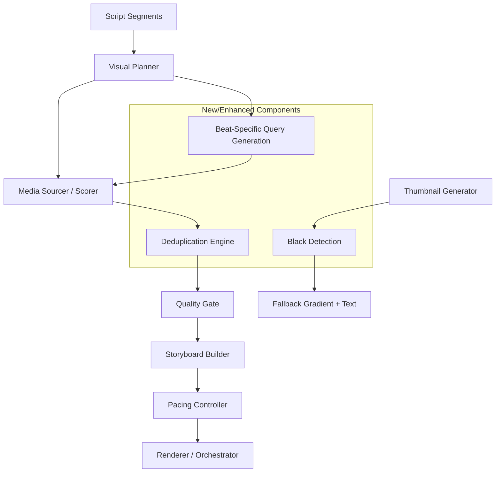

# Design Document: Blind Review Quality Fixes

## Overview

This design addresses critical quality deficiencies identified in a blind review of the AutoTube video generation pipeline. The review scored output poorly across visual quality (4/10), pacing (5/10), narrative clarity (6/10), thumbnail effectiveness (2/10), and overall production value (4/10).

The fixes target eight areas: watermark detection/rejection, visual deduplication, narration-visual relevance enforcement, thumbnail generation, dynamic cut pacing, shot type diversity, first-five-seconds impact, and narration-to-cut synchronization.

The approach extends existing subsystems (`scoreCandidate`, `planSegmentShots`, `generateThumbnail`, `buildStoryboard`, `visualPlanner`) rather than replacing them, ensuring backward compatibility while raising quality thresholds.

## Architecture

The changes span the media acquisition pipeline, the rendering/pacing layer, and the thumbnail generator. No new services are introduced — instead, existing modules gain new scoring rules, validation gates, and planning logic.



### Key Design Decisions

1. **Penalty-based scoring over hard rejection**: Watermark and deduplication penalties reduce scores rather than removing candidates outright. This preserves the fallback chain — only when all candidates score below the acceptance threshold does the system escalate to broadened queries or procedural backgrounds.

2. **Deduplication as a stateful registry**: A simple `Map<string, { domain: string; alt: string }>` tracks assigned assets per video run. This is reset at the start of each `harvestMediaForProject` call, keeping the scope per-project.

3. **Pacing as a post-planning pass**: The pacing controller operates on the shot plan after media assignment, splitting shots and inserting pattern interrupts. This decouples pacing from media sourcing.

4. **Sentence-boundary alignment via text analysis**: Rather than requiring audio waveform analysis, cut points are derived from sentence boundaries in the narration text using regex-based sentence splitting. This works without narration audio being rendered first.

## Components and Interfaces

### 1. Watermark Detection (extends `src/services/media.ts`)

```typescript
// New constants added to media.ts
const WATERMARK_DOMAINS = [
  'shutterstock.com', 'gettyimages.com', 'istockphoto.com',
  '123rf.com', 'dreamstime.com', 'depositphotos.com',
  'alamy.com', 'ftcdn.net'
];

const WATERMARK_INDICATORS = [
  'stock', 'watermark', 'preview', 'comp', 'sample', 'licensed'
];

const WATERMARK_DOMAIN_PENALTY = -500;
const WATERMARK_INDICATOR_PENALTY = -300;
```

The `scoreCandidate` function gains two new penalty checks:
- Domain check: if the candidate's URL or sourceUrl hostname matches a `WATERMARK_DOMAINS` entry, apply -500.
- Indicator check: if the candidate's alt text or URL contains any `WATERMARK_INDICATORS` string, apply -300.

### 2. Visual Deduplication Engine (new export in `src/services/media.ts`)

```typescript
export interface DeduplicationRegistry {
  /** Exact URL matches */
  usedUrls: Set<string>;
  /** Near-duplicate detection: domain + alt text hash */
  usedSignatures: Map<string, string>; // key: `${domain}::${altNormalized}`
}

export function createDeduplicationRegistry(): DeduplicationRegistry;
export function registerAsset(registry: DeduplicationRegistry, asset: MediaAsset): void;
export function getDeduplicationPenalty(
  registry: DeduplicationRegistry,
  candidate: MediaCandidate
): number; // Returns 0, -200, or -400
```

The existing `usedUrlsMap` in `media.ts` is replaced by this more structured registry that also tracks domain+alt combinations for near-duplicate detection.

### 3. Narration-Visual Relevance (extends `src/services/media.ts` and `src/services/visualPlanner.ts`)

**Scoring enhancement** in `scoreCandidate`:
- Count keyword matches between candidate alt text and segment narration
- If matches < 2, apply a relevance penalty (no positive relevance bonus)
- Contextual mismatch detection: if alt text contains domain-specific terms unrelated to the topic, apply -250

**Query generation enhancement** in `visualPlanner.ts`:
- `generateQueries` already extracts noun phrases from narration — ensure at least one query is purely narration-derived
- Ensure segment title appears in at least one query (already partially implemented via `titleEntityCombo`)

### 4. Thumbnail Generation Fix (extends `src/services/thumbnail.ts`)

```typescript
/** Detects if a canvas/blob is effectively all-black */
export function isBlackThumbnail(
  imageData: ImageData | Uint8ClampedArray,
  threshold?: { pixelTolerance: number; percentageThreshold: number }
): boolean;

/** Validates minimum file size */
export function validateThumbnailSize(blob: Blob, minBytes?: number): boolean;
```

The `generateThumbnail` function gains a post-render validation step:
1. Render thumbnail as normal
2. Check if result is "black" (>90% pixels within 10 RGB of black)
3. If black, regenerate with gradient-plus-text fallback
4. Validate minimum 10KB file size

### 5. Pacing Controller (extends `src/services/renderer/editingRhythm.ts`)

```typescript
export interface PacingConfig {
  /** Max hold time for static images (default: 4s, was 5s) */
  maxHoldTimeSec: number;
  /** Max hold time in first 10 seconds (default: 3s) */
  openingMaxHoldTimeSec: number;
  /** Maximum gap between pattern interrupts (default: 20s) */
  maxPatternInterruptGapSec: number;
  /** Ken Burns zoom rate range (default: 2-5% per second) */
  kenBurnsRateRange: [number, number];
}

export interface SentenceBoundary {
  /** Character offset in narration text */
  charOffset: number;
  /** Estimated timestamp in seconds (based on word rate) */
  estimatedTimestamp: number;
}

export function detectSentenceBoundaries(narration: string, segmentDuration: number): SentenceBoundary[];
export function detectEmphasisPoints(narration: string, segmentDuration: number): number[];
export function planPatternInterrupts(totalDuration: number, segments: ScriptSegment[]): TextCardEntry[];
export function shouldInsertContrastingTransition(beatA: NarrativeBeat, beatB: NarrativeBeat): boolean;
```

Key changes to `planSegmentShots`:
- Reduce `maxHoldTimeSec` from 5 to 4 seconds
- Add `openingMaxHoldTimeSec` of 3 seconds for segments in the first 10 seconds
- Align cuts with sentence boundaries rather than fixed intervals
- Apply Ken Burns motion (2-5% zoom/pan per second) to all static image shots

### 6. Shot Type Diversity (extends `src/services/storyboard.ts` and `src/services/visualPlanner.ts`)

The existing `scoreShotDiversity` function already computes diversity metrics. New logic:
- After building the storyboard, check if any shot type exceeds 40% of frames
- If diversity score < 50, flag the 3 lowest-diversity segments for regeneration
- Enforce minimum 3 distinct shot types across any 5 consecutive segments

**Beat-specific query enhancement** in `visualPlanner.ts`:
- When beat is "data": inject chart/graph/visualization keywords into queries
- When beat is "quote": inject portrait/speaker keywords into queries

### 7. First-Five-Seconds Impact (extends pipeline orchestration)

- First segment always gets "hook" beat classification
- First segment's media asset is selected as the highest-scored non-fallback asset across the entire project
- If first segment gets a fallback, retry sourcing up to 2 additional times with broadened queries
- Weak hook detection: analyze first 2 sentences for personal-stakes keywords or statistics

```typescript
export function detectWeakHook(narration: string): { isWeak: boolean; reason: string };

const PERSONAL_STAKES_KEYWORDS = [
  'you', 'your', 'yourself', 'personally', 'family', 'home',
  'account', 'money', 'identity', 'password', 'phone'
];

const STATISTIC_PATTERN = /\d+(?:[.,]\d+)?\s*(?:%|billion|million|trillion|dollars?|people|victims|attacks?)/i;
```

### 8. Narration-to-Cut Synchronization (extends `src/services/renderer/editingRhythm.ts`)

```typescript
export function alignCutsToSentences(
  shots: ShotPlan[],
  boundaries: SentenceBoundary[],
  emphasisPoints: number[],
  segmentDuration: number
): ShotPlan[];

export function synchronizeTextCards(
  cards: TextCardEntry[],
  narrationTimestamps: Map<string, number>,
  tolerance: number // default 0.5s
): TextCardEntry[];
```

The `alignCutsToSentences` function adjusts shot boundaries to snap to the nearest sentence boundary while respecting:
- No cut within 0.5s of an emphasis point
- Each sentence gets a distinct shot when multiple concepts are available

## Data Models

### DeduplicationRegistry

```typescript
interface DeduplicationRegistry {
  usedUrls: Set<string>;
  usedSignatures: Map<string, string>; // `${domain}::${normalizedAlt}` → segmentId
}
```

### Enhanced PacingConfig

```typescript
interface PacingConfig {
  maxHoldTimeSec: number;           // 4 (reduced from 5)
  openingMaxHoldTimeSec: number;    // 3
  splitThresholdSec: number;        // 6
  maxPatternInterruptGapSec: number; // 20
  kenBurnsRateRange: [number, number]; // [0.02, 0.05]
  minShotsForLongSegment: number;   // 2
}
```

### SentenceBoundary

```typescript
interface SentenceBoundary {
  charOffset: number;
  wordIndex: number;
  estimatedTimestamp: number; // seconds from segment start
  text: string; // the sentence text
}
```

### WeakHookResult

```typescript
interface WeakHookResult {
  isWeak: boolean;
  reason: string;
  hasPersonalStakes: boolean;
  hasStatistic: boolean;
}
```

## Correctness Properties

*A property is a characteristic or behavior that should hold true across all valid executions of a system — essentially, a formal statement about what the system should do. Properties serve as the bridge between human-readable specifications and machine-verifiable correctness guarantees.*

### Property 1: Watermark domain penalty

*For any* MediaCandidate whose URL or sourceUrl hostname contains a watermarked-stock domain (shutterstock.com, gettyimages.com, istockphoto.com, 123rf.com, dreamstime.com, depositphotos.com, alamy.com, ftcdn.net), the score returned by `scoreCandidate` SHALL be at least 500 points lower than an identical candidate with a non-blocked domain.

**Validates: Requirements 1.1**

### Property 2: Watermark indicator string penalty

*For any* MediaCandidate whose alt text or URL contains one of the watermark indicator strings ("stock", "watermark", "preview", "comp", "sample", "licensed"), the score returned by `scoreCandidate` SHALL be at least 300 points lower than an identical candidate without those strings.

**Validates: Requirements 1.2**

### Property 3: Deduplication registry tracks all assigned assets

*For any* sequence of `registerAsset` calls with distinct MediaAssets, the registry's `usedUrls` set SHALL contain exactly those asset URLs, and `getDeduplicationPenalty` for any of those URLs SHALL return -400.

**Validates: Requirements 2.1, 2.2**

### Property 4: Near-duplicate penalty

*For any* MediaCandidate whose (source domain, normalized alt text) pair matches an entry already in the deduplication registry, `getDeduplicationPenalty` SHALL return -200 (when the exact URL does not match but the signature does).

**Validates: Requirements 2.3**

### Property 5: Keyword match relevance threshold

*For any* MediaCandidate and narration text pair where the number of shared keywords (words > 2 chars) between the candidate's alt text and the narration is fewer than 2, the relevance score component SHALL be non-positive (zero or negative).

**Validates: Requirements 3.1**

### Property 6: Narration noun phrases appear in search queries

*For any* ScriptSegment with non-empty narration containing at least one multi-word noun phrase, the search queries generated by `generateQueries` SHALL include at least one query that contains a noun phrase extracted from the narration text.

**Validates: Requirements 3.2**

### Property 7: Segment title appears in search queries

*For any* ScriptSegment with a non-empty title (length > 2), the search queries generated by `generateQueries` SHALL include at least one query containing the segment title or its significant words.

**Validates: Requirements 3.4**

### Property 8: Thumbnail background asset selection

*For any* non-empty array of MediaAssets containing at least one non-fallback asset, `selectThumbnailBackground` SHALL return the asset with the highest score among non-fallback assets.

**Validates: Requirements 4.2**

### Property 9: Thumbnail text word count enforcement

*For any* input string, `validateThumbnailText` SHALL return a string containing between 2 and 5 words (inclusive).

**Validates: Requirements 4.3**

### Property 10: Black thumbnail detection

*For any* ImageData where more than 90% of pixels have R, G, and B values each within 10 of 0, `isBlackThumbnail` SHALL return true. For any ImageData where fewer than 90% of pixels meet this criterion, it SHALL return false.

**Validates: Requirements 4.5**

### Property 11: Maximum 4-second hold time

*For any* segment and asset configuration, every shot in the plan returned by `planSegmentShots` SHALL have a duration (endTime - startTime) of at most 4 seconds.

**Validates: Requirements 5.1**

### Property 12: Shot splitting for segments exceeding 6 seconds

*For any* segment with duration > 6 seconds and at least 1 available asset, `planSegmentShots` SHALL return at least 2 shots.

**Validates: Requirements 5.2**

### Property 13: Cuts align with sentence boundaries

*For any* segment narration containing multiple sentences, the cut points (shot boundary timestamps) produced by `alignCutsToSentences` SHALL each be within 0.5 seconds of a detected sentence boundary timestamp.

**Validates: Requirements 5.3, 8.1**

### Property 14: Pattern interrupt maximum spacing

*For any* video with total duration > 20 seconds, the pattern interrupt plan SHALL ensure no gap between consecutive interrupts exceeds 20 seconds.

**Validates: Requirements 5.4**

### Property 15: Contrasting transition for same-beat segments

*For any* pair of consecutive segments sharing the same narrative beat classification, `shouldInsertContrastingTransition` SHALL return true.

**Validates: Requirements 5.5**

### Property 16: Ken Burns motion on all static images

*For any* shot in the plan that uses a static image asset (type === 'image'), the shot's motion parameters SHALL specify a Ken Burns effect with a zoom/pan rate between 2% and 5% per second.

**Validates: Requirements 5.6**

### Property 17: Shot type diversity cap

*For any* storyboard where the total frame count is ≥ 10, no single shot type category SHALL account for more than 40% of all frames.

**Validates: Requirements 6.1**

### Property 18: Minimum shot type variety per window

*For any* sequence of 5 consecutive segments in a storyboard, the number of distinct shot type categories assigned SHALL be at least 3.

**Validates: Requirements 6.3**

### Property 19: Beat-specific query keywords

*For any* segment with narrative beat "data", the generated search queries SHALL contain at least one keyword from the set {chart, graph, data, visualization, statistics, numbers}. *For any* segment with narrative beat "quote", the generated queries SHALL contain at least one keyword from the set {portrait, speaker, person, face, interview, press}.

**Validates: Requirements 6.4, 6.5**

### Property 20: Weak hook detection

*For any* narration text where the first 2 sentences contain neither a personal-stakes keyword nor a statistical figure (number + unit pattern), `detectWeakHook` SHALL return `{ isWeak: true }`.

**Validates: Requirements 7.2**

### Property 21: Faster pacing in opening 10 seconds

*For any* segment whose start time is within the first 10 seconds of the video, all planned shots SHALL have duration ≤ 3 seconds.

**Validates: Requirements 7.3**

### Property 22: Cut avoidance near emphasis points

*For any* segment with identified emphasis points (data citations, proper nouns), no visual cut point in the shot plan SHALL be placed within 0.5 seconds of an emphasis point timestamp.

**Validates: Requirements 8.2**

### Property 23: Distinct shots per sentence

*For any* segment containing N sentences (N ≥ 2) where at least N shot concepts are available, the shot plan SHALL assign a distinct asset or shot concept to each sentence.

**Validates: Requirements 8.3**

### Property 24: Text card synchronization tolerance

*For any* animated text card whose content corresponds to a narration timestamp, the card's display start time SHALL be within 0.5 seconds of that narration timestamp.

**Validates: Requirements 8.4**

## Error Handling

| Scenario | Handling |
|----------|----------|
| All candidates rejected by watermark detection | Broaden query → try Wikimedia/Unsplash → procedural background fallback |
| All candidates penalized below threshold by deduplication | Generate alternative query from secondary shot concept → procedural fallback |
| Thumbnail renders as all-black | Regenerate with gradient + text overlay fallback |
| Thumbnail blob < 10KB | Regenerate with higher-quality settings |
| Vision check API unavailable | Skip vision check, continue with domain-based filtering only |
| Sentence boundary detection fails (no punctuation) | Fall back to fixed-interval cuts at maxHoldTimeSec |
| First segment media sourcing returns fallback | Retry up to 2 times with broadened queries |
| Shot diversity score < 50 | Regenerate visual plans for 3 lowest-diversity segments |
| Ken Burns parameters produce out-of-bounds crop | Clamp zoom/pan to safe bounds (max 1.25x zoom) |

## Testing Strategy

### Property-Based Tests (fast-check)

The project already uses `fast-check` (v4.7.0) with `vitest`. Each correctness property above maps to a property-based test with minimum 100 iterations.

**Test file structure:**
- `src/services/__tests__/watermarkDetection.property.test.ts` — Properties 1, 2
- `src/services/__tests__/deduplication.property.test.ts` — Properties 3, 4
- `src/services/__tests__/relevanceScoring.property.test.ts` — Properties 5, 6, 7
- `src/services/__tests__/thumbnail.property.test.ts` — Properties 8, 9, 10
- `src/services/__tests__/pacingController.property.test.ts` — Properties 11, 12, 13, 14, 15, 16, 21, 22, 23, 24
- `src/services/__tests__/shotDiversity.property.test.ts` — Properties 17, 18, 19
- `src/services/__tests__/hookDetection.property.test.ts` — Property 20

**Configuration:**
- Each test runs minimum 100 iterations
- Each test is tagged: `// Feature: blind-review-quality-fixes, Property N: <title>`
- Generators produce random MediaCandidates, ScriptSegments, narration texts, and asset arrays

### Unit Tests (example-based)

- Watermark fallback chain (Req 1.4): mock all candidates rejected, verify Wikimedia/Unsplash attempted
- Deduplication registry reset (Req 2.4): populate then reset, verify empty
- Contextual mismatch penalty (Req 3.3): specific examples of domain mismatch
- Thumbnail non-black guarantee (Req 4.1): render with no image, verify non-black
- Thumbnail minimum size (Req 4.6): verify 10KB threshold
- First segment hook beat (Req 7.4): verify beat assignment
- First segment retry on fallback (Req 7.5): mock fallback, verify retries
- Diversity regeneration trigger (Req 6.2): create low-diversity storyboard, verify regeneration

### Integration Tests

- Full pipeline run with watermarked sources: verify no watermarked images in final output
- Full pipeline run verifying deduplication: no repeated URLs across segments
- Thumbnail generation end-to-end: verify non-black, ≥10KB output
- Pacing validation on rendered video: verify no static holds > 4s
