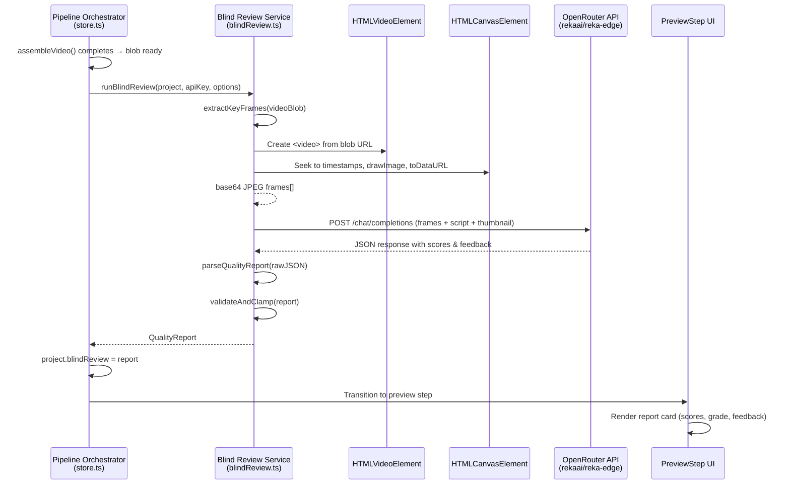
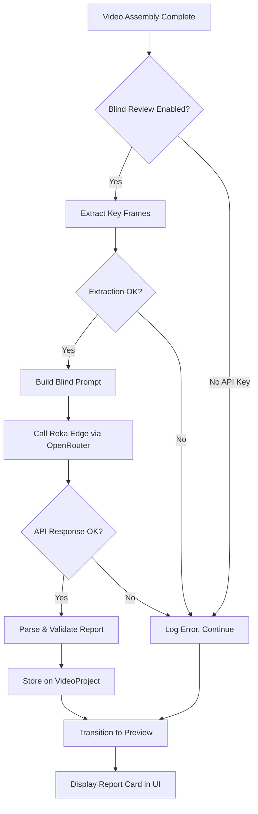

# Design Document: Blind Video Review

## Overview

This feature adds an automated blind quality review step to the AutoTube pipeline. After video assembly produces a rendered video blob, the system:

1. Extracts 10–15 key frames from the video using a `<canvas>` + `<video>` element approach (client-side)
2. Sends the frames, script text, and thumbnail to the `rekaai/reka-edge` vision model via OpenRouter
3. Parses the structured JSON response into a `QualityReport`
4. Stores the report on the `VideoProject` and displays it as a report card in the `PreviewStep` UI

The review is "blind" — the prompt deliberately excludes the intended topic, style, and audience so the model evaluates like a real viewer would. At ~$0.001 per review, it runs automatically on every video.

### Key Design Decisions

- **Client-side frame extraction**: Uses `HTMLVideoElement` + `HTMLCanvasElement` to seek through the video blob and capture frames. No server-side dependency needed.
- **Non-blocking pipeline step**: The review runs between assembly and preview. If it fails or is cancelled, the pipeline continues to preview without a report.
- **Reuse existing patterns**: Follows the same OpenRouter call pattern as `llm.ts` and `aiEditor.ts` — same headers, same `fetchWithTimeout` utility, same error handling style.
- **Pure parsing/validation functions**: All report parsing, score clamping, grade derivation, and color mapping are pure functions, making them straightforward to test with property-based testing.

## Architecture





## Components and Interfaces

### 1. `src/services/blindReview.ts` — Blind Review Service

The core service module. All functions are exported for testability.

```typescript
// ── Frame Extraction ──

/**
 * Computes evenly-spaced timestamps for frame extraction.
 * Returns between 10 and 15 timestamps based on video duration.
 *
 * For videos < 30s: 10 frames
 * For videos 30s–120s: 12 frames
 * For videos > 120s: 15 frames
 */
export function computeFrameTimestamps(
  durationSec: number,
  targetFrames?: number
): number[];

/**
 * Extracts key frames from a video Blob using <video> + <canvas>.
 * Each frame is encoded as a base64 JPEG data URL at max 1280x720.
 * Returns an array of base64 strings, or throws on failure.
 */
export async function extractKeyFrames(
  videoBlob: Blob,
  options?: { signal?: AbortSignal; maxWidth?: number; maxHeight?: number }
): Promise<string[]>;

// ── Prompt Construction ──

/**
 * Builds the system and user prompts for the blind review.
 * The prompt deliberately excludes topic, style, and audience.
 */
export function buildBlindReviewPrompt(
  frames: string[],
  scriptText: string,
  thumbnailDataUrl: string | null
): { system: string; user: Array<{ type: string; [key: string]: unknown }> };

// ── API Call ──

/**
 * Sends frames + script + thumbnail to Reka Edge via OpenRouter.
 * Uses fetchWithTimeout with 60s timeout and 2 retries.
 * Returns the raw response content string, or null on failure.
 */
export async function callBlindReviewAPI(
  frames: string[],
  scriptText: string,
  thumbnailDataUrl: string | null,
  apiKey: string,
  options?: { signal?: AbortSignal }
): Promise<string | null>;

// ── Parsing & Validation ──

/**
 * Clamps a numeric value to an integer in [1, 10].
 */
export function clampScore(value: unknown): number;

/**
 * Derives a letter grade from the average of category scores.
 * A (9–10), B (7–8), C (5–6), D (3–4), F (1–2)
 */
export function deriveLetterGrade(scores: number[]): string;

/**
 * Returns the color category for a numeric score.
 * 1–3 → 'red', 4–6 → 'amber', 7–10 → 'green'
 */
export function scoreColor(score: number): 'red' | 'amber' | 'green';

/**
 * Returns the color category for a letter grade.
 * A/B → 'green', C → 'amber', D/F → 'red'
 */
export function gradeColor(grade: string): 'red' | 'amber' | 'green';

/**
 * Truncates a string to the given max length, appending "…" if truncated.
 */
export function truncateString(str: string, maxLength: number): string;

/**
 * Strips markdown code fences from a string and parses as JSON.
 */
export function parseJSONResponse(raw: string): unknown;

/**
 * Parses raw LLM JSON output into a validated QualityReport.
 * - Clamps scores to integers in [1, 10]
 * - Fills missing scores with 5, missing text with "No feedback provided."
 * - Truncates feedback to 500 chars, summary to 1000 chars
 * - Derives letter grade from average scores
 */
export function parseQualityReport(raw: unknown): QualityReport;

// ── Orchestration ──

/**
 * Runs the full blind review pipeline:
 * 1. Extract key frames from the video blob
 * 2. Call Reka Edge via OpenRouter
 * 3. Parse and validate the response
 *
 * Returns QualityReport on success, null on failure.
 * Non-throwing — all errors are caught and logged.
 */
export async function runBlindReview(
  project: VideoProject,
  apiKey: string,
  options?: {
    signal?: AbortSignal;
    onProgress?: (pct: number, message: string) => void;
  }
): Promise<QualityReport | null>;
```

### 2. `src/types.ts` — Data Model Extensions

```typescript
/** Added to VideoProject */
export interface VideoProject {
  // ... existing fields ...
  /** Blind review quality report, if available. */
  blindReview?: QualityReport;
}

export interface QualityReport {
  /** Scores per category, each an integer 1–10. */
  scores: {
    visualQuality: number;
    pacing: number;
    narrativeClarity: number;
    thumbnailEffectiveness: number;
    overallProductionValue: number;
  };
  /** Written feedback per category, 1–3 sentences each (max 500 chars). */
  feedback: {
    visualQuality: string;
    pacing: string;
    narrativeClarity: string;
    thumbnailEffectiveness: string;
    overallProductionValue: string;
  };
  /** Overall letter grade: A, B, C, D, or F. */
  letterGrade: string;
  /** Overall summary, 2–4 sentences (max 1000 chars). */
  summary: string;
  /** ISO timestamp of when the review was completed. */
  reviewedAt: string;
}
```

### 3. `src/store.ts` — Pipeline Orchestrator Changes

The `assembleVideo` function is modified to call `runBlindReview` after successful video rendering, before transitioning to the preview step.

```typescript
// Inside assembleVideo(), after renderVideoToBlob() succeeds:

// ── Blind Review Step ──
onProgress?.(96, 'Running blind quality review...');
try {
  const report = await runBlindReview(updatedProject, appConfig.openRouterKey, {
    signal,
    onProgress: (pct, msg) => {
      // Map review progress (0-100) to overall progress (96-99)
      const overallPct = 96 + Math.round(pct * 0.03);
      setProcessingProgress(overallPct);
      setProcessingMessage(msg);
    },
  });
  if (report) {
    updatedProject.blindReview = report;
  }
} catch (err) {
  if ((err as Error).name === 'AbortError') throw err;
  logger.warn('Store', 'Blind review failed, continuing to preview', err);
}
```

A new `reviewAbortRef` is added for cancellation support. The `PipelineStep` type does not need to change — the review runs as a sub-step of assembly, not a separate pipeline step.

### 4. `src/components/PreviewStep.tsx` — Report Card UI

A new collapsible `BlindReviewCard` section is added to the PreviewStep component, displayed between the video player and the description section.

```typescript
interface BlindReviewCardProps {
  report: QualityReport | null;
}

function BlindReviewCard({ report }: BlindReviewCardProps) {
  const [isCollapsed, setIsCollapsed] = useState(false);

  if (!report) {
    return (
      <div className="rounded-xl border border-surface-700/50 bg-surface-900/60 p-4">
        <p className="text-sm text-surface-400">
          No blind review available for this project.
        </p>
      </div>
    );
  }

  // Renders: letter grade badge, 5 category score bars with colors,
  // feedback text per category, and overall summary.
  // Collapsible via isCollapsed state.
}
```

## Data Models

### QualityReport

| Field | Type | Constraints |
|-------|------|-------------|
| `scores.visualQuality` | `number` | Integer 1–10 |
| `scores.pacing` | `number` | Integer 1–10 |
| `scores.narrativeClarity` | `number` | Integer 1–10 |
| `scores.thumbnailEffectiveness` | `number` | Integer 1–10 |
| `scores.overallProductionValue` | `number` | Integer 1–10 |
| `feedback.visualQuality` | `string` | Max 500 chars |
| `feedback.pacing` | `string` | Max 500 chars |
| `feedback.narrativeClarity` | `string` | Max 500 chars |
| `feedback.thumbnailEffectiveness` | `string` | Max 500 chars |
| `feedback.overallProductionValue` | `string` | Max 500 chars |
| `letterGrade` | `string` | One of: `A`, `B`, `C`, `D`, `F` |
| `summary` | `string` | Max 1000 chars |
| `reviewedAt` | `string` | ISO 8601 timestamp |

### Score-to-Grade Mapping

| Average Score | Letter Grade |
|--------------|-------------|
| 9.0 – 10.0 | A |
| 7.0 – 8.99 | B |
| 5.0 – 6.99 | C |
| 3.0 – 4.99 | D |
| 1.0 – 2.99 | F |

### Score-to-Color Mapping

| Score Range | Color |
|------------|-------|
| 1–3 | Red |
| 4–6 | Amber |
| 7–10 | Green |

### Grade-to-Color Mapping

| Grade | Color |
|-------|-------|
| A, B | Green |
| C | Amber |
| D, F | Red |

### Frame Extraction Parameters

| Video Duration | Target Frames |
|---------------|--------------|
| < 30s | 10 |
| 30s – 120s | 12 |
| > 120s | 15 |

### OpenRouter Request Configuration

| Parameter | Value |
|-----------|-------|
| Model | `rekaai/reka-edge` |
| Endpoint | `https://openrouter.ai/api/v1/chat/completions` |
| Timeout | 60,000 ms |
| Max Retries | 2 |
| HTTP-Referer | `https://autotube.video` |
| X-Title | `AutoTube Blind Reviewer` |
| Max frame resolution | 1280 × 720 |

## Correctness Properties

*A property is a characteristic or behavior that should hold true across all valid executions of a system — essentially, a formal statement about what the system should do. Properties serve as the bridge between human-readable specifications and machine-verifiable correctness guarantees.*

### Property 1: Frame extraction count and spacing

*For any* video duration > 0, `computeFrameTimestamps(duration)` SHALL return between 10 and 15 timestamps, and the intervals between consecutive timestamps SHALL be equal (within floating-point tolerance).

**Validates: Requirements 1.1**

### Property 2: Blind prompt excludes project context

*For any* project with arbitrary topic, style, and audience strings, the prompt text produced by `buildBlindReviewPrompt` SHALL NOT contain the topic string, the style string, or the audience string.

**Validates: Requirements 2.2**

### Property 3: Score clamping

*For any* numeric value (including floats, negatives, and values > 10), `clampScore(value)` SHALL return an integer in the range [1, 10] inclusive.

**Validates: Requirements 3.1, 3.5**

### Property 4: Letter grade derivation

*For any* array of 5 integers each in [1, 10], `deriveLetterGrade(scores)` SHALL return the correct letter grade based on the arithmetic mean: A for average ≥ 9, B for average ≥ 7, C for average ≥ 5, D for average ≥ 3, F otherwise.

**Validates: Requirements 3.3**

### Property 5: Score-to-color mapping

*For any* integer score in [1, 10], `scoreColor(score)` SHALL return `'red'` for 1–3, `'amber'` for 4–6, and `'green'` for 7–10.

**Validates: Requirements 5.2**

### Property 6: Grade-to-color mapping

*For any* letter grade in {A, B, C, D, F}, `gradeColor(grade)` SHALL return `'green'` for A or B, `'amber'` for C, and `'red'` for D or F.

**Validates: Requirements 5.3**

### Property 7: QualityReport JSON round-trip

*For any* valid `QualityReport` object, `JSON.parse(JSON.stringify(report))` SHALL produce a deeply equal object.

**Validates: Requirements 6.2, 6.3, 7.3**

### Property 8: Missing field defaults

*For any* raw response object with an arbitrary subset of score and feedback fields omitted, `parseQualityReport(raw)` SHALL produce a complete `QualityReport` where every missing score is 5 and every missing feedback string is `"No feedback provided."`.

**Validates: Requirements 7.2**

### Property 9: Markdown fence stripping

*For any* valid JSON string wrapped in markdown code fences (`` ```json ... ``` `` or `` ``` ... ``` ``), `parseJSONResponse(wrapped)` SHALL return the same parsed object as `JSON.parse(original)`.

**Validates: Requirements 7.1**

### Property 10: Feedback and summary truncation

*For any* string of arbitrary length, `truncateString(str, 500)` SHALL return a string of length ≤ 500, and `truncateString(str, 1000)` SHALL return a string of length ≤ 1000. If the input length ≤ maxLength, the output SHALL equal the input.

**Validates: Requirements 7.4**

## Error Handling

| Scenario | Behavior |
|----------|----------|
| Video blob cannot be decoded | `extractKeyFrames` throws; `runBlindReview` catches, logs warning, returns `null` |
| Frame extraction times out (>30s) | AbortController fires; `runBlindReview` catches, logs warning, returns `null` |
| No OpenRouter API key configured | `runBlindReview` returns `null` immediately without making an API call |
| OpenRouter returns HTTP error | `callBlindReviewAPI` logs the error, returns `null`; `runBlindReview` returns `null` |
| OpenRouter returns unparseable response | `parseQualityReport` fills defaults; if completely invalid JSON, `runBlindReview` returns `null` |
| User cancels during review | AbortSignal propagates through `fetchWithTimeout`; `runBlindReview` re-throws `AbortError` |
| Review fails for any reason | Pipeline orchestrator catches the error, logs it, and transitions to preview without a report |
| Scores out of range in response | `clampScore` clamps to nearest bound (1 or 10) and rounds to integer |
| Missing fields in response | `parseQualityReport` fills missing scores with 5, missing text with "No feedback provided." |
| Feedback/summary too long | `truncateString` truncates to 500/1000 chars with "…" suffix |

All errors in the blind review are non-blocking. The pipeline always continues to the preview step regardless of review outcome.

## Testing Strategy

### Property-Based Tests (fast-check)

The following pure functions are tested with property-based tests using `fast-check`, each running a minimum of 100 iterations. Tests are located in `src/services/__tests__/blindReview.test.ts`.

| Property | Function Under Test | Generator Strategy |
|----------|--------------------|--------------------|
| 1: Frame count & spacing | `computeFrameTimestamps` | Random durations 0.1–600s |
| 2: Blind prompt exclusion | `buildBlindReviewPrompt` | Random alphanumeric topic/style/audience strings |
| 3: Score clamping | `clampScore` | Random numbers including negatives, floats, large values |
| 4: Grade derivation | `deriveLetterGrade` | Random arrays of 5 integers in [1, 10] |
| 5: Score color | `scoreColor` | Random integers in [1, 10] |
| 6: Grade color | `gradeColor` | Random elements from {A, B, C, D, F} |
| 7: JSON round-trip | `JSON.parse(JSON.stringify(report))` | Random valid QualityReport objects |
| 8: Missing field defaults | `parseQualityReport` | Random subsets of fields omitted |
| 9: Markdown fence stripping | `parseJSONResponse` | Random JSON wrapped in fence variants |
| 10: Truncation | `truncateString` | Random strings of length 0–2000 |

Each test is tagged: `// Feature: blind-video-review, Property N: <description>`

**PBT library**: `fast-check` (already installed in devDependencies)
**Minimum iterations**: 100 per property

### Unit Tests (vitest)

Example-based tests for specific scenarios:

- `extractKeyFrames` returns error result for empty/invalid blob (Req 1.3)
- `callBlindReviewAPI` includes correct headers (Req 2.6)
- `callBlindReviewAPI` uses 60s timeout and 2 retries (Req 2.4)
- `parseQualityReport` handles completely empty response (Req 2.5)
- `BlindReviewCard` renders all score categories when report is present (Req 5.1)
- `BlindReviewCard` shows "no review" message when report is null (Req 5.4)
- `BlindReviewCard` collapses/expands on click (Req 5.5)

### Integration Tests

- Pipeline orchestrator triggers blind review after assembly (Req 4.1)
- Pipeline continues to preview when review fails (Req 4.4)
- Pipeline continues to preview when review is cancelled (Req 4.3)
- Project serialization/deserialization preserves blindReview field (Req 6.2, 6.3)
