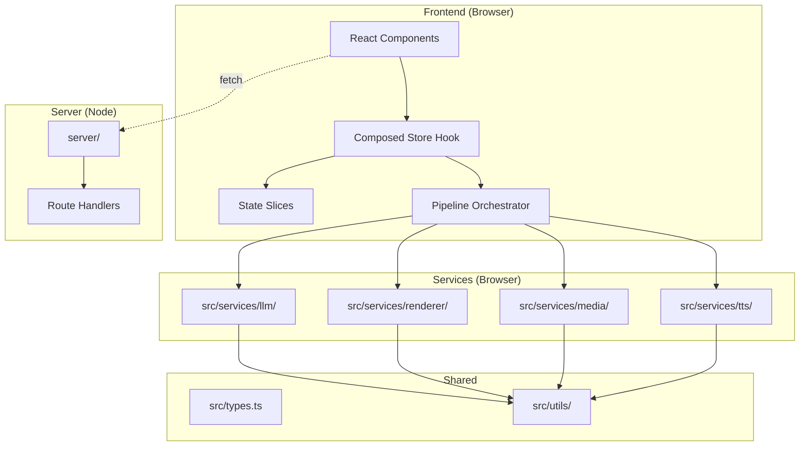

# Design Document: Codebase Refactor

## Overview

This design describes the architectural refactoring of the AutoTube video generator from a monolithic structure into a modular, domain-driven architecture. The refactor preserves all external behavior while restructuring internals for maintainability, testability, and clear separation of concerns.

The current codebase has several pain points:
- `videoRenderer.ts` (~2300 lines) mixes canvas drawing, encoding, preloading, and orchestration
- `store.ts` (~900+ lines) is a god object combining state, pipeline orchestration, and side effects
- `llm.ts` (~770 lines) bundles script generation, review, title generation, and shared utilities
- `vite.config.ts` embeds a full API server (~400 lines of route handlers) in build config
- TTS is split across 3 files (`tts.ts`, `grokTts.ts`, `meloTts.ts`) with no unified interface
- No consistent error handling or retry patterns across services

The refactor introduces domain directories with barrel exports, a standalone API server, state slices, and shared utilities for error handling and retries.

## Architecture



### Dependency Flow

Dependencies flow in one direction: UI → Store → Pipeline → Services → Utils. No circular imports between domain directories. All cross-domain communication goes through barrel `index.ts` exports or the shared `src/types.ts`.

## Components and Interfaces

### 1. API Server (`server/`)

**Current state:** All API routes are embedded in `vite.config.ts` `configureServer()` middleware (~400 lines).

**Target structure:**
```
server/
├── index.ts              # Express app setup, middleware registration
├── routes/
│   ├── proxyImage.ts     # GET /api/proxy-image
│   ├── renderVideo.ts    # POST /api/render-video
│   ├── serverRender.ts   # POST /api/server-render
│   ├── renderOutput.ts   # GET /api/render-output/:format/*
│   ├── saveProject.ts    # POST /api/save-project
│   ├── exportProject.ts  # GET /api/export-project
│   ├── searchVideos.ts   # GET /api/search-videos
│   ├── downloadClip.ts   # GET /api/download-clip
│   └── search.ts         # GET /api/search
└── middleware/
    ├── cors.ts           # CORS headers
    └── errorHandler.ts   # Global error handler → structured JSON
```

**Interface:**
```typescript
// server/routes/types.ts
import type { Request, Response } from 'express';

export type RouteHandler = (req: Request, res: Response) => Promise<void>;

// Each route file exports a single handler:
export declare function handleProxyImage(req: Request, res: Response): Promise<void>;
```

**Integration with Vite:** The `vite.config.ts` will use `vitePlugin` to proxy `/api/*` to the Express server running on a separate port during dev, or use Vite's `server.proxy` config. The Express app is imported and mounted via a custom Vite plugin that calls `server.middlewares.use(app)`.

### 2. Store Decomposition (`src/store/`)

**Current state:** Single `store.ts` file with one massive `useVideoProject()` hook containing all state, effects, and orchestration.

**Target structure:**
```
src/store/
├── index.ts              # Composed useVideoProject() hook (backward compat)
├── slices/
│   ├── projectSlice.ts   # VideoProject state, setProject, project mutations
│   ├── pipelineSlice.ts  # Step statuses, currentStep, step transitions
│   ├── configSlice.ts    # AppConfig, encryption, unlock/lock
│   ├── narrationSlice.ts # TTS state, voice selection, audio URLs
│   └── uiSlice.ts        # Logs, processing progress/message, modals
└── pipeline/
    └── orchestrator.ts   # Step execution logic (generateScript, sourceMedia, etc.)
```

**Slice interface pattern:**
```typescript
// Each slice exports:
export interface ProjectSliceState {
  project: VideoProject | null;
  topicConfig: TopicConfig;
}

export interface ProjectSliceActions {
  setProject: (p: VideoProject | null) => void;
  updateSegment: (id: string, patch: Partial<ScriptSegment>) => void;
  // ...
}

export function useProjectSlice(): ProjectSliceState & ProjectSliceActions;
```

**Composed hook:** The `index.ts` barrel calls each slice hook and merges their returns into the existing `useVideoProject()` shape. Existing components continue working unchanged.

**Pipeline orchestrator:** Extracted as a set of pure async functions that accept state + callbacks, perform the pipeline step (calling services), and return results. The store hook invokes these and updates state from the results.

### 3. Video Renderer Decomposition (`src/services/renderer/`)

**Current state:** `videoRenderer.ts` (~2300 lines) with 25+ functions mixing canvas drawing, encoding, preloading, and orchestration.

**Target structure:**
```
src/services/renderer/
├── index.ts              # Barrel: re-exports renderVideoToBlob, QUALITY_PRESETS
├── orchestrator.ts       # renderVideoToBlob — coordinates sub-modules
├── canvas/
│   ├── draw.ts           # Main draw() function, drawProceduralBackground
│   ├── scenes.ts         # Scene layout functions (stat-card, quote-card, etc.)
│   ├── overlays.ts       # drawKineticTextOverlay, drawDiagramOverlay
│   ├── transitions.ts    # renderTransition, computeCrossfadeAlpha
│   └── text.ts           # wrapText, roundRect, hexToRgba, drawTechnicalLabel
├── preload.ts            # preload(), loadImage(), buildImageSources()
├── encoding.ts           # MediaRecorder setup, getSupportedMimeType, tryServerRender
└── animation.ts          # computeVisualStyle, Ken Burns param computation
```

**Module boundaries:**
- `orchestrator.ts` imports from all sub-modules, coordinates the render loop
- `canvas/*` modules are pure drawing functions (ctx in, pixels out)
- `preload.ts` handles async image loading and caching
- `encoding.ts` handles MediaRecorder/ffmpeg encoding
- `animation.ts` handles time-based animation calculations

### 4. LLM Service Decomposition (`src/services/llm/`)

**Current state:** `llm.ts` (~770 lines) with script generation, review, title generation, and helper functions.

**Target structure:**
```
src/services/llm/
├── index.ts              # Barrel: re-exports generateAIScript, reviewAndImproveScript, generateVideoTitle
├── callLLM.ts            # Shared: callLLM(prompt, config) with retry, timeout, JSON parsing
├── scriptGenerator.ts    # generateAIScript — script creation logic + prompts
├── scriptReviewer.ts     # reviewAndImproveScript — quality review + improvement
├── titleGenerator.ts     # generateVideoTitle — SEO title generation
├── topicContext.ts       # fetchWikiContext, fetchTopicContext — research helpers
└── parsing.ts            # parseSegmentsFromContent, validateSegment, sanitiseTopic
```

**Shared `callLLM` interface:**
```typescript
export interface LLMConfig {
  apiKey: string;
  model?: string;
  endpoint?: string;
  timeoutMs?: number;
  maxRetries?: number;
  signal?: AbortSignal;
}

export interface LLMResponse<T> {
  data: T;
  usage?: { promptTokens: number; completionTokens: number };
}

export async function callLLM<T>(
  messages: Array<{ role: string; content: string }>,
  config: LLMConfig,
  parser?: (content: string) => T,
): Promise<LLMResponse<T>>;
```

Each sub-module accepts `LLMConfig` as a parameter rather than reading from global state. This enables testing with mock configs and supports multiple model configurations.

### 5. TTS Consolidation (`src/services/tts/`)

**Current state:** Three separate files — `tts.ts` (just a VOICES array), `grokTts.ts`, `meloTts.ts` — plus browser SpeechSynthesis in `utils/speech.ts`.

**Target structure:**
```
src/services/tts/
├── index.ts              # Barrel: exports generateNarration, TTS_ENGINES
├── interface.ts          # TTSEngine interface definition
├── grokEngine.ts         # Grok TTS implementation
├── meloEngine.ts         # Melo/Cloudflare TTS implementation
├── browserEngine.ts      # Browser SpeechSynthesis implementation
└── registry.ts           # Engine registry + fallback logic
```

**Unified interface:**
```typescript
// interface.ts
export interface TTSEngine {
  readonly name: string;
  readonly voices: ReadonlyArray<{ id: string; description: string }>;
  generate(text: string, voice: string, options?: { signal?: AbortSignal }): Promise<string | null>;
  isAvailable(config: TTSConfig): boolean;
}

export interface TTSConfig {
  engine: 'grok' | 'melo' | 'browser';
  xaiApiKey?: string;
  cloudflareAccountId?: string;
  cloudflareApiToken?: string;
  voice?: string;
}

// index.ts
export async function generateNarration(
  text: string,
  config: TTSConfig,
): Promise<string>;
```

**Fallback strategy:** The registry maintains an ordered list of engines. `generateNarration` tries the preferred engine first, then falls back through the list. Each failure is logged via the `logger` utility.

### 6. Shared Utilities

**Error handling (`src/utils/errors.ts`):**
```typescript
export interface ServiceError {
  code: string;
  message: string;
  originalError?: unknown;
  retryable: boolean;
  attempts?: number;
}

export function isServiceError(err: unknown): err is ServiceError;
export function createServiceError(code: string, message: string, opts?: Partial<ServiceError>): ServiceError;
```

**Retry utility (`src/utils/withRetry.ts`):**
```typescript
export interface RetryOptions {
  maxRetries: number;
  backoff: 'linear' | 'exponential';
  baseDelayMs?: number;
  signal?: AbortSignal;
  onRetry?: (attempt: number, error: unknown) => void;
}

export async function withRetry<T>(
  fn: () => Promise<T>,
  options: RetryOptions,
): Promise<T>;
```

This replaces all ad-hoc retry loops and watchdog timers across the codebase.

### 7. Target Directory Structure

```
src/
├── App.tsx
├── main.tsx
├── index.css
├── types.ts                    # Shared types (unchanged)
├── env.d.ts
├── store/
│   ├── index.ts                # useVideoProject() composed hook
│   ├── slices/
│   │   ├── projectSlice.ts
│   │   ├── pipelineSlice.ts
│   │   ├── configSlice.ts
│   │   ├── narrationSlice.ts
│   │   └── uiSlice.ts
│   └── pipeline/
│       └── orchestrator.ts
├── components/
│   ├── PreviewStep/
│   │   ├── index.tsx
│   │   ├── VideoPlayer.tsx
│   │   ├── Timeline.tsx
│   │   ├── QualitySettings.tsx
│   │   └── ExportActions.tsx
│   ├── AssetTester/
│   │   ├── index.tsx
│   │   ├── AssetList.tsx
│   │   ├── AssetDetail.tsx
│   │   ├── TestRunner.tsx
│   │   └── ResultsDisplay.tsx
│   └── ... (other components unchanged if <400 lines)
├── services/
│   ├── renderer/
│   │   ├── index.ts
│   │   ├── orchestrator.ts
│   │   ├── canvas/
│   │   │   ├── draw.ts
│   │   │   ├── scenes.ts
│   │   │   ├── overlays.ts
│   │   │   ├── transitions.ts
│   │   │   └── text.ts
│   │   ├── preload.ts
│   │   ├── encoding.ts
│   │   └── animation.ts
│   ├── llm/
│   │   ├── index.ts
│   │   ├── callLLM.ts
│   │   ├── scriptGenerator.ts
│   │   ├── scriptReviewer.ts
│   │   ├── titleGenerator.ts
│   │   ├── topicContext.ts
│   │   └── parsing.ts
│   ├── tts/
│   │   ├── index.ts
│   │   ├── interface.ts
│   │   ├── grokEngine.ts
│   │   ├── meloEngine.ts
│   │   ├── browserEngine.ts
│   │   └── registry.ts
│   ├── media/
│   │   ├── index.ts            # Barrel for media service
│   │   ├── harvester.ts        # Core media sourcing logic (from media.ts)
│   │   ├── scoring.ts          # Quality scoring
│   │   └── cache.ts            # MediaCache
│   ├── pipeline/
│   │   └── index.ts            # Re-export from store/pipeline if needed
│   ├── renderingShared.ts      # Stays (shared between browser + server renderer)
│   ├── analytics.ts            # Stays (small, focused)
│   ├── logger.ts               # Stays (small, focused)
│   └── ... (other small focused services stay as-is)
├── utils/
│   ├── cn.ts
│   ├── extractJson.ts
│   ├── fetchWithTimeout.ts
│   ├── jsonRepair.ts
│   ├── secureStorage.ts
│   ├── speech.ts
│   ├── errors.ts               # NEW: ServiceError type
│   └── withRetry.ts            # NEW: shared retry utility
server/
├── index.ts
├── routes/
│   ├── proxyImage.ts
│   ├── renderVideo.ts
│   ├── serverRender.ts
│   ├── renderOutput.ts
│   ├── saveProject.ts
│   ├── exportProject.ts
│   ├── searchVideos.ts
│   ├── downloadClip.ts
│   └── search.ts
└── middleware/
    ├── cors.ts
    └── errorHandler.ts
```

## Data Models

No new data models are introduced. The refactor preserves all existing types in `src/types.ts`. The key structural additions are:

**New types added to `src/types.ts` or domain-specific files:**

```typescript
// src/utils/errors.ts
export interface ServiceError {
  code: string;
  message: string;
  originalError?: unknown;
  retryable: boolean;
  attempts?: number;
}

// src/services/tts/interface.ts
export interface TTSEngine { /* see above */ }
export interface TTSConfig { /* see above */ }

// src/services/llm/callLLM.ts
export interface LLMConfig { /* see above */ }
export interface LLMResponse<T> { /* see above */ }

// src/utils/withRetry.ts
export interface RetryOptions { /* see above */ }
```

**State slice interfaces** (in respective slice files):
- `ProjectSliceState` + `ProjectSliceActions`
- `PipelineSliceState` + `PipelineSliceActions`
- `ConfigSliceState` + `ConfigSliceActions`
- `NarrationSliceState` + `NarrationSliceActions`
- `UISliceState` + `UISliceActions`

## Correctness Properties

*A property is a characteristic or behavior that should hold true across all valid executions of a system — essentially, a formal statement about what the system should do. Properties serve as the bridge between human-readable specifications and machine-verifiable correctness guarantees.*

### Property 1: API error responses are structured JSON

*For any* API route handler and *for any* error condition (invalid input, upstream failure, internal error), the response SHALL be a JSON object containing at minimum `{ error: string }` with an HTTP status code in the 4xx or 5xx range.

**Validates: Requirements 1.5**

### Property 2: State slice isolation

*For any* state slice action invocation, only the state fields belonging to that slice SHALL change — all other slice state fields SHALL remain strictly equal (by reference) to their values before the action.

**Validates: Requirements 2.5**

### Property 3: Service error type consistency

*For any* service function that fails (either by exhausting retries or encountering a non-retryable error), the resulting error SHALL be a `ServiceError` object containing a non-empty `code`, a non-empty `message`, and a boolean `retryable` field.

**Validates: Requirements 6.2, 10.4**

### Property 4: Module boundary enforcement (barrel-only imports)

*For any* import statement in a domain module (`renderer/`, `llm/`, `tts/`, `media/`) that references another domain, the import path SHALL resolve to that domain's barrel `index.ts` — never to an internal file within the other domain.

**Validates: Requirements 7.2, 7.4**

### Property 5: Acyclic domain dependency graph

*For any* pair of domain directories (A, B), if A imports from B (directly or transitively), then B SHALL NOT import from A (directly or transitively).

**Validates: Requirements 7.3**

### Property 6: TTS engine delegation

*For any* valid `TTSConfig` specifying an engine preference, `generateNarration` SHALL invoke the `generate` method of the engine matching that preference (and no other engine) when the preferred engine is available and succeeds.

**Validates: Requirements 8.2**

### Property 7: TTS engine fallback on failure

*For any* `TTSConfig` where the preferred engine's `generate` call returns `null` or throws, `generateNarration` SHALL attempt the next available engine in priority order and SHALL log the fallback event via the logger.

**Validates: Requirements 8.4**

## Error Handling

### Standard Error Type

All services use `ServiceError` from `src/utils/errors.ts`:

```typescript
interface ServiceError {
  code: string;        // e.g., 'LLM_TIMEOUT', 'TTS_ENGINE_FAILED', 'MEDIA_FETCH_FAILED'
  message: string;     // Human-readable description
  originalError?: unknown;  // The underlying error
  retryable: boolean;  // Whether the caller should retry
  attempts?: number;   // How many attempts were made
}
```

### Retry Strategy

All network-calling services use `withRetry`:
- **LLM calls:** 2 retries, exponential backoff (1s, 2s), abort signal from pipeline
- **TTS calls:** 2 retries, linear backoff (1s), then engine fallback
- **Media fetches:** 1 retry, 500ms delay, then skip asset
- **API proxy routes:** No retry (client can retry)

### Error Propagation

1. Services throw `ServiceError` on unrecoverable failure
2. Pipeline orchestrator catches `ServiceError`, updates UI state with error message
3. Components display error state from the UI slice
4. No service catches errors silently — all failures are logged via `logger`

### Watchdog Removal

The current ad-hoc watchdog timer in `store.ts` (300s timeout on assembly) is replaced by:
- `AbortSignal.timeout()` passed to `renderVideoToBlob`
- The `withRetry` utility's built-in timeout support
- No more `setInterval` polling for progress staleness

## Testing Strategy

### Unit Tests (Vitest)

Focus areas:
- **State slices:** Each slice tested in isolation — actions produce expected state changes
- **LLM parsing:** `parseSegmentsFromContent`, `validateSegment`, `sanitiseTopic` with edge cases
- **Renderer canvas functions:** Pure drawing functions tested with mock canvas context
- **TTS registry:** Engine selection, fallback behavior
- **withRetry utility:** Retry counts, backoff timing, abort signal handling
- **ServiceError creation:** Correct fields populated

### Property-Based Tests (fast-check)

The project already has `fast-check` installed. Property tests will validate the correctness properties above:

- **Property 1 (API errors):** Generate random invalid inputs for each route, verify JSON error response structure
- **Property 2 (Slice isolation):** Generate random actions, verify only target slice state changes
- **Property 3 (ServiceError consistency):** Generate random failure scenarios, verify error shape
- **Property 4 (Barrel imports):** Parse import statements from source files, verify cross-domain imports target index.ts
- **Property 5 (Acyclic graph):** Build import graph from source, verify no cycles between domains
- **Property 6 (TTS delegation):** Generate random configs, verify correct engine is called
- **Property 7 (TTS fallback):** Generate random failure sequences, verify fallback chain

Each property test runs minimum 100 iterations. Tests are tagged:
- **Feature: codebase-refactor, Property 1: API error responses are structured JSON**
- **Feature: codebase-refactor, Property 2: State slice isolation**
- etc.

### Integration Tests

- API server routes: Start server, hit each endpoint with valid/invalid requests
- Pipeline orchestrator: Mock services, verify step transitions
- Full TTS flow: Mock engine APIs, verify narration generation end-to-end

### Smoke Tests

- Verify directory structure matches target layout
- Verify no component exceeds 400 lines
- Verify no `console.log`/`console.error` in service files
- Verify TypeScript compilation passes
- Verify no circular imports between domains
