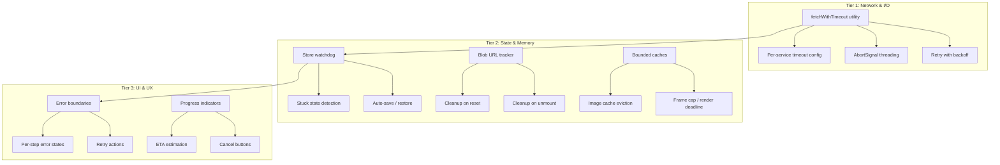

# Design Document — Codebase Robustness Audit

## Overview

This design covers a systematic hardening pass across the entire AutoTube codebase. The goal is to eliminate hangs, crashes, silent failures, memory leaks, and stuck states by adding timeouts, abort signal threading, defensive error handling, memory management, state recovery, and graceful degradation to every service and component.

The changes are organized into cross-cutting utilities and per-file modifications. A new `src/utils/fetchWithTimeout.ts` utility centralizes timeout and retry logic. Each existing service and component receives targeted patches rather than rewrites, keeping the diff surface small and reviewable.

### Design Principles

1. **Defense in depth**: Every async boundary gets a timeout, every error gets caught, every resource gets cleaned up.
2. **Fail forward**: When a subsystem fails, the pipeline continues with degraded output rather than stopping entirely.
3. **User visibility**: Every failure is surfaced in the UI with a clear message and a recovery action.
4. **Minimal new abstractions**: Reuse existing patterns (fetchWithRetry, logger, ErrorBoundary) and extend them rather than introducing new frameworks.

## Architecture

The robustness improvements are layered across three tiers:



### Change Map

| File | Changes |
|------|---------|
| `src/utils/fetchWithTimeout.ts` | **New** — Centralized fetch wrapper with per-attempt timeout, retry, and AbortSignal support |
| `src/services/llm.ts` | Use `fetchWithTimeout` with 30s timeout; accept AbortSignal parameter |
| `src/services/tts.ts` | Use `fetchWithTimeout` with 30s timeout; accept AbortSignal parameter |
| `src/services/llmVisualDirector.ts` | Use `fetchWithTimeout` with 20s timeout; accept AbortSignal parameter |
| `src/services/media.ts` | Add 15s timeout to all provider fetches; accept AbortSignal; never throw from `sourceSegmentMedia` |
| `src/services/videoRenderer.ts` | Clear saturationCache after render; null-out canvas dimensions; clear capturedFrames; track and revoke blob URLs |
| `src/services/logger.ts` | Wrap subscriber callback in try/catch |
| `src/services/analytics.ts` | Wrap localStorage writes in try/catch |
| `src/services/youtube.ts` | Wrap clipboard write in try/catch |
| `src/store.ts` | Add AbortSignal to all pipeline steps; add auto-save/restore; reset processing steps on load; revoke blob URLs on reset; add cancel for script/media/narration steps |
| `src/components/PreviewStep.tsx` | Revoke thumbnail blob URL on unmount; stop audio on unmount |
| `src/components/SettingsModal.tsx` | Wrap verification in try/catch; show red indicator on failure |
| `src/components/ErrorBoundary.tsx` | No changes needed — already functional |
| `src/components/BatchProcessor.tsx` | Already handles per-job errors — no changes needed |

## Components and Interfaces

### New Utility: `src/utils/fetchWithTimeout.ts`

This utility replaces the three separate `fetchWithRetry` implementations in `llm.ts`, `tts.ts`, and `llmVisualDirector.ts` with a single, configurable function.

```typescript
export interface FetchWithTimeoutOptions {
  /** Per-attempt timeout in milliseconds. Default: 30000 */
  timeoutMs?: number;
  /** Maximum retry attempts. Default: 3 */
  maxRetries?: number;
  /** Base delay for exponential backoff in ms. Default: 1000 */
  baseDelayMs?: number;
  /** Maximum backoff delay in ms. Default: 10000 */
  maxDelayMs?: number;
  /** External AbortSignal for cancellation. */
  signal?: AbortSignal;
}

/**
 * Fetch with per-attempt timeout, exponential backoff retry, and
 * external AbortSignal support.
 *
 * - Retries on 429 and 5xx responses.
 * - Does NOT retry on 4xx client errors (except 429).
 * - Each attempt gets its own AbortSignal with the configured timeout.
 * - If the external signal is aborted, all retries stop immediately.
 */
export async function fetchWithTimeout(
  url: string,
  options: RequestInit,
  config?: FetchWithTimeoutOptions,
): Promise<Response>;
```

**Implementation details:**
- Creates a per-attempt `AbortController` with `setTimeout` for the timeout.
- Links the per-attempt controller to the external `signal` via an `abort` event listener.
- Cleans up the timeout and listener after each attempt.
- On 4xx (except 429), throws immediately without retry.
- On 429 or 5xx, waits `min(baseDelayMs * 2^(attempt-1), maxDelayMs)` then retries.
- On network error, retries with backoff.

### Modified Interface: Service Functions

All service functions that make network calls gain an optional `signal?: AbortSignal` parameter:

```typescript
// llm.ts
export async function generateAIScript(
  config: TopicConfig,
  apiKey: string,
  model?: string,
  signal?: AbortSignal,  // NEW
): Promise<ScriptSegment[]>;

// tts.ts
export async function generateOpenAITTS(
  text: string,
  apiKey: string,
  voice?: string,
  signal?: AbortSignal,  // NEW
): Promise<string | null>;

// llmVisualDirector.ts
export async function generateAIPlan(
  segmentText: string,
  topicContext: TopicContext,
  apiKey: string,
  model?: string,
  signal?: AbortSignal,  // NEW
): Promise<LlmVisualPlan>;

// media.ts
export async function sourceSegmentMedia(
  segment: ScriptSegment,
  plan: SegmentVisualPlan,
  topicContext: TopicContext,
  usedUrls: Set<string>,
  segmentIndex: number,
  config: AppConfig,
  signal?: AbortSignal,  // NEW
): Promise<{ assets: Omit<MediaAsset, 'id' | 'segmentId'>[]; plan: SegmentVisualPlan; segmentId: string }>;
```

### Modified Interface: Store

The store gains AbortController refs for each pipeline step and a unified cancel mechanism:

```typescript
// New refs in useVideoProject
const scriptAbortRef = useRef<AbortController | null>(null);
const mediaAbortRef = useRef<AbortController | null>(null);
const narrationAbortRef = useRef<AbortController | null>(null);
// renderAbortRef already exists

// New exposed function
cancelCurrentOperation: () => void;  // Cancels whatever step is currently processing
```

### Modified Interface: Renderer Cleanup

The renderer gains a cleanup function called after render completes or is cancelled:

```typescript
function cleanupRenderResources(
  canvas: HTMLCanvasElement,
  offscreen: HTMLCanvasElement,
  bgCacheCanvas: HTMLCanvasElement,
  recCanvas: HTMLCanvasElement | null,
  blobUrls: string[],
): void {
  // Set all canvas dimensions to 0 to release GPU memory
  // Revoke all tracked blob URLs
  // Clear saturationCache
  // Clear capturedFrames array
}
```

## Data Models

No new data models are introduced. The existing types (`VideoProject`, `AppConfig`, `SystemLog`, etc.) are sufficient. The changes are behavioral, not structural.

### localStorage Schema (unchanged, but with validation)

The store already saves to `autotube_project` and `autotube_config` keys. The robustness audit adds validation on load:

```typescript
// Validation on load
function validateStoredProject(data: unknown): { project: VideoProject; ... } | null {
  if (!data || typeof data !== 'object') return null;
  const d = data as Record<string, unknown>;
  if (!d.project || typeof d.project !== 'object') return null;
  // Validate required fields exist
  // Reset any 'processing' step statuses to 'active'
  return d as { project: VideoProject; ... };
}
```

## Correctness Properties

*A property is a characteristic or behavior that should hold true across all valid executions of a system — essentially, a formal statement about what the system should do. Properties serve as the bridge between human-readable specifications and machine-verifiable correctness guarantees.*

### Property 1: fetchWithTimeout enforces per-attempt timeout and correct retry behavior

*For any* timeout value T, maximum retry count N, and sequence of server responses, `fetchWithTimeout` SHALL abort each attempt after T milliseconds, retry on 429/5xx up to N times with exponential backoff, and NOT retry on 4xx client errors (except 429).

**Validates: Requirements 1.1, 1.2, 1.5, 1.6, 16.1, 16.2, 16.5**

### Property 2: Segment-level failure isolation

*For any* list of segments where processing segment K throws an error, the pipeline (media sourcing or narration generation) SHALL continue processing segments K+1 through N, producing results for all non-failing segments.

**Validates: Requirements 3.2, 3.3**

### Property 3: sourceSegmentMedia never throws

*For any* valid or invalid combination of segment, visual plan, topic context, and app config, `sourceSegmentMedia` SHALL return a result object (possibly with fallback assets) and SHALL NOT throw an unhandled exception.

**Validates: Requirements 3.7**

### Property 4: Batch job failure isolation

*For any* batch of jobs where job K fails with an error, the batch processor SHALL mark job K as 'error' and continue processing jobs K+1 through N, completing all non-failing jobs.

**Validates: Requirements 4.4, 14.1**

### Property 5: Image cache bounded to maximum size

*For any* number of images loaded during a render session, the image cache SHALL contain at most 60 entries, evicting oldest entries when the limit is exceeded.

**Validates: Requirements 5.6**

### Property 6: Captured frames bounded to maximum count

*For any* video duration and frame rate, the renderer SHALL capture at most 2000 frames, stopping frame capture when the limit is reached.

**Validates: Requirements 6.1**

### Property 7: Processing steps reset on page reload

*For any* saved project state where one or more steps have 'processing' status, loading that state SHALL reset those steps to 'active' (not leave them in 'processing'), preventing stuck UI on reload.

**Validates: Requirements 7.4, 8.4**

### Property 8: Corrupted localStorage handled gracefully

*For any* string stored in the `autotube_project` or `autotube_config` localStorage keys (including invalid JSON, truncated data, or completely random bytes), the store SHALL fall back to a fresh/default state without throwing an unhandled exception.

**Validates: Requirements 8.5, 17.4**

### Property 9: Canvas safety classification

*For any* image URL, `isCanvasSafeSource` SHALL return `true` only for URLs that are guaranteed not to taint the canvas (data:, blob:, local proxy, known CORS proxies), and the renderer SHALL only draw images where `safeForCanvas` is `true`.

**Validates: Requirements 12.1**

### Property 10: Canvas dimensions match quality preset

*For any* quality value ('draft', 'standard', 'high'), the renderer SHALL create canvases with dimensions exactly matching `QUALITY_PRESETS[quality].width` and `QUALITY_PRESETS[quality].height`.

**Validates: Requirements 12.4**

### Property 11: Bounded storage collections

*For any* number of entries written, the logger in-memory buffer SHALL contain at most 100 entries, the analytics localStorage store SHALL contain at most 50 entries, and the analytics service SHALL catch and suppress any localStorage write errors.

**Validates: Requirements 15.1, 15.2, 15.3, 15.4**

### Property 12: Visual Director retry with backoff

*For any* sequence of 429/5xx responses from OpenRouter, the Visual Director SHALL retry up to 2 times with exponential backoff, and return a fallback plan if all attempts fail.

**Validates: Requirements 16.3, 9.7**

### Property 13: Harvester returns empty array on non-200

*For any* non-200 HTTP response from any image provider (DDG, Wikimedia, Unsplash, Pexels, Serper, Firecrawl), the corresponding search function SHALL return an empty array without throwing.

**Validates: Requirements 16.4**

### Property 14: Segment validation produces valid defaults

*For any* raw object (including null, undefined, empty objects, objects with wrong types), `validateSegment` SHALL return a valid `ScriptSegment` with sensible defaults for all missing or invalid fields.

**Validates: Requirements 17.1**

### Property 15: Visual plan validation produces valid fallback

*For any* raw object (including null, undefined, empty objects), `validateVisualPlan` SHALL return a valid `LlmVisualPlan` with fallback values for all missing or invalid fields.

**Validates: Requirements 17.2**

### Property 16: parseSegmentsFromContent handles multiple formats

*For any* valid segments array serialized as bare JSON array, wrapped in `{ "segments": [...] }`, or enclosed in markdown code fences, `parseSegmentsFromContent` SHALL successfully parse and return valid segments.

**Validates: Requirements 17.5**

### Property 17: Image source ordering

*For any* external HTTP/HTTPS URL, `buildImageSources` SHALL return sources in the order: [local proxy, weserv.nl, direct URL, allorigins.win, corsproxy.io], providing a deterministic fallback chain.

**Validates: Requirements 19.1**

### Property 18: YouTube metadata truncation

*For any* title string and description string of arbitrary length, `generateYouTubeMetadata` SHALL return a title of at most 100 characters and a description of at most 5000 characters.

**Validates: Requirements 20.4**

### Property 19: Config merge with defaults

*For any* partial or corrupted config object loaded from localStorage, the store SHALL produce a complete `AppConfig` with all required fields populated (using defaults for missing fields), and SHALL NOT crash on invalid JSON.

**Validates: Requirements 21.2, 21.3**

## Error Handling

### Network Errors

All network calls go through `fetchWithTimeout` which:
1. Catches `TypeError` (network failure) and retries with backoff.
2. Catches `AbortError` (timeout or user cancel) and either retries (timeout) or propagates (user cancel).
3. On final failure, throws a descriptive error that the calling service catches and converts to a fallback result.

### Service-Level Error Handling

Each service follows the same pattern:
```
try {
  result = await fetchWithTimeout(url, options, { timeoutMs, signal });
  // validate and return
} catch (err) {
  if (err.name === 'AbortError') throw err;  // Let cancellation propagate
  logger.error(source, message, err);
  return fallbackResult;
}
```

### Store-Level Error Handling

The store wraps each pipeline step in try/catch:
```
try {
  await pipelineStep(signal);
} catch (err) {
  if (err.name === 'AbortError') {
    // User cancelled — reset to 'active'
  } else {
    // Real error — set to 'error' with message
  }
}
```

### Component-Level Error Handling

- `ErrorBoundary` catches unhandled React errors (already implemented).
- Each step component handles its own error states via the `status` prop.
- Async operations in components (thumbnail generation, audio playback) are wrapped in try/catch with state resets.

### localStorage Error Handling

All localStorage reads are wrapped in try/catch with JSON.parse validation. All localStorage writes are wrapped in try/catch that logs warnings but never crashes.

## Testing Strategy

### Property-Based Tests (Vitest + fast-check)

The project uses Vitest for unit testing. Property-based tests will use the `fast-check` library (to be added as a dev dependency).

Each correctness property maps to a single property-based test with a minimum of 100 iterations. Tests are tagged with the format: `Feature: codebase-robustness-audit, Property N: description`.

**PBT-appropriate areas:**
- `fetchWithTimeout` timeout/retry/backoff behavior (Properties 1, 12)
- `validateSegment` and `validateVisualPlan` defensive parsing (Properties 14, 15)
- `parseSegmentsFromContent` format handling (Property 16)
- `buildImageSources` ordering (Property 17)
- `generateYouTubeMetadata` truncation (Property 18)
- `isCanvasSafeSource` classification (Property 9)
- Bounded collections (Properties 5, 6, 11)
- Corrupted localStorage handling (Property 8)
- Config merge with defaults (Property 19)

**Example-based unit tests:**
- Abort signal propagation through the store
- Blob URL revocation on reset/unmount
- Watchdog timer behavior
- UI error states (component rendering)
- Canvas cleanup after render
- Speech synthesis stop on navigation

**Integration tests:**
- Full pipeline cancel at each step
- Page reload state restoration
- Batch processing with mixed success/failure

### Test File Organization

```
src/services/__tests__/
  fetchWithTimeout.test.ts        — Properties 1, 12, 13
  validateSegment.test.ts         — Property 14
  validateVisualPlan.test.ts      — Property 15
  parseSegments.test.ts           — Property 16
  buildImageSources.test.ts       — Property 17
  youtubeMetadata.test.ts         — Property 18
  isCanvasSafeSource.test.ts      — Property 9
  boundedCollections.test.ts      — Properties 5, 6, 11
  localStorage.test.ts            — Properties 7, 8, 19
  segmentFailureIsolation.test.ts — Properties 2, 3, 4
```

### Test Configuration

- Property-based tests: minimum 100 iterations per property via `fc.assert(property, { numRuns: 100 })`
- Each test tagged: `// Feature: codebase-robustness-audit, Property N: description`
- Tests run via `vitest run --passWithNoTests`
