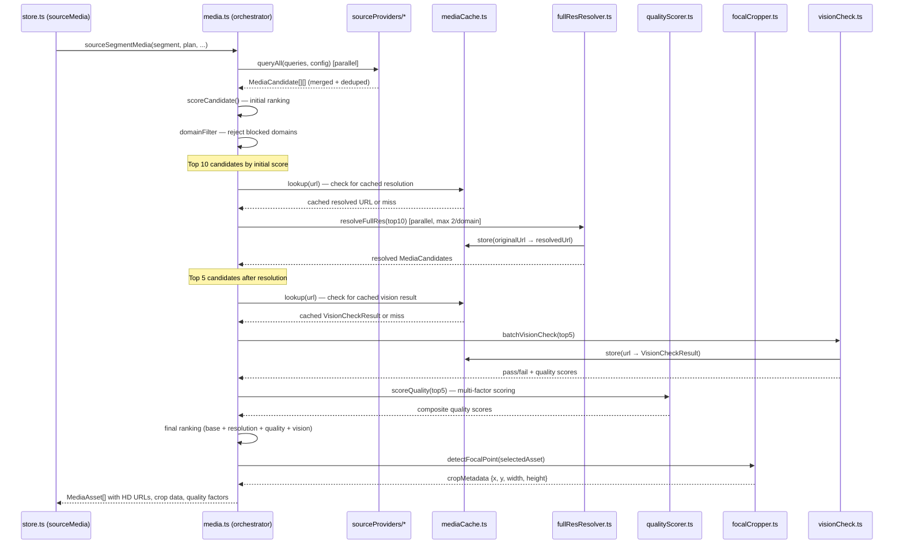
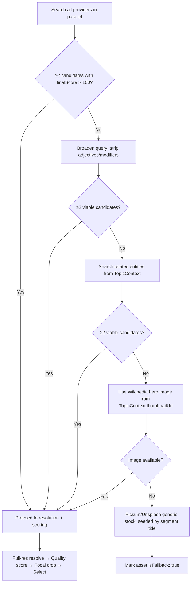

# Design Document: HD Media Acquisition

## Overview

The HD Media Acquisition feature transforms AutoTube's media pipeline from a "take whatever the search API returns" approach into a professional-grade visual acquisition system. The current pipeline accepts thumbnail-resolution images from DuckDuckGo and Wikimedia, producing blurry visuals that undermine video quality. This design introduces six interconnected subsystems that work together to deliver sharp, well-composed, properly-cropped HD visuals for every video segment.

The architecture follows a pipeline pattern: **Search → Merge → Resolve → Score → Crop → Select**, with caching at the Resolve and Score stages to avoid redundant network calls. Each stage is independently testable and gracefully degrades when external services are unavailable.

### Key Design Decisions

1. **Provider adapter pattern** — Each image source (Pexels, Pixabay, Flickr, government archives) is implemented as a standalone adapter behind a common `SourceProvider` interface. This keeps the harvester orchestrator clean and makes adding new sources trivial.

2. **Reka Edge reuse** — The existing Reka Edge vision model (already used for `visionCheck.ts` and `blindReview.ts`) is reused for focal-point detection and multi-factor quality scoring. This avoids introducing new AI dependencies and leverages the existing OpenRouter integration pattern.

3. **Two-tier caching** — `localStorage` for cross-session persistence of URL resolutions and vision check results; in-memory `Map` for session-scoped image data. This matches the existing secure storage pattern in the codebase.

4. **Non-blocking fallbacks everywhere** — Every external call (page fetch, API query, vision model) has a timeout and a fallback path. The pipeline never blocks on a single failure.

## Architecture

### High-Level Pipeline Flow



### Fallback Chain Flow



## Components and Interfaces

### New Modules

#### 1. `src/services/sourceProviders/types.ts` — Provider Interface

Defines the common contract all source providers implement.

```typescript
import type { MediaCandidate } from '../media';

export interface SourceProviderConfig {
  apiKey?: string;
  signal?: AbortSignal;
  maxResults?: number;
}

export interface SourceProvider {
  readonly name: string;
  readonly requiresKey: boolean;
  isAvailable(config: SourceProviderConfig): boolean;
  search(query: string, config: SourceProviderConfig): Promise<MediaCandidate[]>;
}
```

#### 2. `src/services/sourceProviders/pexels.ts`

Queries the Pexels API. Returns up to 15 candidates per query with full dimensions and photographer attribution. Sets `baseScore: 170`.

```typescript
export class PexelsProvider implements SourceProvider {
  readonly name = 'Pexels';
  readonly requiresKey = true;
  
  isAvailable(config: SourceProviderConfig): boolean {
    return Boolean(config.apiKey);
  }
  
  async search(query: string, config: SourceProviderConfig): Promise<MediaCandidate[]> {
    // GET https://api.pexels.com/v1/search?query={query}&per_page=15
    // Authorization: {apiKey}
    // Maps response.photos[] → MediaCandidate with baseScore 170
    // Includes photographer in source field for attribution
  }
}
```

#### 3. `src/services/sourceProviders/pixabay.ts`

Queries the Pixabay API. Returns up to 15 candidates per query. Sets `baseScore: 160`.

```typescript
export class PixabayProvider implements SourceProvider {
  readonly name = 'Pixabay';
  readonly requiresKey = true;
  
  async search(query: string, config: SourceProviderConfig): Promise<MediaCandidate[]> {
    // GET https://pixabay.com/api/?key={apiKey}&q={query}&per_page=15&image_type=photo
    // Maps response.hits[] → MediaCandidate with baseScore 160
    // Uses largeImageURL for full resolution
  }
}
```

#### 4. `src/services/sourceProviders/flickr.ts`

Queries the Flickr API filtered to Creative Commons licenses. Returns up to 15 candidates. Sets `baseScore: 140`. Includes license type in `source` field.

```typescript
export class FlickrProvider implements SourceProvider {
  readonly name = 'Flickr';
  readonly requiresKey = true;
  
  async search(query: string, config: SourceProviderConfig): Promise<MediaCandidate[]> {
    // GET https://api.flickr.com/services/rest/?method=flickr.photos.search
    //   &api_key={apiKey}&text={query}&license=1,2,3,4,5,6,9,10
    //   &extras=url_l,url_o,o_dims&per_page=15&format=json&nojsoncallback=1
    // Maps response.photos.photo[] → MediaCandidate with baseScore 140
    // Includes "Flickr CC-BY" (or similar) in source field
  }
}
```

#### 5. `src/services/sourceProviders/govPress.ts`

Queries government press photo archives for political/military/international topics. Returns public domain candidates.

```typescript
export class GovPressProvider implements SourceProvider {
  readonly name = 'Government Press';
  readonly requiresKey = false;
  
  isAvailable(): boolean { return true; }
  
  async search(query: string, config: SourceProviderConfig): Promise<MediaCandidate[]> {
    // Queries whitehouse.gov, defense.gov, nato.int photo galleries
    // Uses Open Graph meta tags and structured data to find images
    // Sets baseScore: 150 (public domain, high authority)
    // Only activated for topics matching political/military/international keywords
  }
}
```

#### 6. `src/services/sourceProviders/index.ts` — Provider Registry

Aggregates all providers and exposes a parallel query function.

```typescript
import type { SourceProvider, SourceProviderConfig } from './types';
import type { MediaCandidate } from '../media';
import type { AppConfig } from '../../types';

export function getAllProviders(): SourceProvider[];

export function getAvailableProviders(config: AppConfig): SourceProvider[];

/**
 * Query all available providers in parallel with a 10s timeout per provider.
 * Failed/timed-out providers are silently skipped.
 * Returns merged, deduplicated candidates (highest baseScore wins per URL).
 */
export async function queryAllProviders(
  query: string,
  config: AppConfig,
  signal?: AbortSignal,
): Promise<MediaCandidate[]>;

/**
 * Deduplicate candidates by URL, keeping the one with the highest baseScore.
 */
export function deduplicateCandidates(candidates: MediaCandidate[]): MediaCandidate[];
```

#### 7. `src/services/fullResResolver.ts` — Full-Resolution URL Resolver

Fetches source pages and extracts the highest-resolution version of candidate images.

```typescript
export interface ResolveResult {
  resolvedUrl: string;
  width?: number;
  height?: number;
  changed: boolean;
}

export interface ResolverOptions {
  signal?: AbortSignal;
  cache?: MediaCache;
  /** Max concurrent requests to the same domain. Default: 2 */
  domainConcurrency?: number;
  /** Timeout per page fetch in ms. Default: 8000 */
  timeoutMs?: number;
}

/**
 * Resolve a single candidate's full-resolution URL from its source page.
 * 
 * Resolution strategy (in order):
 * 1. Parse <meta property="og:image"> for hero image
 * 2. Parse srcset attributes, select largest width descriptor
 * 3. Parse JSON-LD structured data for image objects
 * 4. WordPress detection: strip dimension suffixes (-1024x768) from filename
 * 5. Find  elements ≥1200px wide within article body
 * 6. Match gallery images by URL pattern similarity to original
 * 
 * Falls back to original URL if source page is unreachable or no upgrade found.
 */
export async function resolveFullResolution(
  candidate: MediaCandidate,
  options?: ResolverOptions,
): Promise<ResolveResult>;

/**
 * Batch-resolve the top N candidates with per-domain rate limiting.
 * Respects robots.txt before fetching each domain.
 */
export async function batchResolve(
  candidates: MediaCandidate[],
  options?: ResolverOptions,
): Promise<Map<string, ResolveResult>>;

/**
 * Check robots.txt for a domain. Returns true if fetching is allowed.
 * Results are cached for the session.
 */
export async function checkRobotsTxt(
  domain: string,
  options?: { signal?: AbortSignal; timeoutMs?: number },
): Promise<boolean>;

/**
 * Strip WordPress dimension suffixes from image URLs.
 * e.g., "photo-1024x768.jpg" → "photo.jpg"
 */
export function stripWordPressDimensions(url: string): string;

/**
 * Extract the highest-resolution image URL from an HTML document string.
 * Pure function — no network calls.
 */
export function extractBestImageUrl(
  html: string,
  originalUrl: string,
  baseUrl: string,
): { url: string; width?: number; height?: number } | null;
```

#### 8. `src/services/qualityScorer.ts` — Multi-Factor Image Quality Scoring

Uses Reka Edge to evaluate sharpness, lighting, composition, vibrancy, and relevance.

```typescript
export interface QualityFactors {
  sharpness: number;    // 0-10
  lighting: number;     // 0-10
  composition: number;  // 0-10
  vibrancy: number;     // 0-10
  relevance: number;    // 0-10
}

export interface QualityScorerResult {
  factors: QualityFactors;
  compositeScore: number; // 0-200 (weighted, scaled)
}

/** Weight configuration for composite score calculation */
export const QUALITY_WEIGHTS = {
  sharpness: 0.25,
  lighting: 0.20,
  composition: 0.15,
  vibrancy: 0.15,
  relevance: 0.25,
} as const;

/**
 * Compute the weighted composite score from quality factors.
 * Pure function: compositeScore = sum(factor * weight) * 20, scaled to 0-200.
 */
export function computeCompositeScore(factors: QualityFactors): number;

/**
 * Build the Reka Edge prompt for multi-factor quality assessment.
 * Returns system + user message parts for the OpenRouter API call.
 */
export function buildQualityScorerPrompt(
  imageUrl: string,
  visualConcept: string,
): { system: string; user: Array<{ type: string; [key: string]: unknown }> };

/**
 * Parse the raw JSON response from Reka Edge into validated QualityFactors.
 * Clamps each factor to [0, 10]. Returns default factors (all 5) on parse failure.
 */
export function parseQualityResponse(raw: unknown): QualityFactors;

/**
 * Score a single candidate image using Reka Edge.
 * Makes one API call that evaluates all five factors simultaneously.
 */
export async function scoreImageQuality(
  imageUrl: string,
  visualConcept: string,
  apiKey: string,
  options?: { signal?: AbortSignal },
): Promise<QualityScorerResult | null>;

/**
 * Batch-score the top N candidates. Processes in parallel with concurrency limit.
 * Falls back to existing scoreCandidate() if Reka Edge is unavailable.
 */
export async function batchScoreQuality(
  candidates: MediaCandidate[],
  visualConcept: string,
  apiKey: string,
  options?: { signal?: AbortSignal; concurrency?: number },
): Promise<Map<string, QualityScorerResult>>;
```

#### 9. `src/services/focalCropper.ts` — Smart Aspect Ratio Cropping

Uses Reka Edge to detect focal points and compute 16:9 crop rectangles.

```typescript
export interface FocalPoint {
  x: number; // 0-1 percentage of image width
  y: number; // 0-1 percentage of image height
}

export interface CropMetadata {
  x: number;      // pixels from left
  y: number;      // pixels from top
  width: number;  // crop width in pixels
  height: number; // crop height in pixels
}

export interface FocalCropResult {
  focalPoint: FocalPoint;
  crop: CropMetadata;
  method: 'vision' | 'center';
}

/** Aspect ratio range that counts as "already 16:9 enough" */
export const ASPECT_RATIO_MIN = 1.6;
export const ASPECT_RATIO_MAX = 1.9;
export const TARGET_ASPECT_RATIO = 16 / 9; // 1.7778

/**
 * Check if an image needs cropping based on its aspect ratio.
 */
export function needsCropping(width: number, height: number): boolean;

/**
 * Compute a 16:9 crop rectangle centered on a focal point,
 * constrained to remain within image boundaries.
 * Pure function — no network calls.
 */
export function computeCropRect(
  imageWidth: number,
  imageHeight: number,
  focalPoint: FocalPoint,
): CropMetadata;

/**
 * Compute a center-crop rectangle (fallback when vision model is unavailable).
 * Pure function.
 */
export function computeCenterCrop(
  imageWidth: number,
  imageHeight: number,
): CropMetadata;

/**
 * Detect the focal point of an image using Reka Edge vision model.
 * Returns null if the API is unavailable or fails.
 * Completes within 5 seconds (timeout enforced).
 */
export async function detectFocalPoint(
  imageUrl: string,
  apiKey: string,
  options?: { signal?: AbortSignal },
): Promise<FocalPoint | null>;

/**
 * Full focal crop pipeline: detect focal point → compute crop.
 * Falls back to center-crop if vision model is unavailable.
 */
export async function focalCrop(
  imageUrl: string,
  imageWidth: number,
  imageHeight: number,
  apiKey: string,
  options?: { signal?: AbortSignal },
): Promise<FocalCropResult>;
```

#### 10. `src/services/mediaCache.ts` — Resolution Caching Layer

Two-tier cache: `localStorage` for persistent URL/vision data, in-memory for session image data.

```typescript
export interface CacheEntry<T> {
  data: T;
  timestamp: number; // Date.now()
}

export const CACHE_TTL_MS = 24 * 60 * 60 * 1000; // 24 hours

export class MediaCache {
  private memoryCache: Map<string, CacheEntry<unknown>>;
  private readonly storagePrefix: string;

  constructor(storagePrefix?: string);

  /**
   * Check if a cache entry exists and is not expired.
   */
  isValid<T>(key: string, tier: 'persistent' | 'memory'): boolean;

  /**
   * Get a cached value. Returns null if missing or expired.
   */
  get<T>(key: string, tier: 'persistent' | 'memory'): T | null;

  /**
   * Store a value in the specified tier.
   * For 'persistent': writes to localStorage (falls back to memory if full).
   * For 'memory': writes to in-memory Map only.
   */
  set<T>(key: string, value: T, tier: 'persistent' | 'memory'): void;

  /**
   * Remove expired entries from localStorage.
   */
  pruneExpired(): void;

  /**
   * Clear all cache entries (both tiers).
   */
  clear(): void;

  // Convenience methods for common cache operations:

  getCachedResolution(originalUrl: string): ResolveResult | null;
  setCachedResolution(originalUrl: string, result: ResolveResult): void;

  getCachedVisionResult(imageUrl: string): VisionCheckResult | null;
  setCachedVisionResult(imageUrl: string, result: VisionCheckResult): void;

  getCachedImageData(url: string): Blob | null;
  setCachedImageData(url: string, data: Blob): void;
}
```

### Modified Modules

#### `src/services/media.ts` — Harvester Integration

The existing `harvestMediaWithSafetyNet` function is modified to:

1. **Replace inline provider calls** with `queryAllProviders()` from the provider registry, which runs all available providers (DDG, Wikimedia, Pexels, Pixabay, Flickr, GovPress, Serper) in parallel.
2. **Insert resolution stage** after initial scoring: call `batchResolve()` on the top 10 candidates.
3. **Insert quality scoring stage** after resolution: call `batchScoreQuality()` on the top 5 candidates.
4. **Insert focal cropping** after final selection: call `focalCrop()` on each selected asset.
5. **Integrate cache lookups** before resolution and vision check stages.
6. **Emit progress messages** through a new `ProgressReporter` callback at each stage.
7. **Implement the fallback chain** as a structured sequence of broadening strategies.

The `sourceSegmentMedia` function gains a `progressCallback` parameter that the store passes through from `setProcessingMessage` / `setProcessingProgress`.

#### `src/types.ts` — Schema Extensions

New optional fields on `MediaAsset`:

```typescript
export interface MediaAsset {
  // ... existing fields ...
  
  /** 16:9 crop rectangle in pixels, applied by the renderer */
  cropMetadata?: { x: number; y: number; width: number; height: number };
  
  /** Multi-factor quality scores from Reka Edge (each 0-10) */
  qualityFactors?: {
    sharpness: number;
    lighting: number;
    composition: number;
    vibrancy: number;
    relevance: number;
  };
  
  /** Full-resolution dimensions after URL resolution */
  resolvedWidth?: number;
  resolvedHeight?: number;
  
  /** Full-resolution URL if different from original url */
  resolvedUrl?: string;
}
```

New optional fields on `AppConfig`:

```typescript
export interface AppConfig {
  // ... existing fields ...
  
  pexelsKey?: string;
  pixabayKey?: string;
  flickrKey?: string;
}
```

#### `src/store.ts` — Settings & Progress

- The `DEFAULT_APP_CONFIG` gains `pexelsKey`, `pixabayKey`, `flickrKey` fields (empty strings).
- The `sourceMedia` callback passes `setProcessingMessage` and `setProcessingProgress` through to the harvester for granular progress reporting.
- The `setAppConfig` callback persists the new API keys through the existing secure storage mechanism.

#### `src/components/SettingsModal.tsx` — New API Key Fields

- Three new input fields for Pexels, Pixabay, and Flickr API keys.
- Placed alongside existing API key fields in the settings form.
- Keys are saved/loaded through the existing `appConfig` / `setAppConfig` flow.

#### `src/services/videoRenderer.ts` — Crop Application

- When rendering a `MediaAsset` with `cropMetadata`, the renderer applies the crop coordinates via `drawImage(img, crop.x, crop.y, crop.width, crop.height, 0, 0, canvasWidth, canvasHeight)`.

## Data Models

### MediaCandidate (Extended)

The existing `MediaCandidate` interface in `media.ts` is extended:

```typescript
export interface MediaCandidate {
  url: string;
  thumbnailUrl?: string;
  alt: string;
  source: string;
  sourceUrl?: string;
  width?: number;
  height?: number;
  baseScore: number;
  query: string;
  finalScore: number;
  type: 'image' | 'video';
  
  // New fields from resolution stage
  resolvedUrl?: string;
  resolvedWidth?: number;
  resolvedHeight?: number;
  
  // New fields from quality scoring stage
  qualityFactors?: QualityFactors;
  qualityCompositeScore?: number;
  
  // New field for license tracking
  license?: string;
}
```

### Cache Storage Schema (localStorage)

```
atube_cache_res:{url}  → JSON { data: ResolveResult, timestamp: number }
atube_cache_vis:{url}  → JSON { data: VisionCheckResult, timestamp: number }
```

### Progress Message Format

```typescript
interface ProgressUpdate {
  phase: 'search' | 'resolve' | 'score' | 'select';
  message: string;
  percentage: number;
}
```

Progress percentage allocation per segment:
- **Search phase** (0–30%): "Searching N sources for '[query]'..." → "Found N candidates, filtering..."
- **Resolve phase** (30–50%): "Resolving full-resolution for top N..."
- **Score phase** (50–75%): "Vision-checking top N..."
- **Select phase** (75–100%): "Selected: [source], [width]×[height]"


## Correctness Properties

*A property is a characteristic or behavior that should hold true across all valid executions of a system — essentially, a formal statement about what the system should do. Properties serve as the bridge between human-readable specifications and machine-verifiable correctness guarantees.*

### Property 1: HTML extraction selects the highest-resolution image

*For any* valid HTML document containing one or more `` tags, `<meta property="og:image">` tags, `srcset` attributes, or JSON-LD image data, `extractBestImageUrl` SHALL return the image URL with the largest pixel dimensions (width × height) that matches the original candidate URL pattern. If no higher-resolution image exists, it SHALL return `null`.

**Validates: Requirements 1.1, 1.4, 1.5**

### Property 2: srcset parsing selects the largest width descriptor

*For any* valid `srcset` attribute string containing one or more image descriptors with width values (e.g., `"img-480w.jpg 480w, img-1024w.jpg 1024w"`), the srcset parser SHALL return the URL associated with the numerically largest width descriptor.

**Validates: Requirements 1.2**

### Property 3: WordPress dimension suffix stripping round-trip

*For any* image URL string, `stripWordPressDimensions` SHALL:
- If the URL contains a WordPress dimension suffix pattern (`-{N}x{N}` before the file extension), return the URL with the suffix removed.
- If the URL does not contain such a suffix, return the URL unchanged.

In both cases, the result SHALL be a valid URL string. Applying `stripWordPressDimensions` twice SHALL produce the same result as applying it once (idempotence).

**Validates: Requirements 1.3**

### Property 4: Candidate deduplication preserves highest score per URL

*For any* array of `MediaCandidate` objects (possibly containing duplicate URLs with different `baseScore` values), `deduplicateCandidates` SHALL return an array where:
- Every URL appears exactly once.
- For each URL, the kept candidate has the maximum `baseScore` among all candidates sharing that URL.
- The output length is less than or equal to the input length.

**Validates: Requirements 2.7**

### Property 5: Provider normalization produces valid MediaCandidates

*For any* source provider and any valid API response from that provider, the returned `MediaCandidate[]` SHALL have every element containing non-empty `source`, `alt`, and `query` strings, a numeric `baseScore`, and a `type` of either `'image'` or `'video'`.

**Validates: Requirements 2.9**

### Property 6: Aspect ratio cropping threshold is correct

*For any* image with dimensions `(width, height)` where both are positive integers, `needsCropping` SHALL return `true` if and only if the aspect ratio `width / height` is outside the range `[1.6, 1.9]`.

**Validates: Requirements 3.1, 3.7**

### Property 7: Crop rectangle is valid 16:9 within image bounds

*For any* image dimensions `(width, height)` where both are positive integers and any focal point `(x, y)` where `0 ≤ x ≤ 1` and `0 ≤ y ≤ 1`, `computeCropRect` SHALL return a `CropMetadata` where:
- `crop.x ≥ 0` and `crop.y ≥ 0`
- `crop.x + crop.width ≤ imageWidth` and `crop.y + crop.height ≤ imageHeight`
- `crop.width / crop.height` is approximately `16/9` (within floating-point tolerance of ±0.01)
- `crop.width > 0` and `crop.height > 0`

**Validates: Requirements 3.2**

### Property 8: Quality factor parsing clamps to valid range

*For any* raw JSON value (object, string, null, undefined, array, or malformed data), `parseQualityResponse` SHALL return a `QualityFactors` object where every factor (`sharpness`, `lighting`, `composition`, `vibrancy`, `relevance`) is an integer in the range `[0, 10]`.

**Validates: Requirements 4.2, 4.3, 4.4, 4.5, 4.6**

### Property 9: Composite quality score matches weighted formula

*For any* `QualityFactors` object where each factor is in `[0, 10]`, `computeCompositeScore` SHALL return a value equal to `(sharpness × 0.25 + lighting × 0.20 + composition × 0.15 + vibrancy × 0.15 + relevance × 0.25) × 20`, and the result SHALL be in the range `[0, 200]`.

**Validates: Requirements 4.7**

### Property 10: Cache TTL enforcement

*For any* cache entry with a stored `timestamp`, `isValid` SHALL return `true` if and only if `Date.now() - timestamp < 24 * 60 * 60 * 1000` (24 hours). Entries at or beyond the 24-hour boundary SHALL be treated as expired.

**Validates: Requirements 6.2, 6.4, 6.6**

### Property 11: MediaAsset JSON round-trip

*For any* valid `MediaAsset` object (including all optional fields: `cropMetadata`, `qualityFactors`, `resolvedWidth`, `resolvedHeight`, `resolvedUrl`, `trace`), `JSON.parse(JSON.stringify(asset))` SHALL produce an object deeply equal to the original (excluding `Date` fields which serialize to ISO strings).

**Validates: Requirements 10.6**

### Property 12: Seeded stock images vary by segment title

*For any* two distinct non-empty segment title strings, the Picsum fallback URLs generated by seeding with each title SHALL be different, ensuring visual variety across segments.

**Validates: Requirements 8.7**

## Error Handling

### Strategy: Graceful Degradation at Every Layer

The HD Media Acquisition pipeline follows a "never block, always degrade" philosophy. Every external call has a timeout, every stage has a fallback, and the pipeline guarantees output even when everything goes wrong.

### Error Categories and Responses

| Error Source | Timeout | Fallback Behavior | Logging |
|---|---|---|---|
| Source Provider API failure | 10s | Skip provider, continue with others | `logger.warn` with provider name |
| Source page fetch (resolver) | 8s | Return original candidate URL unchanged | `logger.warn` with URL |
| robots.txt check failure | 3s | Assume allowed (permissive default) | `logger.info` |
| Reka Edge vision check | 15s | Skip vision check, use domain-filtered scores | `logger.warn` |
| Reka Edge quality scorer | 15s | Fall back to existing `scoreCandidate()` | `logger.warn` |
| Reka Edge focal point detection | 5s | Fall back to center-crop | `logger.warn` |
| localStorage full/unavailable | N/A | Fall back to in-memory-only caching | `logger.info` |
| All providers return 0 results | N/A | Trigger fallback chain (broaden → entities → wiki → stock) | `logger.warn` per stage |
| AbortSignal fired (user cancel) | N/A | Re-throw `AbortError` — pipeline stops cleanly | `logger.info` |

### Cancellation Support

All async functions accept an optional `AbortSignal` parameter. When the signal fires:
1. In-flight `fetch` calls are cancelled via the signal.
2. The function re-throws the `AbortError` without catching it.
3. The store's `sourceMedia` callback catches the `AbortError` and resets UI state.

This matches the existing cancellation pattern used in `blindReview.ts`, `visionCheck.ts`, and `media.ts`.

### Rate Limiting

The full-resolution resolver enforces per-domain concurrency limits:
- Maximum 2 concurrent requests to the same domain.
- Implemented via a `Map<string, Promise[]>` semaphore in `batchResolve`.
- If a domain's queue is full, the request waits for the oldest in-flight request to complete.

### Cache Error Handling

- `localStorage.setItem` failures (quota exceeded, private browsing) are caught silently.
- The cache falls back to in-memory storage without throwing.
- `JSON.parse` failures on cached data are caught — the entry is treated as a cache miss.
- Corrupted cache entries are pruned on next access.

## Testing Strategy

### Testing Framework

- **Unit tests**: Vitest (already configured in the project)
- **Property-based tests**: fast-check v4.7.0 (already installed as a dev dependency)
- **Integration tests**: Vitest with mocked `fetch` calls
- **E2E tests**: Playwright (existing setup)

### Property-Based Tests

Each correctness property from the design document is implemented as a single property-based test using `fast-check`. Each test runs a minimum of 100 iterations.

**Tag format**: `Feature: hd-media-acquisition, Property {N}: {title}`

| Property | Test File | Generator Strategy |
|---|---|---|
| P1: HTML extraction | `fullResResolver.test.ts` | Generate HTML with random img/meta/srcset/JSON-LD combinations |
| P2: srcset parsing | `fullResResolver.test.ts` | Generate srcset strings with random width descriptors |
| P3: WP dimension stripping | `fullResResolver.test.ts` | Generate URLs with/without `-NNNxNNN` suffixes |
| P4: Deduplication | `sourceProviders/index.test.ts` | Generate MediaCandidate arrays with duplicate URLs |
| P5: Provider normalization | `sourceProviders/*.test.ts` | Generate mock API responses per provider |
| P6: Aspect ratio threshold | `focalCropper.test.ts` | Generate random (width, height) pairs |
| P7: Crop rect validity | `focalCropper.test.ts` | Generate random dimensions + focal points |
| P8: Quality factor clamping | `qualityScorer.test.ts` | Generate arbitrary JSON values |
| P9: Composite score formula | `qualityScorer.test.ts` | Generate random QualityFactors |
| P10: Cache TTL | `mediaCache.test.ts` | Generate random timestamps relative to now |
| P11: MediaAsset round-trip | `types.test.ts` | Generate random MediaAsset objects with all optional fields |
| P12: Seeded stock variety | `media.test.ts` | Generate pairs of distinct segment titles |

### Unit Tests (Example-Based)

| Module | Key Test Cases |
|---|---|
| `fullResResolver.ts` | Timeout fallback (1.6), no-upgrade fallback (1.7), robots.txt blocking |
| `sourceProviders/pexels.ts` | Correct baseScore (170), photographer attribution, max 15 results |
| `sourceProviders/pixabay.ts` | Correct baseScore (160), largeImageURL usage |
| `sourceProviders/flickr.ts` | CC license filtering, baseScore (140), license in source field |
| `sourceProviders/govPress.ts` | Topic keyword activation, public domain marking |
| `qualityScorer.ts` | API unavailable fallback, top-5 batch limit |
| `focalCropper.ts` | Center-crop fallback, skip for 16:9 images |
| `mediaCache.ts` | localStorage fallback, expired entry pruning |
| `media.ts` | Fallback chain stages, progress message formats |

### Integration Tests

| Scenario | What's Tested |
|---|---|
| Full pipeline with all providers mocked | End-to-end flow from query to MediaAsset[] |
| Provider failure resilience | One provider times out, others succeed |
| Cache hit path | Second run uses cached resolutions and vision results |
| Cancellation mid-pipeline | AbortSignal fires during resolution stage |
| Video renderer with cropMetadata | drawImage called with correct crop coordinates |

### Test Organization

```
src/services/__tests__/
  fullResResolver.test.ts
  qualityScorer.test.ts
  focalCropper.test.ts
  mediaCache.test.ts
  sourceProviders/
    pexels.test.ts
    pixabay.test.ts
    flickr.test.ts
    govPress.test.ts
    index.test.ts
  media.test.ts          (extended with new integration tests)
  types.test.ts          (MediaAsset round-trip property)
```
