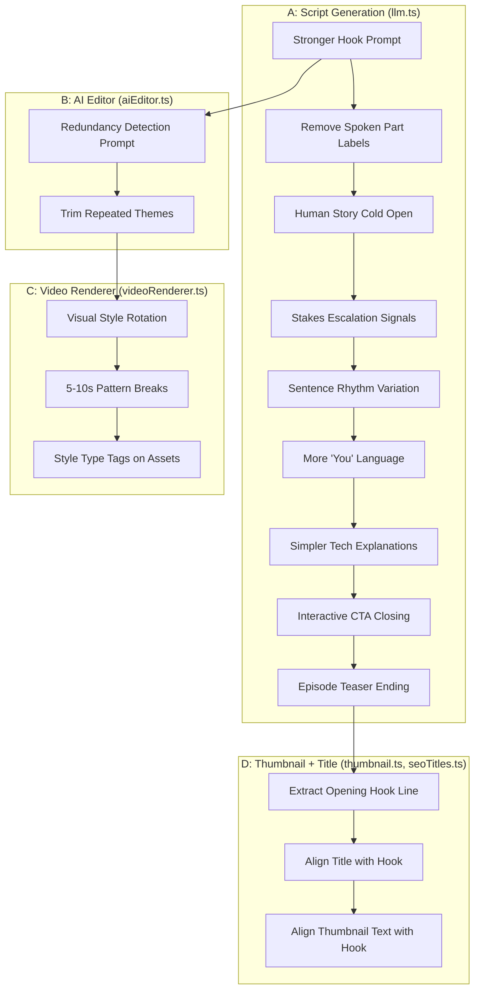
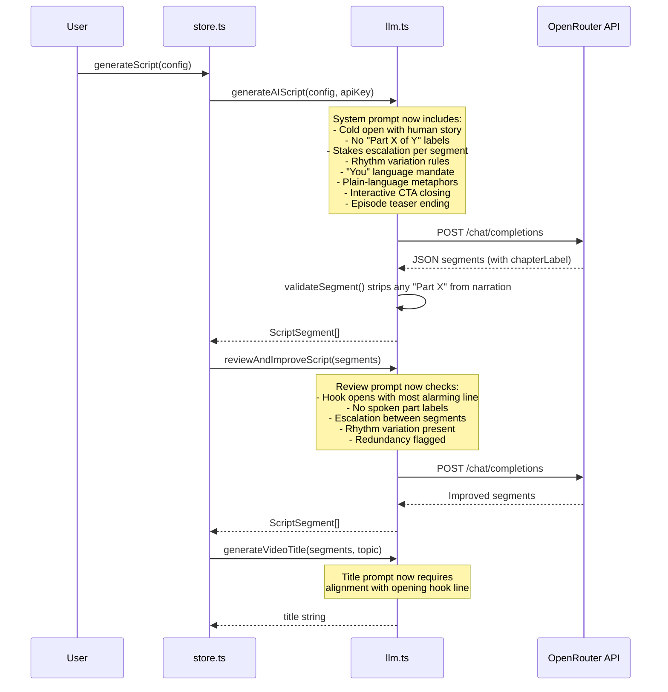
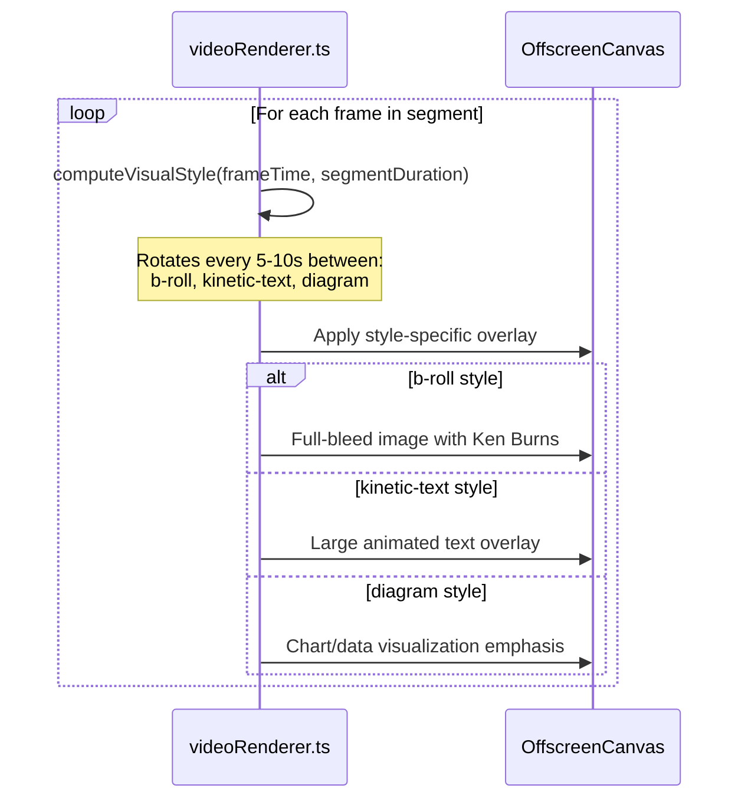
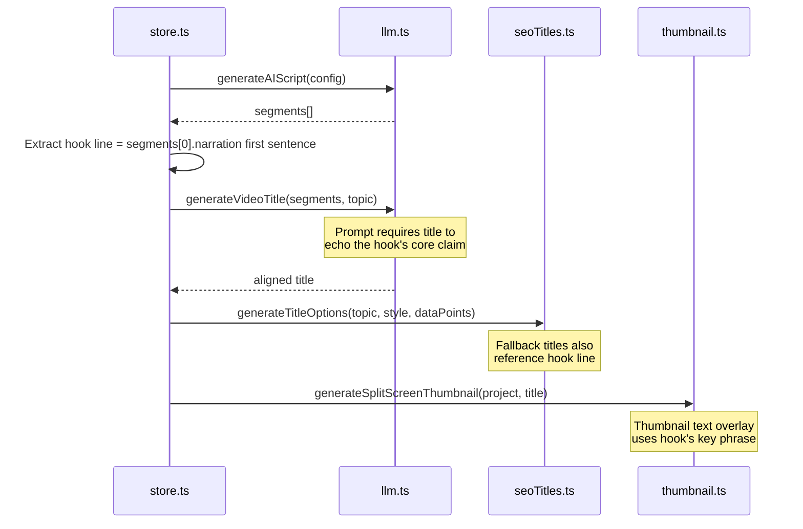

# Design Document: Video Quality from Reviews

## Overview

This feature encodes 12 specific improvements derived from AI video review feedback directly into AutoTube's codebase so that ALL future videos benefit automatically. The improvements span three major subsystems: **script generation** (LLM prompts in `llm.ts`), **AI editing** (redundancy trimming in `aiEditor.ts`), and **video rendering/assembly** (visual pattern breaks in `videoRenderer.ts`, thumbnail-title alignment in `thumbnail.ts` and `seoTitles.ts`).

The changes are primarily prompt engineering and template-level modifications — they reshape the instructions given to the LLM and the rendering pipeline's visual behavior without altering the core data model or pipeline architecture. The `ScriptSegment` type gains one optional field (`chapterLabel`) to support on-screen chapter text without spoken labels, and the renderer gains a visual style rotation system for pattern breaks.

The design groups the 12 improvements into four workstreams: (A) Script Generation Prompt Overhaul (items 1–9), (B) AI Editor Redundancy Trimming (item 12), (C) Visual Pattern Breaks in Rendering (item 10), and (D) Thumbnail-Title-Hook Alignment (item 11).

## Architecture



## Sequence Diagrams

### Script Generation Flow (Improvements 1–9)



### Visual Pattern Break Flow (Improvement 10)



### Thumbnail-Title-Hook Alignment Flow (Improvement 11)



## Components and Interfaces

### Component 1: Enhanced Script Generation Prompt (`llm.ts`)

**Purpose**: Rewrites the system and user prompts for `generateAIScript()` and `reviewAndImproveScript()` to encode improvements 1–9.

**Interface**:
```typescript
// Existing function signatures remain unchanged.
// The changes are internal to the prompt strings.

export function generateAIScript(
  config: TopicConfig,
  apiKey: string,
  model?: string,
  signal?: AbortSignal,
): Promise<ScriptSegment[]>;

export function reviewAndImproveScript(
  segments: ScriptSegment[],
  topic: string,
  apiKey: string,
  signal?: AbortSignal,
): Promise<ScriptSegment[]>;

export function generateVideoTitle(
  segments: ScriptSegment[],
  topic: string,
  apiKey: string,
  signal?: AbortSignal,
): Promise<string>;
```

**Responsibilities**:
- Encode "strongest hook first" rule: the system prompt's HOOK section instructs the LLM to open with the single most compelling/alarming line before any structure
- Prohibit spoken part labels: add explicit ban on "Part X of Y" in narration text; add `chapterLabel` field to JSON schema for internal structure
- Mandate human story cold open: HOOK + CONTEXT segments must lead with a named person's story
- Require stakes escalation: each segment's narration must feel heavier than the last, with explicit escalation signals
- Enforce sentence rhythm variation: mix short punchy sentences (2–5 words) with medium explanatory lines (10–20 words)
- Increase "you" language: at least 3 direct viewer addresses per script ("your data", "this affects you")
- Require plain-language metaphors for every technical term
- Replace generic outro with interactive binary CTA (YES/NO question with on-screen options)
- Replace generic sign-off with specific episode teaser for a related next topic

### Component 2: Part Label Sanitizer (`llm.ts`)

**Purpose**: Post-processing guard that strips any "Part X of Y" patterns from narration text even if the LLM ignores the prompt instruction.

**Interface**:
```typescript
/** Strips "Part X of Y" labels from narration text. */
export function stripPartLabels(narration: string): string;
```

**Responsibilities**:
- Regex-based removal of patterns like "Part 1 of 7", "Part 2:", "Section 3 of 5"
- Applied inside `validateSegment()` so every segment is sanitized regardless of source
- Preserves the rest of the narration text intact

### Component 3: AI Editor Redundancy Trimmer (`aiEditor.ts`)

**Purpose**: Adds redundancy detection instructions to the AI editor's system prompt so the LLM identifies and flags repeated themes/warnings.

**Interface**:
```typescript
// Existing function signature unchanged.
// The buildEditPrompt() system prompt gains a new editing dimension.

export function buildEditPrompt(project: VideoProject): { system: string; user: string };
```

**Responsibilities**:
- Add "Redundancy Trimming" as editing dimension #7 in the system prompt
- Instruct the LLM to identify segments where the same warning, theme, or statistic appears more than once
- For repeated content: shorten the second occurrence to a brief callback ("As we saw earlier...") or remove entirely
- Track trimmed content in the `rationale` field of each `SegmentEditEntry`

### Component 4: Visual Pattern Break System (`videoRenderer.ts`)

**Purpose**: Introduces a visual style rotation that changes the rendering approach every 5–10 seconds within a segment to prevent visual monotony.

**Interface**:
```typescript
/** Visual style types for pattern breaks. */
export type VisualStyleType = 'b-roll' | 'kinetic-text' | 'diagram';

/** Determines which visual style to use at a given point in a segment. */
export function computeVisualStyle(
  frameTimeSec: number,
  segmentDurationSec: number,
  segmentType: ScriptSegment['type'],
): VisualStyleType;

/** Applies a kinetic text overlay to the canvas. */
export function drawKineticTextOverlay(
  ctx: CanvasRenderingContext2D,
  width: number,
  height: number,
  text: string,
  progress: number,
): void;

/** Applies a diagram/data emphasis overlay to the canvas. */
export function drawDiagramOverlay(
  ctx: CanvasRenderingContext2D,
  width: number,
  height: number,
  concept: string,
  progress: number,
): void;
```

**Responsibilities**:
- Rotate visual style every 5–10 seconds (configurable interval)
- `b-roll`: standard full-bleed image with Ken Burns (current default behavior)
- `kinetic-text`: large animated text overlay highlighting a key phrase from the narration
- `diagram`: data visualization emphasis with chart-style framing and accent colors
- Integrate into the main render loop in `renderVideoToBlob()` without breaking existing frame capture logic

### Component 5: Thumbnail-Title-Hook Aligner (`thumbnail.ts`, `seoTitles.ts`)

**Purpose**: Ensures the thumbnail text, video title, and opening hook line all reference the same core claim or phrase.

**Interface**:
```typescript
/** Extracts the first sentence (hook line) from the intro segment's narration. */
export function extractHookLine(segments: ScriptSegment[]): string;

/** Generates title options that are aligned with the opening hook. */
export function generateHookAlignedTitles(
  topic: string,
  hookLine: string,
  style: string,
  dataPoints?: string[],
): TitleOption[];
```

**Responsibilities**:
- Extract the opening hook line from the first segment's narration
- Pass the hook line to `generateVideoTitle()` so the LLM prompt requires title-hook alignment
- Update `generateTitleOptions()` to produce fallback titles that echo the hook's core claim
- Update `generateSplitScreenThumbnail()` to use the hook's key phrase as the overlay text instead of the generic title

## Data Models

### Extended ScriptSegment

```typescript
export interface ScriptSegment {
  id: string;
  type: 'intro' | 'section' | 'transition' | 'outro';
  title: string;
  narration: string;
  visualNote: string;
  duration: number;
  /** Optional on-screen chapter label (not spoken). Added for improvement #2. */
  chapterLabel?: string;
}
```

**Validation Rules**:
- `chapterLabel` is optional; if present, must be a non-empty string ≤ 50 characters
- `narration` must not contain "Part X of Y" patterns (enforced by `stripPartLabels`)
- `narration` for intro segment must contain at least one direct viewer address ("you", "your")

### Visual Style Rotation Config

```typescript
export interface VisualStyleConfig {
  /** Seconds between style changes. Default: 7. Range: [5, 10]. */
  rotationIntervalSec: number;
  /** Ordered list of styles to cycle through. */
  styleSequence: VisualStyleType[];
  /** Whether to enable kinetic text overlays. Default: true. */
  enableKineticText: boolean;
  /** Whether to enable diagram overlays. Default: true. */
  enableDiagramOverlay: boolean;
}
```

**Validation Rules**:
- `rotationIntervalSec` must be in range [5, 10]
- `styleSequence` must contain at least 2 distinct styles
- At least one of `enableKineticText` or `enableDiagramOverlay` must be true

## Algorithmic Pseudocode

### Algorithm 1: Strip Part Labels

```typescript
const PART_LABEL_REGEX = /\b(?:Part|Section|Segment)\s+\d+\s*(?:of\s+\d+)?[:\s\-–—]*/gi;

function stripPartLabels(narration: string): string {
  // PRECONDITION: narration is a non-null string
  // POSTCONDITION: returned string contains no "Part X of Y" patterns
  //                all other text is preserved
  
  const cleaned = narration.replace(PART_LABEL_REGEX, '').trim();
  // Collapse any resulting double spaces
  return cleaned.replace(/\s{2,}/g, ' ');
}
```

**Preconditions:**
- `narration` is a non-null string

**Postconditions:**
- Returned string contains no matches for `PART_LABEL_REGEX`
- All non-matching text is preserved verbatim
- No leading/trailing whitespace

### Algorithm 2: Compute Visual Style Rotation

```typescript
function computeVisualStyle(
  frameTimeSec: number,
  segmentDurationSec: number,
  segmentType: ScriptSegment['type'],
): VisualStyleType {
  // PRECONDITION: frameTimeSec >= 0
  // PRECONDITION: segmentDurationSec > 0
  // POSTCONDITION: returns a valid VisualStyleType
  
  const ROTATION_INTERVAL = 7; // seconds
  const STYLES: VisualStyleType[] = ['b-roll', 'kinetic-text', 'diagram'];
  
  // Intro and outro segments always use b-roll for consistency
  if (segmentType === 'intro' || segmentType === 'outro') {
    return 'b-roll';
  }
  
  // For section/transition segments, rotate based on time
  const styleIndex = Math.floor(frameTimeSec / ROTATION_INTERVAL) % STYLES.length;
  return STYLES[styleIndex];
}
```

**Preconditions:**
- `frameTimeSec` is a non-negative number
- `segmentDurationSec` is a positive number
- `segmentType` is a valid segment type

**Postconditions:**
- Returns `'b-roll'` for intro/outro segments
- Returns a style from the rotation sequence for section/transition segments
- Style changes every `ROTATION_INTERVAL` seconds

**Loop Invariants:** N/A (no loops)

### Algorithm 3: Extract Hook Line

```typescript
function extractHookLine(segments: ScriptSegment[]): string {
  // PRECONDITION: segments is a non-empty array
  // POSTCONDITION: returns the first sentence of the intro segment's narration
  //                or empty string if no intro segment exists
  
  const intro = segments.find(s => s.type === 'intro');
  if (!intro) return '';
  
  // Extract first sentence: split on period, exclamation, or question mark
  // followed by a space or end of string
  const match = intro.narration.match(/^[^.!?]+[.!?]/);
  return match ? match[0].trim() : intro.narration.slice(0, 100).trim();
}
```

**Preconditions:**
- `segments` is a non-empty array of `ScriptSegment`

**Postconditions:**
- Returns the first sentence of the intro segment's narration
- If no intro segment exists, returns empty string
- Result is trimmed and at most ~100 characters

### Algorithm 4: Redundancy Detection Prompt Addition

```typescript
function buildRedundancyInstruction(): string {
  return `7. **Redundancy Trimming**: Scan all segment narrations for repeated themes, warnings, statistics, or phrases. If the same point appears in more than one segment:
   - Keep the FIRST occurrence at full strength
   - For the second occurrence: either (a) shorten to a brief callback like "As we saw earlier..." or (b) remove entirely and adjust duration
   - Flag trimmed content in the rationale field
   - Goal: every mention of a theme should land HARDER because it's not diluted by repetition`;
}
```

**Preconditions:** None

**Postconditions:**
- Returns a string containing the redundancy trimming instruction
- Instruction is formatted to match existing editing dimensions in the AI editor prompt

## Key Functions with Formal Specifications

### Function 1: stripPartLabels()

```typescript
export function stripPartLabels(narration: string): string
```

**Preconditions:**
- `narration` is a string (may be empty)

**Postconditions:**
- Returns a string with all "Part X of Y", "Section X of Y", "Segment X" patterns removed
- Non-matching text is preserved
- No double spaces in output
- Result is trimmed

### Function 2: computeVisualStyle()

```typescript
export function computeVisualStyle(
  frameTimeSec: number,
  segmentDurationSec: number,
  segmentType: ScriptSegment['type'],
): VisualStyleType
```

**Preconditions:**
- `frameTimeSec >= 0`
- `segmentDurationSec > 0`
- `segmentType` is one of `'intro' | 'section' | 'transition' | 'outro'`

**Postconditions:**
- Returns `'b-roll'` for intro/outro segments (always)
- For section/transition: returns style from `['b-roll', 'kinetic-text', 'diagram']` based on time rotation
- Style changes every 7 seconds (±0)
- Return value is always a valid `VisualStyleType`

### Function 3: extractHookLine()

```typescript
export function extractHookLine(segments: ScriptSegment[]): string
```

**Preconditions:**
- `segments` is an array (may be empty)

**Postconditions:**
- If array contains an intro segment: returns its first sentence (up to first `.!?`)
- If no intro segment: returns empty string
- Result length ≤ 100 characters
- Result is trimmed

### Function 4: drawKineticTextOverlay()

```typescript
export function drawKineticTextOverlay(
  ctx: CanvasRenderingContext2D,
  width: number,
  height: number,
  text: string,
  progress: number,
): void
```

**Preconditions:**
- `ctx` is a valid 2D rendering context
- `width > 0`, `height > 0`
- `text` is a non-empty string
- `0 <= progress <= 1`

**Postconditions:**
- Canvas has a large text overlay drawn at center
- Text opacity and scale animate based on `progress`
- Text is truncated to fit within canvas width with padding
- No mutations to canvas state beyond the overlay drawing (save/restore used)

### Function 5: drawDiagramOverlay()

```typescript
export function drawDiagramOverlay(
  ctx: CanvasRenderingContext2D,
  width: number,
  height: number,
  concept: string,
  progress: number,
): void
```

**Preconditions:**
- `ctx` is a valid 2D rendering context
- `width > 0`, `height > 0`
- `concept` is a string describing the data concept
- `0 <= progress <= 1`

**Postconditions:**
- Canvas has a data-emphasis overlay with accent borders and label
- Overlay animates in based on `progress`
- No mutations to canvas state beyond the overlay (save/restore used)

## Example Usage

```typescript
// Example 1: stripPartLabels in action
import { stripPartLabels } from './services/llm';

const raw = "Part 1 of 7: The world of AI is changing fast.";
const cleaned = stripPartLabels(raw);
// cleaned === "The world of AI is changing fast."

const raw2 = "Section 3 — Here's what you need to know.";
const cleaned2 = stripPartLabels(raw2);
// cleaned2 === "Here's what you need to know."

// Example 2: Visual style rotation
import { computeVisualStyle } from './services/videoRenderer';

computeVisualStyle(0, 20, 'section');    // 'b-roll' (0-7s)
computeVisualStyle(8, 20, 'section');    // 'kinetic-text' (7-14s)
computeVisualStyle(15, 20, 'section');   // 'diagram' (14-21s)
computeVisualStyle(5, 20, 'intro');      // 'b-roll' (intro always b-roll)

// Example 3: Hook line extraction
import { extractHookLine } from './services/seoTitles';

const segments = [
  { id: '1', type: 'intro' as const, title: 'Hook',
    narration: 'Meta just got fined $1.3 billion. And it might be the beginning of the end for Big Tech in Europe.',
    visualNote: '', duration: 20 },
  // ... more segments
];
const hook = extractHookLine(segments);
// hook === "Meta just got fined $1.3 billion."

// Example 4: Hook-aligned title generation
import { generateHookAlignedTitles } from './services/seoTitles';

const titles = generateHookAlignedTitles(
  'EU vs Big Tech',
  'Meta just got fined $1.3 billion.',
  'business_insider',
);
// titles[0].title includes reference to "$1.3 billion" or "Meta fine"
```

## Correctness Properties

1. **No spoken part labels**: For all segments produced by `generateAIScript()` and `reviewAndImproveScript()`, `segment.narration` must not match `/\bPart\s+\d+\s*(of\s+\d+)?/i`.

2. **Hook-first ordering**: The first segment (type `'intro'`) must have its narration begin with a concrete consequence or alarming fact, not a question or backstory setup.

3. **Visual style rotation coverage**: For any segment of duration ≥ 14 seconds with type `'section'`, at least 2 distinct `VisualStyleType` values must be used during rendering.

4. **Redundancy reduction**: After the AI edit pass, no two segments should contain the same statistic, warning phrase, or theme repeated verbatim (exact substring match of ≥ 10 words).

5. **Thumbnail-title-hook alignment**: The video title returned by `generateVideoTitle()` must share at least one significant keyword (≥ 5 chars, not a stop word) with the first sentence of the intro segment's narration.

6. **Interactive CTA presence**: The outro segment's narration must contain a binary question pattern (e.g., containing "yes or no", "agree or disagree", or a question mark followed by two options).

7. **Episode teaser presence**: The outro segment's narration must reference a specific related topic for a future video, not a generic sign-off like "more videos coming soon" or "thanks for watching".

8. **"You" language density**: Across all segments, the word "you" or "your" must appear at least 3 times total in the combined narration text.

9. **Sentence rhythm variation**: The intro segment's narration must contain at least one sentence of ≤ 5 words and at least one sentence of ≥ 12 words.

10. **stripPartLabels idempotency**: `stripPartLabels(stripPartLabels(text)) === stripPartLabels(text)` for all input strings.

## Error Handling

### Error Scenario 1: LLM Ignores Prompt Instructions

**Condition**: The LLM returns segments with "Part X of Y" labels despite the prompt prohibiting them.
**Response**: `stripPartLabels()` in `validateSegment()` removes them as a post-processing guard.
**Recovery**: The script review pass (`reviewAndImproveScript`) provides a second chance to fix issues. If both fail, the sanitizer catches it.

### Error Scenario 2: Visual Style Rotation on Short Segments

**Condition**: A segment is shorter than the rotation interval (< 7 seconds), so only one style is used.
**Response**: `computeVisualStyle()` returns the first style in the sequence (`'b-roll'`), which is the current default behavior.
**Recovery**: No degradation — short segments naturally don't need pattern breaks.

### Error Scenario 3: Hook Line Extraction Fails

**Condition**: The intro segment has no clear sentence boundary (no `.!?` in narration).
**Response**: `extractHookLine()` falls back to the first 100 characters of the narration.
**Recovery**: Title generation still works with the truncated hook; thumbnail uses whatever text is available.

### Error Scenario 4: AI Editor Redundancy Pass Fails

**Condition**: The AI editor LLM call fails or returns invalid JSON.
**Response**: Existing fallback in `runAIEditPass()` creates a default no-op `EditPlan`, preserving the original script.
**Recovery**: The redundancy trimming is a best-effort optimization; the video is still valid without it.

### Error Scenario 5: Canvas Context Unavailable for Overlays

**Condition**: `drawKineticTextOverlay()` or `drawDiagramOverlay()` receives a null context.
**Response**: Functions check for null context and return early without drawing.
**Recovery**: The frame renders without the overlay, falling back to standard b-roll appearance.

## Testing Strategy

### Unit Testing Approach

- **`stripPartLabels()`**: Test with various "Part X of Y" patterns, edge cases (no match, multiple matches, partial matches), and verify idempotency.
- **`computeVisualStyle()`**: Test rotation at boundary times (0s, 7s, 14s), intro/outro override, and edge cases (0 duration, very long segments).
- **`extractHookLine()`**: Test with various sentence structures, empty arrays, missing intro segments, and narrations without sentence boundaries.
- **`generateHookAlignedTitles()`**: Test that returned titles share keywords with the hook line.

### Property-Based Testing Approach

**Property Test Library**: fast-check (already in devDependencies)

- **stripPartLabels idempotency**: For any arbitrary string, applying `stripPartLabels` twice yields the same result as applying it once.
- **computeVisualStyle determinism**: For the same inputs, `computeVisualStyle` always returns the same output.
- **computeVisualStyle range**: For any valid inputs, the return value is always one of the three valid `VisualStyleType` values.
- **extractHookLine length bound**: For any array of segments, the result length is ≤ 100 characters.

### Integration Testing Approach

- End-to-end pipeline test: generate a script with the new prompts and verify the output segments satisfy the correctness properties (no part labels, "you" language present, rhythm variation).
- Render a short test video and verify that visual style changes occur at the expected intervals.
- Generate titles from a script and verify hook-title keyword overlap.

## Performance Considerations

- **Prompt length**: The enhanced system prompt is ~20% longer than the current one. This is within OpenRouter's context window limits for Gemini 2.0 Flash and adds negligible latency.
- **stripPartLabels**: Regex-based, runs in O(n) time on narration text. Called once per segment during validation — no performance concern.
- **Visual style rotation**: `computeVisualStyle()` is a pure arithmetic function called once per frame. Zero allocation, O(1) time.
- **Kinetic text overlay**: `drawKineticTextOverlay()` adds one `fillText` call per frame when active. Negligible compared to existing image compositing.
- **Redundancy trimming**: No additional LLM call — the instruction is added to the existing AI editor prompt, so it's processed in the same request.

## Security Considerations

- No new external API calls or endpoints are introduced.
- The `stripPartLabels` regex is simple and not vulnerable to ReDoS (no nested quantifiers).
- All prompt modifications use the existing `sanitiseTopic()` function for user input sanitization.
- The `chapterLabel` field is optional and validated to ≤ 50 characters, preventing injection of large strings into the rendering pipeline.

## Dependencies

- No new external dependencies required.
- Existing dependencies used: `fast-check` (property-based testing), `vitest` (unit testing).
- All changes are internal to existing service files — no new npm packages needed.
