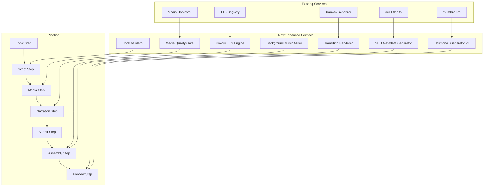

# Design Document: Video Quality Max

## Overview

This design upgrades the AutoTube pipeline to achieve professional-grade video output across all quality dimensions. The implementation spans 10 interconnected requirements that together transform the pipeline from a functional prototype into a production-quality video generator.

The architecture follows the existing patterns: registry-based services, canvas rendering, and localStorage state management. New capabilities are added as composable modules that integrate with the existing pipeline steps (Topic → Script → Media → Narration → AI Edit → Assembly → Preview).

Key architectural decisions:
- **Kokoro TTS** integrates via the existing `TTSEngine` interface and registry pattern
- **Background music mixing** uses the Web Audio API for real-time ducking and crossfading during assembly
- **Script hook structure** is enforced at the LLM prompt level and validated post-generation
- **Media quality** improvements extend the existing scoring pipeline with new quality gates
- **Rendering enhancements** build on the existing canvas-based renderer with new transition and motion modules
- **Metadata generation** extends the existing `seoTitles.ts` and `thumbnail.ts` services

## Architecture



The system maintains backward compatibility: all new features degrade gracefully when dependencies are unavailable (e.g., Kokoro server unreachable → fallback to Grok/Melo/Browser TTS).

## Components and Interfaces

### 1. Kokoro TTS Engine (`src/services/tts/kokoroEngine.ts`)

Implements the existing `TTSEngine` interface to integrate with the TTS registry.

```typescript
interface KokoroConfig {
  serverUrl: string;          // User-configurable Kokoro server endpoint
  targetWpm?: number;         // 120–200, default 160
  voice?: string;             // Voice ID from available voices
}

interface KokoroVoice {
  id: string;
  description: string;
  gender: 'male' | 'female';
  style: 'authoritative' | 'conversational' | 'dramatic' | 'professional';
}

// Implements TTSEngine interface
const kokoroEngine: TTSEngine = {
  name: 'kokoro',
  voices: [
    { id: 'af_heart', description: 'Female conversational' },
    { id: 'am_adam', description: 'Male authoritative' },
    { id: 'af_sarah', description: 'Female professional' },
    { id: 'am_michael', description: 'Male dramatic' },
  ],
  generate(text: string, voice: string, options?: { signal?: AbortSignal }): Promise<string | null>,
  isAvailable(config: TTSConfig): boolean,
};
```

The registry priority becomes: **Kokoro → Grok → Melo → Browser**.

### 2. Narration Pacing Controller (`src/services/tts/pacingController.ts`)

Manages WPM targeting and SSML-like markup for prosody control.

```typescript
interface PacingConfig {
  targetWpm: number;          // 120–200
  segmentType: 'intro' | 'section' | 'transition' | 'outro';
  emphasisMarkers?: string[]; // Key phrases to emphasize
}

interface PacingResult {
  processedText: string;      // Text with SSML/prosody markers applied
  estimatedWpm: number;       // Calculated WPM for the segment
  estimatedDuration: number;  // Duration in seconds
  pausePoints: number[];      // Character offsets where pauses are inserted
}

function applyPacing(text: string, config: PacingConfig): PacingResult;
function computeSegmentWpm(segmentType: string): number;
function insertDataPointPauses(text: string): string;
```

### 3. Background Music Mixer (`src/services/audioMixer.ts`)

Web Audio API-based mixer that layers music under narration with ducking.

```typescript
interface MixerConfig {
  musicUrl: string;           // Path to music track
  narrationClips: NarrationClip[];
  duckingLevel: number;       // 0.15–0.20 during narration
  peakLevel: number;          // 0.60–0.80 during gaps
  fadeInMs: number;           // 500ms
  fadeOutMs: number;          // 2000ms
  crossfadeMs: number;        // 200–400ms for volume transitions
}

interface MusicPreset {
  id: string;
  name: string;
  mood: 'tense' | 'uplifting' | 'neutral';
  filename: string;
}

const MUSIC_PRESETS: MusicPreset[] = [
  { id: 'tense', name: 'Tense', mood: 'tense', filename: 'bg-tense.aac' },
  { id: 'uplifting', name: 'Uplifting', mood: 'uplifting', filename: 'bg-uplifting.aac' },
  { id: 'neutral', name: 'Neutral', mood: 'neutral', filename: 'bg-neutral.aac' },
];

function createAudioMixer(config: MixerConfig): AudioMixer;
function computeDuckingEnvelope(narrationTimings: Array<{ start: number; end: number }>): GainNode;
```

### 4. Hook Validator (`src/services/hookValidator.ts`)

Validates that generated scripts contain a proper hook in the intro segment.

```typescript
type HookPattern = 'surprising_statistic' | 'provocative_question' | 'personal_stakes' | 'counterintuitive_claim';

interface HookValidationResult {
  hasHook: boolean;
  pattern: HookPattern | null;
  hookText: string;           // The identified hook sentence(s)
  wordCount: number;          // Should be 40–60
  isWithinTarget: boolean;    // Word count within range
}

function validateHook(introSegment: ScriptSegment): HookValidationResult;
function detectHookPattern(text: string): HookPattern | null;
function generateTemplateHook(topic: string, pattern: HookPattern): string;
```

### 5. Media Quality Gate (`src/services/mediaQualityGate.ts`)

Extends the existing media scoring pipeline with quality thresholds and broadened search fallback.

```typescript
interface QualityGateConfig {
  minCompositeScore: number;  // 100 for acceptance
  minAcceptableScore: number; // 80 for procedural fallback
  preferredMinWidth: number;  // 1920
  preferredMinHeight: number; // 1080
  clichePatterns: string[];   // Patterns to reject
  videoClipInterval: number;  // 1 video per 3 segments
}

interface QualityGateResult {
  accepted: boolean;
  score: number;
  fallbackAction: 'none' | 'broaden_search' | 'procedural_background';
  reason?: string;
}

function evaluateCandidate(candidate: MediaCandidate, config: QualityGateConfig): QualityGateResult;
function generateProceduralBackground(semanticColors: { primary: string; secondary: string }): HTMLCanvasElement;
```

### 6. Enhanced Transition Renderer (`src/services/renderer/canvas/transitions.ts`)

Extends the existing transition system with section-aware transitions from `SECTION_DESIGN_TEMPLATES`.

```typescript
interface TransitionConfig {
  type: string;               // From SectionDesignTemplate.transitionOut
  durationMs: number;
  accentColor?: string;
  fromSectionType?: string;
  toSectionType?: string;
}

function renderSectionTransition(
  ctx: RenderContext2D,
  fromFrame: ImageData,
  toFrame: ImageData,
  progress: number,
  config: TransitionConfig,
): void;

function computeVisualChangeCount(segmentDuration: number, assetCount: number): number;
```

### 7. Fast-Paced Editing Controller (`src/services/renderer/editingRhythm.ts`)

Enforces maximum hold times and visual variety constraints during rendering.

```typescript
interface EditingRhythmConfig {
  maxHoldTimeSec: number;     // 5 seconds max per static image
  maxAssetTimeSec: number;    // 7 seconds max without motion/overlay
  minVisualChanges: number;   // 2 per 10-second window
  splitThresholdSec: number;  // 8 seconds narration → split into 2 shots
}

interface ShotPlan {
  assetIndex: number;
  startTime: number;
  endTime: number;
  motionType: 'ken_burns' | 'zoom' | 'cut' | 'overlay';
  framing: 'close_up' | 'wide_angle' | 'medium';
}

function planSegmentShots(
  segment: ScriptSegment,
  assets: MediaAsset[],
  config: EditingRhythmConfig,
): ShotPlan[];

function alternateFraming(segmentIndex: number): 'close_up' | 'wide_angle';
```

### 8. YouTube Metadata Generator (extends `src/services/seoTitles.ts`)

Extends the existing SEO title service with full description, tags, and chapter generation.

```typescript
interface YouTubeMetadata {
  title: string;              // 40–70 chars
  description: string;        // Summary + chapters + tags
  tags: string[];             // 8–15 tags, 2–30 chars each
  chapters: ChapterMarker[];
  thumbnailVariants: ThumbnailConcept[];
}

interface ChapterMarker {
  timestamp: string;          // "0:00" format
  title: string;
  segmentIndex: number;
}

function generateFullMetadata(
  project: VideoProject,
  topicContext: TopicContext,
): YouTubeMetadata;
```

### 9. Enhanced Thumbnail Generator (extends `src/services/thumbnail.ts`)

Adds hook-derived text overlays and variant selection based on visual hierarchy scoring.

The existing `generateThumbnailConcepts`, `scoreVisualHierarchy`, and `generateThumbnail` functions are extended:
- Text overlay derived from hook key phrase (not generic title)
- 3 variants generated (fear, curiosity, authority) — already implemented
- Best variant selected by `scoreVisualHierarchy` — already implemented
- Dark gradient overlay 40%→80% — already implemented
- Bold 52–56px font with 16–20px shadow — already implemented

### 10. Narration Audio Export (`src/services/tts/audioExport.ts`)

Manages audio blob storage and timing metadata for assembly.

```typescript
interface AudioExportResult {
  blobUrl: string;            // Blob URL for playback/assembly
  duration: number;           // Duration in seconds
  segmentId: string;
  startOffset: number;        // Cumulative start time
  format: 'wav' | 'mp3';
}

interface NarrationTimingValidation {
  totalDuration: number;
  targetDuration: number;
  withinTolerance: boolean;   // ±20%
  overagePercent: number;
  suggestion?: string;        // "Remove or shorten segments X, Y"
}

function exportNarrationClip(audioBlob: Blob, segmentId: string): AudioExportResult;
function validateNarrationTiming(clips: AudioExportResult[], targetDuration: number): NarrationTimingValidation;
```

## Data Models

### TTSConfig Extension

```typescript
// Extended TTSConfig (backward compatible)
interface TTSConfig {
  engine: 'kokoro' | 'grok' | 'melo' | 'browser';
  xaiApiKey?: string;
  cloudflareAccountId?: string;
  cloudflareApiToken?: string;
  voice?: string;
  // New fields for Kokoro
  kokoroServerUrl?: string;
  targetWpm?: number;
}
```

### VideoProject Extension

```typescript
// New optional fields on VideoProject
interface VideoProject {
  // ... existing fields ...
  
  /** YouTube metadata generated after assembly */
  youtubeMetadata?: {
    title: string;
    description: string;
    tags: string[];
    chapters: Array<{ timestamp: string; title: string }>;
  };
  
  /** Selected thumbnail variant and blob URL */
  selectedThumbnail?: {
    variant: ThumbnailVariant;
    blobUrl: string;
  };
  
  /** Background music configuration */
  musicConfig?: {
    preset: string;
    enabled: boolean;
    volume: number;
  };
}
```

### NarrationClip Extension

```typescript
// Extended NarrationClip (backward compatible)
interface NarrationClip {
  // ... existing fields ...
  
  /** Estimated WPM for this clip */
  estimatedWpm?: number;
  
  /** Engine that generated this clip */
  generatedBy?: string;
  
  /** Start offset in the final timeline */
  startOffset?: number;
}
```

## Correctness Properties

*A property is a characteristic or behavior that should hold true across all valid executions of a system — essentially, a formal statement about what the system should do. Properties serve as the bridge between human-readable specifications and machine-verifiable correctness guarantees.*

### Property 1: TTS Registry Fallback Guarantees Audio Generation

*For any* text input and any TTS configuration where the preferred engine fails (returns null or throws), the TTS registry SHALL attempt the next available engine in priority order and log the failure, eventually returning either a valid audio URL from a fallback engine or null only when all engines are exhausted.

**Validates: Requirements 1.5**

### Property 2: Segment-Type WPM Targeting

*For any* script segment, the computed target WPM SHALL fall within the segment-type-appropriate range: intro segments produce WPM in [170, 180], outro/advice segments produce WPM in [140, 155], and all other segments produce WPM in [120, 200].

**Validates: Requirements 2.1, 2.2, 2.3**

### Property 3: Data Point Pause Insertion

*For any* narration text containing a statistical pattern (dollar amounts, percentages, or large numbers), the pacing processor SHALL insert a pause marker of 300–500ms immediately before each detected data point.

**Validates: Requirements 2.5**

### Property 4: Background Music Ducking Levels

*For any* time point in the audio timeline with defined narration intervals, the background music volume SHALL be in [0.15, 0.20] when narration is active at that time point, and in [0.60, 0.80] when no narration is active, with volume transitions between states lasting 200–400ms.

**Validates: Requirements 3.2, 3.3, 3.7**

### Property 5: Hook Validation and Pattern Detection

*For any* intro segment produced by the pipeline, the hook validator SHALL identify a hook within the first 2 sentences that matches one of the four valid patterns (surprising statistic, provocative question, personal-stakes statement, or counterintuitive claim).

**Validates: Requirements 4.1, 4.2**

### Property 6: Template Hook Contains Topic

*For any* non-empty topic string and any valid hook pattern, the template-based hook generator SHALL produce text that contains the topic name (case-insensitive substring match).

**Validates: Requirements 4.4**

### Property 7: Intro Segment Word Count

*For any* valid intro segment, the narration word count SHALL be between 40 and 60 words inclusive.

**Validates: Requirements 4.5**

### Property 8: Cliché Media Rejection

*For any* set of media candidates where at least one candidate matches a cliché visual pattern (hooded hacker, generic binary code, abstract circuit boards) AND at least one alternative candidate scores above 150, the cliché candidate SHALL NOT be selected as the final asset.

**Validates: Requirements 5.4**

### Property 9: Video Clip Sourcing Frequency

*For any* segment count N ≥ 3, the media sourcer SHALL attempt to source at least ⌊N/3⌋ video clips to add motion variety.

**Validates: Requirements 5.6**

### Property 10: Section-Appropriate Transitions

*For any* pair of consecutive segments with different section types, the renderer SHALL apply the motif transition defined by the outgoing segment's `SECTION_DESIGN_TEMPLATES` entry (transitionOut field).

**Validates: Requirements 6.1, 6.2**

### Property 11: Statistical Text Card Display

*For any* segment where `hasStatisticalContent(narration)` returns true, the render plan SHALL include an animated text card overlay with a duration between 2 and 3 seconds.

**Validates: Requirements 6.4**

### Property 12: Section Title Cards at Topic Changes

*For any* pair of consecutive segments where the section type changes, the renderer SHALL schedule a title card with duration of 1200ms (±50ms).

**Validates: Requirements 6.5**

### Property 13: Visual Change Density

*For any* segment with duration ≥ 10 seconds, the shot plan SHALL contain at least 2 visual changes (cuts, zooms, transitions, or overlay changes) within each 10-second window.

**Validates: Requirements 6.6**

### Property 14: Title Length Enforcement

*For any* topic string, all titles produced by `generateTitleOptions` SHALL have a length between 40 and 70 characters inclusive.

**Validates: Requirements 7.1**

### Property 15: Description Structure Completeness

*For any* valid project with at least one segment, `generateVideoDescription` SHALL produce a fullDescription containing: (a) a non-empty summary, (b) chapter markers with timestamp format "X:XX", and (c) a "Tags:" line with comma-separated values.

**Validates: Requirements 7.2**

### Property 16: Tag Count and Length Constraints

*For any* valid TopicContext and style, `generateTags` SHALL return between 8 and 15 tags where each tag has a length between 2 and 30 characters.

**Validates: Requirements 7.3**

### Property 17: Data Point Embedding in Titles

*For any* non-empty dataPoints array, `generateTitleOptions` SHALL produce at least one title that contains at least one of the provided data point strings as a substring.

**Validates: Requirements 7.4**

### Property 18: Chapter Marker Timing Alignment

*For any* array of segments with positive durations, the generated chapter markers SHALL have timestamps that correspond to the cumulative start time of each segment (within ±1 second tolerance for rounding).

**Validates: Requirements 7.6**

### Property 19: Thumbnail Background Asset Selection

*For any* non-empty array of MediaAssets containing at least one non-fallback asset, `selectThumbnailBackground` SHALL return the asset with the highest score among non-fallback assets.

**Validates: Requirements 8.2**

### Property 20: Hook Key Phrase Extraction

*For any* non-empty hook line string, `extractKeyPhrase` SHALL return a non-empty string that is either a currency amount, percentage, number with context, named entity, or significant words from the hook.

**Validates: Requirements 8.5**

### Property 21: Thumbnail Variant Generation

*For any* topic, style, and audience combination, `generateThumbnailConcepts` SHALL return exactly 3 concepts with variants 'fear', 'curiosity', and 'authority' respectively.

**Validates: Requirements 8.6**

### Property 22: Narration Duration Validation

*For any* array of clip durations and target duration, `validateNarrationTiming` SHALL return `withinTolerance=true` if and only if the total duration is within targetDuration ± 20%, and SHALL provide a non-null suggestion when the total exceeds the target by more than 20%.

**Validates: Requirements 9.3, 9.4**

### Property 23: Maximum Visual Hold Time

*For any* shot plan generated by `planSegmentShots`, no single static image shot SHALL exceed 5 seconds duration without a cut, zoom, or transition.

**Validates: Requirements 10.1**

### Property 24: Shot Splitting for Long Narration

*For any* segment with narration duration exceeding 8 seconds, `planSegmentShots` SHALL return at least 2 shots with a cut or motion change.

**Validates: Requirements 10.2**

### Property 25: Framing Alternation

*For any* pair of consecutive segment indices i and i+1, `alternateFraming(i)` SHALL return a different framing value than `alternateFraming(i+1)`.

**Validates: Requirements 10.3**

### Property 26: Animated Text Card Insertion

*For any* video with more than 5 segments, the render plan SHALL include at least 2 animated text cards (statistics, quotes, or section titles) distributed across the video.

**Validates: Requirements 10.4**

### Property 27: Maximum Asset Display Without Change

*For any* shot plan, no single visual asset SHALL appear for more than 7 consecutive seconds without a motion type change or overlay change.

**Validates: Requirements 10.5**


## Error Handling

### TTS Engine Failures

| Scenario | Handling |
|----------|----------|
| Kokoro server unreachable | Return null within 10s timeout, trigger registry fallback to Grok → Melo → Browser |
| Kokoro returns invalid audio | Log error, return null, trigger fallback |
| All TTS engines fail | Return null, display error in NarrationStep with "No TTS engines available" message |
| AbortSignal fired during generation | Propagate AbortError immediately (no fallback) |
| Invalid WPM parameter (outside 120–200) | Clamp to nearest valid value, log warning |

### Background Music Mixer Failures

| Scenario | Handling |
|----------|----------|
| Music file fails to load | Proceed with narration-only output, log warning |
| Web Audio API unavailable | Skip music mixing entirely, produce narration-only output |
| Narration clip missing audioUrl | Skip that clip's timing in ducking envelope, log warning |
| Invalid ducking parameters | Use defaults (0.15 during narration, 0.60 during gaps) |

### Media Sourcing Failures

| Scenario | Handling |
|----------|----------|
| All candidates score below 80 | Generate procedural background with semantic color palette |
| Top candidate below 100 | Attempt broadened search query (strip modifiers, keep core nouns) |
| Video clip sourcing fails | Fall back to image-only for that segment |
| Image load timeout (8s) | Try next proxy source in chain, then skip asset |
| All providers return empty | Use procedural background as final fallback |

### Script Hook Validation Failures

| Scenario | Handling |
|----------|----------|
| LLM generates intro without hook | Re-prompt with explicit hook instruction (1 retry) |
| Template hook exceeds word count | Truncate to 60 words at sentence boundary |
| Hook pattern detection fails | Accept intro as-is, log warning (non-blocking) |

### Rendering Failures

| Scenario | Handling |
|----------|----------|
| Canvas allocation fails (4K) | Fall back to 1080p resolution |
| Transition rendering error | Fall back to simple crossfade |
| Text card rendering error | Skip text card, continue with image-only |
| Shot plan produces 0 shots | Use single full-duration shot with Ken Burns |

### Metadata Generation Failures

| Scenario | Handling |
|----------|----------|
| Title exceeds 70 chars | Truncate at 70 characters |
| Title below 40 chars | Append suffix " — The Full Story" and pad |
| Tag generation produces < 8 tags | Add generic filler tags (video, trending, etc.) |
| Chapter marker timing mismatch | Recalculate from segment durations |

### Narration Duration Validation

| Scenario | Handling |
|----------|----------|
| Total narration > target + 20% | Display warning with suggestion to remove/shorten segments |
| Total narration < target - 20% | Display info suggesting adding content (non-blocking) |
| Individual clip duration = 0 | Mark clip as 'unavailable', exclude from total |

## Testing Strategy

### Property-Based Testing

This feature is well-suited for property-based testing because it contains many pure functions with clear input/output behavior and universal properties that should hold across wide input spaces (text processing, scoring, validation, timing computation).

**Library**: `fast-check` (already installed in devDependencies)

**Configuration**: Each property test runs a minimum of 100 iterations.

**Tag format**: Each test is tagged with a comment referencing the design property:
```
// Feature: video-quality-max, Property {N}: {property_text}
```

### Test Organization

```
src/services/__tests__/
  kokoroEngine.property.test.ts     — Properties 1, 2, 3
  audioMixer.property.test.ts       — Property 4
  hookValidator.property.test.ts    — Properties 5, 6, 7
  mediaQualityGate.property.test.ts — Properties 8, 9
  transitions.property.test.ts      — Properties 10, 11, 12, 13
  seoMetadata.property.test.ts      — Properties 14, 15, 16, 17, 18
  thumbnail.property.test.ts        — Properties 19, 20, 21
  narrationTiming.property.test.ts  — Property 22
  editingRhythm.property.test.ts    — Properties 23, 24, 25, 26, 27
```

### Unit Tests (Example-Based)

Unit tests cover specific examples, edge cases, and integration points:

- **Kokoro engine**: Interface conformance, voice count, server URL acceptance, 10s timeout
- **Background music**: Fade-in/out timing, toggle disable, preset count
- **Script hook**: UI badge rendering, LLM prompt construction
- **Media**: Resolution preference scoring, broadened search trigger, procedural background generation
- **Thumbnail**: 1280×720 dimensions, gradient overlay, font size, regenerate button
- **Narration UI**: Playback button presence, WPM display, audio element binding
- **Preview step**: Metadata display, thumbnail display with regenerate option

### Integration Tests

Integration tests verify end-to-end behavior across service boundaries:

- TTS registry with mocked Kokoro server (fallback chain)
- Assembly step with background music mixing (audio output verification)
- Media sourcing with quality gate (broadened search trigger)
- Full metadata generation from project state

### Test Execution

```bash
# Run all unit + property tests
npm run test:unit

# Run with coverage
npm run test:unit:coverage
```

All property-based tests use `fast-check` with `fc.assert(fc.property(...), { numRuns: 100 })` minimum configuration.
