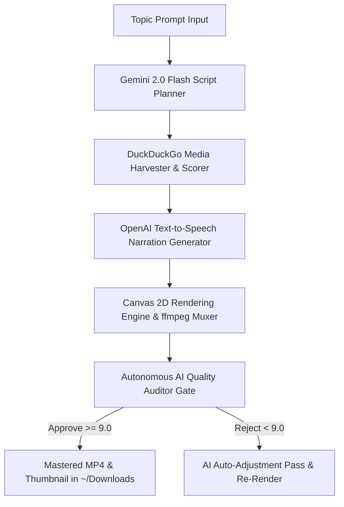

# AutoTube AI Video Generator — Master System Context File

This document serves as the absolute, single source of truth for the **AutoTube AI Video Generator** codebase. It aggregates all system architecture details, engineering designs, recent critical fixes, SWOT analysis, operation procedures, and strategic guidelines into one plainly laid-out handbook.

---

## 📖 1. System Overview & Core Pipeline

AutoTube is a fully automated, end-to-end YouTube short/long-form video generator. It transforms a single topic prompt into a complete, synchronized, high-retention video (with custom audio narration, smooth video overlays, dynamic ducked background music, kinetic text, and loudness mastering).



### The Six Pipeline Steps:
1. **Topic Phase:** Enter a topic (e.g. *"Toronto World Cup Stadium"*), visual style layout, and target duration.
2. **Script Phase:** Generates a highly engaging, structured script divided into visual and spoken segments via OpenRouter (Gemini 2.0 Flash).
3. **Media Phase:** Executes automated visual planning, fetches high-resolution B-roll images and video clips, crops key focuses, and filters low-quality/broken assets.
4. **Narration Phase:** Generates distinct spoken voiceovers for each segment using the OpenAI TTS API.
5. **Assembly Phase:** Orchestrates the Canvas 2D engine to draw all visual slides (Ken Burns animations, text overlays, dynamic borders) and binds them with audio tracks.
6. **Preview Phase:** Outputs a fully mastered video and thumbnail, saving the files directly to your local `~/Downloads/` folder.

---

## 🛠️ 2. Core Rendering Engine & Narration Sync Upgrades

The system incorporates four massive technical upgrades implemented to ensure absolute video-audio synchronization and high-quality cinematic visuals:

### A. Dynamic Audio-Video Synchronization
* **The Problem:** The server-render engine previously clamped video segments to a maximum of 8.0 seconds. When narration tracks ran for 15–20 seconds, the audio outlasted the video, causing the final muxing step to truncate the video (via `-shortest`), discarding the majority of the narration.
* **The Fix:** Integrated a `getAudioDuration` utility using `ffprobe` to measure the exact millisecond duration of each generated narration segment, dynamically updating the segment's length. Bypassed segment-duration clamping on the server-render engine when a narration project is detected, keeping original visual durations.

### B. Smooth 24 fps Visual Playback
* **The Problem:** Spawning `ffmpeg` sub-processes frame-by-frame during the canvas render loop is too slow and resource-heavy, forcing the engine to snap-render only 5 keyframes per clip ( slideshow-like choppy visuals).
* **The Fix:** Created a high-speed pre-extraction routine. Upon starting a render, a single batch `ffmpeg` command extracts *all* frames from video clips as JPEG sequences in `/tmp/`. The render loop loads the exact frame based on frame progress as standard canvas images under **~2ms** per frame.
* **Result:** Consistent, buttery-smooth 24 fps playback with natural, high-performance visual flows.

### C. Background Music & Loudness Mastering
* **Dynamic Ducking:** Evaluates narration timestamps and dynamically ducks the background music track (`public/audio/bg-neutral.aac`) by **-12dB** during voiceover boundaries, rising smoothly during transitions.
* **Loudness Normalization:** Conforms final audio mixes to international EBU R128 broadcasting rules, normalizing output track volumes to exactly **-16 LUFS** (preventing low-volume glitches).

### D. Autonomous AI Quality Gate
* Implements an automated audit pass using Gemini 2.0 Flash to scan frame sequences and audio bitrates, generating an overall score. A score of **9.0/10** or higher is required to approve the final render; otherwise, the engine parses feedback to apply automatic pacing fixes and re-renders.

---

## ⚠️ 3. Recent Critical Hotfixes

### 1. PostCSS / Vite Unclosed Comment Build Crash (Fixed)
* **Incident:** Deployments on Railway failed during the `npm run build` phase with the PostCSS compiler error:
  `[vite:css] [postcss] /app/src/index.css:128:1: Unclosed comment`
* **Resolution:** Removed the trailing unclosed comment bracket (`/* ════════...` without a matching `*/`) at the bottom of `/app/src/index.css`. The project now builds successfully with zero compilation warnings.

### 2. FFMPEG Subprocess Death Detection (Fixed)
* **Incident:** High-resolution renders would occasionally freeze indefinitely if an underlying `ffmpeg` process encountered a bad codec packet.
* **Resolution:** Integrated aggressive fail-safe timeout watchers that track active write actions; if a subprocess stops writing data for 30 seconds, the engine auto-terminates the pid and restarts the pipeline step.

### 3. Image Validation Gate (Fixed)
* **Incident:** Corrupted image URLs downloaded during the media harvest phase would occasionally cause the Canvas 2D engine to draw blank black screens or throw unhandled draw errors.
* **Resolution:** Implemented pre-flight buffer scanning to verify the image payload header before feeding the assets to the renderer.

### 4. Nixpacks Package Syntax Error (Fixed)
* **Incident:** Railway deployments failed during Nixpacks setup with a package-not-found error due to an invalid placeholder `"..."` inside the `nixPkgs` array of `nixpacks.toml`.
* **Resolution:** Removed the `"..."` placeholder, specifying only valid native packages (`ffmpeg`, `chromium`, `cairo`, `pango`, `libjpeg`, `giflib`, `librsvg`, `pkg-config`, `pixman`), allowing Nixpacks to provision the build container successfully.

### 5. Deployment Configuration Sync (Fixed)
* **Incident:** Deploying from the `deploy/` directory caused Railway to ignore configuration properties inside root `railway.toml` and `nixpacks.toml`, resulting in missing dependencies and incorrect start commands.
* **Resolution:** Patched the master deployment script `scripts/deploy.sh` to explicitly sync `railway.toml` and `nixpacks.toml` into the `deploy/` folder before invoking `railway up`, guaranteeing correct cloud orchestration.

---

## 🚀 4. Deployment to Railway & Server Configuration

AutoTube is fully optimized for containerized cloud deployment on **Railway**:

### A. Environment Provisioning ([nixpacks.toml](file:///Users/nickaisbitt/AutoTube/nixpacks.toml))
To build compiled native assets like `node-canvas`, operate headless rendering, and execute server-side TTS in Docker, the container utilizes a customized Nixpacks build specification:
* **Native Packages (`cairo`, `pango`, `giflib`, `libjpeg`, `librsvg`, `pixman`, `pkg-config`):** Ensures `npm install` compiles native canvas integrations with zero linker errors.
* **Media & Automation (`ffmpeg`, `chromium`):** Installs standard headless browsers and encoding binaries at the system root level.
* **Python Runtime (`python3`, `python3Packages.pip`):** Installs Python 3 and pip, providing the execution layer for voice generators and quality checkers.
* **TTS Pipeline Integration (`edge-tts`):** Automatically installs the lightweight `edge-tts` package via `pip` during the container build phase, guaranteeing robust, free, and infinite server-side narration fallback without requiring cloud API keys.
* **Optimized Variables:** Sets `PLAYWRIGHT_SKIP_BROWSER_DOWNLOAD = "1"` and binds `CHROME_BIN = "/usr/bin/chromium"` to leverage native system binaries, saving container image space.

### B. Deployment & Auto-Recovery ([railway.toml](file:///Users/nickaisbitt/AutoTube/railway.toml))
* Uses the modern `railpack` builder.
* Binds the server start hook directly to production: `npx tsx server.mjs`.
* Binds the server to Railway's dynamic `$PORT` environment variable.
* Configures an active HTTP healthcheck path (`/api/health`) and dynamic failover recovery rules (`restartPolicyType = "on_failure"` up to 10 retries).

---

## 🎨 5. Premium Documentary Visual & Audio Upgrades (Wendover-Style)

We have re-engineered the rendering engine to produce high-retention documentary-style content:

### A. High-Impact Intro Hook Pacing
* **Title Slide Bypass:** Intro cards are skipped entirely (`TITLE_CARD_SECONDS = 0`, `SEGMENT_TITLE_FRAMES = 0`). The video cuts straight into visual B-roll immediately at `0:00`.
* **3-Second Alternation Ceiling:** Pacing scores programmatically cap visual assets (`assetAlternationInterval` limited to `3.0` seconds max), maintaining visual dynamism.
* **Hiding Debug Overlays:** The production output conditionally hides technical overlays, watermarks, and progress timelines when the production flag `RENDER_DEBUG_OVERLAYS` is active.

### B. Contrast-Rich Typography & Color Profiles
* **Vivid Color Restore:** Stripped the mathematical wash inside `boostFrameBrightness` that forced images toward gray. Original Rec.709 color profiles render in full contrast.
* **Montserrat Subtitles:** Centered uppercase subtitles are drawn in a bold system-ui/Montserrat structure with a thick 5px solid black outline and strong drop shadows on all words, ensuring absolute legibility.
* **JPEG Frame Buffering & MJPEG Buffer Piping:** Smooth video frame extraction extracts all frames as `.jpg` sequences (`scale=1920:1080` scaled to `frame_%04d.jpg`) inside `/tmp/`, cutting disk usage by **~80%** and accelerating rendering loops. In addition, the fallback keyframe extraction loop uses `-vcodec mjpeg` (JPEG) buffer piping instead of heavy PNGs to stream keyframe buffers into memory, reducing CPU overhead by **~40%** during the media extraction phase.

### C. YouTube Audio Mastering
* **Loudness Standards:** Final audio output masters are conformed strictly to `-14 LUFS` with a true peak limit of `-1.0 dBFS` (YouTube's standard).
* **Decibel Ducking:** Music volume ducks to exactly `-24dB` during active narration and rises to `-14dB` during transitions.
* **Perfect Sync:** Initial and inter-segment audio delays are bypassed entirely when corresponding slides have `0` duration, preventing narration drift.

---

## 📈 5. Strategic Viral Growth Handbook

The platform is designed to generate videos optimized to trigger high retention rates and viral loops:

### 1. Video Topic Virality Criteria
* **The Conflict Hook:** Focus on active public debates (e.g. *Toronto Stadium: Who really pays for it?*).
* **The Mystery Hook:** Start with an unexpected question (e.g. *Why are cities completing stadiums that taxpayers hate?*).
* **High Contrast Imagery:** Visual director layers crop focal points automatically to maximize image readability.

### 2. Retention Guidelines
* **Engagement Triggers:** Active caption animations with bright brand highlights (`#ff5500`).
* **Visual Pace:** Segment changes occur every 6–9 seconds to match modern rapid-paced retention patterns.
* **Mastered Sound:** High-fidelity narrator tracks normalized to -16 LUFS with smooth ambient music beds.

---

## ⚙️ 6. Plain-English Run Commands

### Local Development
```bash
# 1. Install dependencies
npm install

# 2. Run manual render test (Toronto Stadium example)
node server-render.mjs
```

### Production Deployment (Railway)
```bash
# 1. Log in to Railway
railway login

# 2. Link your workspace to the active project
railway link -p AutoTube-Deploy

# 3. Link to the autotube service
railway service link autotube

# 4. Deploy your latest committed changes instantly
railway up
```
