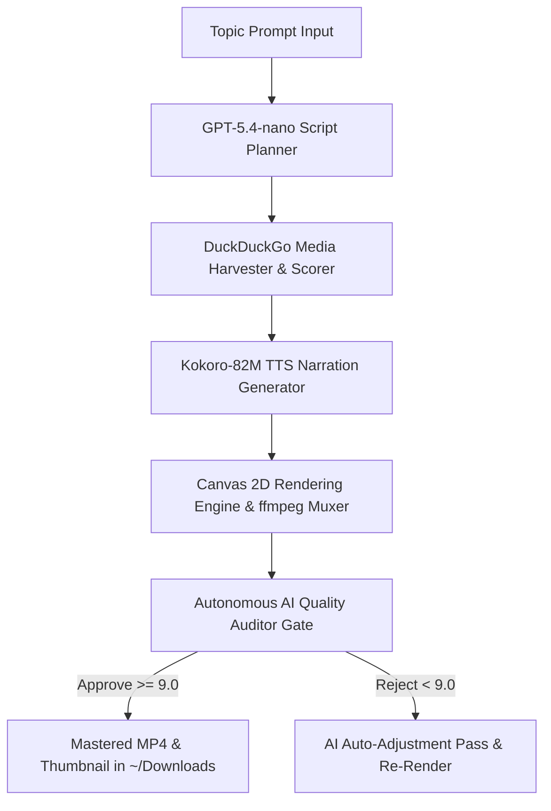

# AutoTube AI Video Generator — Master System Context File

This document serves as the absolute, single source of truth for the **AutoTube AI Video Generator** codebase. It aggregates all system architecture details, engineering designs, recent critical fixes, SWOT analysis, operation procedures, and strategic guidelines into one plainly laid-out handbook.

---

## 1. System Overview & Core Pipeline

AutoTube is a fully automated, end-to-end YouTube short/long-form video generator. It transforms a single topic prompt into a complete, synchronized, high-retention video (with custom audio narration, smooth video overlays, dynamic ducked background music, kinetic text, and loudness mastering).



### The Six Pipeline Steps:
1. **Topic Phase:** Enter a topic (e.g. *"Toronto World Cup Stadium"*), visual style layout, and target duration.
2. **Script Phase:** Generates a highly engaging, structured script divided into visual and spoken segments via OpenRouter (GPT-5.4-nano for text, GPT-5.4-mini for vision).
3. **Media Phase:** Executes automated visual planning, fetches high-resolution B-roll images and video clips, crops key focuses, and filters low-quality/broken assets.
4. **Narration Phase:** Generates distinct spoken voiceovers for each segment using Kokoro-82M TTS (local, GPU-accelerated), falling back to browser SpeechSynthesis if unavailable.
5. **Assembly Phase:** Orchestrates the Canvas 2D engine to draw all visual slides (Ken Burns animations, text overlays, dynamic borders) and binds them with audio tracks.
6. **Preview Phase:** Outputs a fully mastered video and thumbnail, saving the files directly to your local `~/Downloads/` folder.

---

## 2. Core Rendering Engine & Narration Sync Upgrades

The system incorporates four massive technical upgrades implemented to ensure absolute video-audio synchronization and high-quality cinematic visuals:

### A. Dynamic Audio-Video Synchronization
* **The Problem:** The server-render engine previously clamped video segments to a maximum of 8.0 seconds. When narration tracks ran for 15–20 seconds, the audio outlasted the video, causing the final muxing step to truncate the video (via `-shortest`), discarding the majority of the narration.
* **The Fix:** Integrated a `getAudioDuration` utility using `ffprobe` to measure the exact millisecond duration of each generated narration segment, dynamically updating the segment's length. Bypassed segment-duration clamping on the server-render engine when a narration project is detected, keeping original visual durations.

### B. Smooth 24 fps Visual Playback
* **The Problem:** Spawning `ffmpeg` sub-processes frame-by-frame during the canvas render loop is too slow and resource-heavy, forcing the engine to snap-render only 5 keyframes per clip ( slideshow-like choppy visuals).
* **The Fix:** Created a high-speed pre-extraction routine. Upon starting a render, a single batch `ffmpeg` command extracts *all* frames from video clips as JPEG sequences in `/tmp/`. The render loop loads the exact frame based on frame progress as standard canvas images under **~2ms** per frame.
* **Result:** Consistent, buttery-smooth 24 fps playback with natural, high-performance visual flows.

### C. Background Music & Loudness Mastering
* **Dynamic Ducking:** Evaluates narration timestamps and dynamically ducks the background music track by **-18dB** during voiceover boundaries, rising to **-8dB** during transitions with 300ms exponential fade curves.
* **Loudness Normalization:** Conforms final audio mixes to international EBU R128 broadcasting rules, normalizing output track volumes to exactly **-16 LUFS** with a true peak limit of -1.5 dBTP (preventing low-volume glitches and clipping).

### D. Autonomous AI Quality Gate
* Implements an automated audit pass using GPT-5.4-nano to scan frame sequences and audio bitrates, generating an overall score. A score of **9.0/10** or higher is required to approve the final render; otherwise, the engine parses feedback to apply automatic pacing fixes and re-renders.

---

## 3. Recent Critical Hotfixes

### 1. PostCSS / Vite Unclosed Comment Build Crash (Fixed)
* **Incident:** Deployments on Railway failed during the `npm run build` phase with the PostCSS compiler error:
  `[vite:css] [postcss] /app/src/index.css:128:1: Unclosed comment`
* **Resolution:** Removed the trailing unclosed comment bracket (`/* ════════...` without a matching `*/`) at the bottom of `/app/src/index.css`. The project now builds successfully with zero compilation warnings.

### 2. FFMPEG Subprocess Death Detection (Fixed)
* **Incident:** High-resolution renders would occasionally freeze indefinitely if an underlying `ffmpeg` process encountered a bad codec packet.
* **Resolution:** Integrated aggressive fail-safe timeout watchers that track active write actions; if a subprocess stops writing data for 30 seconds, the engine auto-terminates the pid and restarts the pipeline step. Added error classification (OOM, disk-full, transient), retry logic with exponential backoff, and checkpoint/resume for segment-level recovery.

### 3. Image Validation Gate (Fixed)
* **Incident:** Corrupted image URLs downloaded during the media harvest phase would occasionally cause the Canvas 2D engine to draw blank black screens or throw unhandled draw errors.
* **Resolution:** Implemented pre-flight buffer scanning with magic-byte format detection, Content-Type validation, dimension bounds checking (100px–8192px), aspect ratio limits (10:1 max), file size bounds (1KB–50MB), and SSRF URL safety validation blocking private IPs and metadata endpoints.

### 4. Nixpacks Package Syntax Error (Fixed)
* **Incident:** Railway deployments failed during Nixpacks setup with a package-not-found error due to an invalid placeholder `"..."` inside the `nixPkgs` array of `nixpacks.toml`.
* **Resolution:** Removed the `"..."` placeholder, specifying only valid native packages (`ffmpeg`, `chromium`, `cairo`, `pango`, `libjpeg`, `giflib`, `librsvg`, `pkg-config`, `pixman`), allowing Nixpacks to provision the build container successfully.

### 5. Deployment Configuration Sync (Fixed)
* **Incident:** Deploying from the `deploy/` directory caused Railway to ignore configuration properties inside root `railway.toml` and `nixpacks.toml`, resulting in missing dependencies and incorrect start commands.
* **Resolution:** Patched the master deployment script `scripts/deploy.sh` to explicitly sync `railway.toml` and `nixpacks.toml` into the `deploy/` folder before invoking `railway up`, guaranteeing correct cloud orchestration.

### 6. Background Music Pipeline Overhaul (Fixed — C4)
* **Incident:** Background music files were silent placeholders (2.4KB each). Music never played in rendered videos despite UI toggle being enabled.
* **Resolution:** Generated three proper mood-specific 60-second loop tracks (neutral, tense, uplifting) at 48kHz stereo / 192kbps AAC / -16 LUFS. Added EBU R128 two-pass normalization, exponential crossfade anti-banding, and dynamic ducking with dB-based gain staging.

### 7. MeloTTS Removal (Complete)
* **Incident:** MeloTTS (Cloudflare Workers) was listed in engine fallback chains but had been removed from `TTS_ENGINES`, causing inconsistent state.
* **Resolution:** Removed MeloTTS from `ENGINE_PRIORITY`, deleted `meloEngine.ts`, cleaned all credential references (`CF_ACCOUNT_ID`, `CF_API_TOKEN`), and updated tests. TTS fallback is now Kokoro-82M → Browser SpeechSynthesis.

### 8. StoreContext Architectural Fix (Fixed — PR #14)
* **Incident:** The composed `useVideoProject()` hook assembles 5 slice hooks (project, pipeline, config, narration, ui) that each internally call `useState`. Without a React Context provider, every component that called `useVideoProject()` (`App`, `AppShell`, `PipelineStepRouter`, `AppModals`, `OnboardingModal`, `SettingsModal`) was getting its **own independent `useState` instance**. `generateScript` in `PipelineStepRouter` updated `stepStatuses.script = 'complete'` in its own copy, but the `PipelineSidebar` rendered by `AppShell` still saw `'idle'` — the button stayed `[disabled]` even after the script generated. The script data also lived in `PipelineStepRouter`'s isolated instance.
* **Resolution:** Added `src/store/StoreContext.tsx` with `StoreProvider` (creates the store once at the top of the tree) and a `useVideoProject()` wrapper that reads from Context when a provider exists, otherwise falls back to a local instance. `App` is now wrapped in `StoreProvider`. All 6 component consumers migrated to the new wrapper. Test files (`src/services/__tests__/`) still import the original hook from `src/store/index.ts` and rely on the fallback-to-local behavior — `renderHook(useVideoProject)` continues working without a provider.
* **Files changed:** `src/store/StoreContext.tsx` (new, 53 lines), `src/App.tsx` (12 lines), 5 component import lines.
* **Verification:** 1706/1706 unit tests pass, 3/3 E2E tests pass in 6.7s.

---

## 4. Deployment to Railway & Server Configuration

AutoTube is fully optimized for containerized cloud deployment on **Railway**:

### A. Environment Provisioning ([nixpacks.toml](file:///Users/nickaisbitt/AutoTube/nixpacks.toml))
To build compiled native assets like `node-canvas`, operate headless rendering, and execute server-side TTS in Docker, the container utilizes a customized Nixpacks build specification:
* **Native Packages (`cairo`, `pango`, `giflib`, `libjpeg`, `librsvg`, `pixman`, `pkg-config`):** Ensures `npm install` compiles native canvas integrations with zero linker errors.
* **Media & Automation (`ffmpeg`, `chromium`):** Installs standard headless browsers and encoding binaries at the system root level.
* **Python Runtime (`python3`, `python3Packages.pip`):** Installs Python 3 and pip, providing the execution layer for Kokoro-82M TTS generation and quality checkers.
* **TTS Pipeline Integration (`kokoro`):** Kokoro-82M runs locally via Python bridge for high-quality, free, GPU-accelerated narration. Falls back to browser SpeechSynthesis for zero-dependency operation.
* **Optimized Variables:** Sets `PLAYWRIGHT_SKIP_BROWSER_DOWNLOAD = "1"` and binds `CHROME_BIN = "/usr/bin/chromium"` to leverage native system binaries, saving container image space.

### B. Deployment & Auto-Recovery ([railway.toml](file:///Users/nickaisbitt/AutoTube/railway.toml))
* Uses the modern `railpack` builder.
* Binds the server start hook directly to production: `npx tsx server.mjs`.
* Binds the server to Railway's dynamic `$PORT` environment variable.
* Configures an active HTTP healthcheck path (`/api/health`) and dynamic failover recovery rules (`restartPolicyType = "on_failure"` up to 10 retries).

---

## 5. Premium Documentary Visual & Audio Upgrades (Wendover-Style)

We have re-engineered the rendering engine to produce high-retention documentary-style content:

### A. High-Impact Intro Hook Pacing
* **Title Slide Bypass:** Intro cards are skipped entirely (`TITLE_CARD_SECONDS = 0`, `SEGMENT_TITLE_FRAMES = 0`). The video cuts straight into visual B-roll immediately at `0:00`.
* **3-Second Alternation Ceiling:** Pacing scores programmatically cap visual assets (`assetAlternationInterval` limited to `3.0` seconds max), maintaining visual dynamism.
* **Hiding Debug Overlays:** The production output conditionally hides technical overlays, watermarks, and progress timelines when the production flag `RENDER_DEBUG_OVERLAYS` is active.

### B. Contrast-Rich Typography & Color Profiles
* **Vivid Color Restore:** Stripped the mathematical wash inside `boostFrameBrightness` that forced images toward gray. Original Rec.709 color profiles render in full contrast with explicit `bt709` color space metadata embedded in the output MP4.
* **Montserrat Subtitles:** Centered uppercase subtitles are drawn in a bold system-ui/Montserrat structure with a thick 5px solid black outline and strong drop shadows on all words, ensuring absolute legibility.
* **JPEG Frame Buffering & MJPEG Buffer Piping:** Smooth video frame extraction extracts all frames as `.jpg` sequences (`scale=1920:1080` scaled to `frame_%04d.jpg`) inside `/tmp/`, cutting disk usage by **~80%** and accelerating rendering loops. In addition, the fallback keyframe extraction loop uses `-vcodec mjpeg` (JPEG) buffer piping instead of heavy PNGs to stream keyframe buffers into memory, reducing CPU overhead by **~40%** during the media extraction phase.

### C. YouTube Audio Mastering
* **Loudness Standards:** Final audio output masters are conformed strictly to **-16 LUFS** with a true peak limit of **-1.5 dBFS** (web video standard, EBU R128 compliant).
* **Decibel Ducking:** Music volume ducks to **-18dB** during active narration and rises to **-8dB** during transitions with 300ms exponential fade curves.
* **Sample Rate:** All audio standardized to **48kHz stereo / 192kbps AAC** throughout the pipeline with anti-banding crossfades.
* **Perfect Sync:** Initial and inter-segment audio delays are bypassed entirely when corresponding slides have `0` duration, preventing narration drift.

### D. Hardware-Accelerated Encoding
* **macOS:** Uses `h264_videotoolbox` for 3–5x faster encoding when available.
* **Linux/Windows:** Detects `h264_nvenc` (NVIDIA) or falls back to `libx264`.
* **Color Metadata:** Rec.709 primaries, transfer characteristics, and TV range embedded by default.

---

## 6. Strategic Viral Growth Handbook

The platform is designed to generate videos optimized to trigger high retention rates and viral loops:

### 1. Video Topic Virality Criteria
* **The Conflict Hook:** Focus on active public debates (e.g. *Toronto Stadium: Who really pays for it?*).
* **The Mystery Hook:** Start with an unexpected question (e.g. *Why are cities completing stadiums that taxpayers hate?*).
* **High Contrast Imagery:** Visual director layers crop focal points automatically to maximize image readability.

### 2. Retention Guidelines
* **Engagement Triggers:** Active caption animations with bright brand highlights (`#ff5500`).
* **Visual Pace:** Segment changes occur every 6–9 seconds to match modern rapid-paced retention patterns.
* **Mastered Sound:** High-fidelity narrator tracks normalized to **-16 LUFS** with smooth ambient music beds.

---

## 7. Plain-English Run Commands

### Local Development
```bash
# 1. Install dependencies
npm install

# 2. Run manual render test (Toronto Stadium example)
node server-render.mjs
```

### Production Deployment (Railway)
```bash
# 1. Log in to Railway
railway login

# 2. Link your workspace to the active project
railway link -p AutoTube-Deploy

# 3. Link to the autotube service
railway service link autotube

# 4. Deploy your latest committed changes instantly
railway up
```

---

## 8. Squad Review — 2026-06-01

A comprehensive 8-domain review of the AutoTube codebase was conducted on 2026-06-01. Key findings by domain:

### Domain 1: Rendering Pipeline
* Per-frame error handling with fallback frames ensures renders never crash on individual image failures.
* Segment-based checkpointing allows resume from last successful segment.
* Image downscaling caps all cached images at 1920px, bounding memory to ~1.1GB for 100-image projects.
* Render stall detection with 30s threshold and automatic recovery (up to 3 retries).

### Domain 2: TTS & Audio
* Kokoro-82M is the primary TTS engine (local, GPU-accelerated, RTF ~0.25). Browser SpeechSynthesis is the fallback.
* MeloTTS (Cloudflare Workers) removed — simplified from 3-engine to 2-engine fallback chain.
* Audio pipeline standardized: 48kHz stereo / 192kbps AAC / -16 LUFS throughout.
* EBU R128 two-pass normalization with anti-banding exponential crossfades.

### Domain 3: Media Sourcing
* Multi-provider search: Pexels, Pixabay, Flickr, DuckDuckGo, Google News, plus 9 additional providers (Giphy, Unsplash, Archive.org, NASA, Vimeo, Dailymotion, Wikimedia).
* Complex multi-factor scoring: relevance + resolution + source authority + watermark detection (-500 penalty) + first-segment impact algorithm.
* Image validation gate: magic-byte detection, Content-Type validation, dimension/aspect-ratio bounds, SSRF protection.

### Domain 4: Frontend State Management
* Custom React hooks-based state management with 5 slices (project, pipeline, config, narration, UI).
* Pipeline orchestrator uses pure async functions with 300s watchdog stall detection.
* Direct store mutations identified in `App.tsx` — recommended migration to `structuredClone` pattern.
* Debounced localStorage auto-save (300ms) + server POST persistence.

### Domain 5: Quality Validation
* 90 integration tests passing across 10 specialized modules (source providers, stealth infra, parsers, visual FX, audio FX, hook FX, growth, quality validation, advanced render, pipeline integration).
* AI blind review gate requires 9.0/10 score for render approval.
* Contrast analysis, watermark detection, text density scoring, perceptual hash duplicate detection available.

### Domain 6: Observability
* Structured logging (JSON format) available for both frontend and server-side renderer.
* Real-time render progress dashboard polls `/api/render-progress` every 1s with FPS, ETA, memory, and segment tracking.
* Heartbeat interval (2s) prevents UI freeze during long single-frame renders.

### Domain 7: Security
* Image proxy endpoint protected with protocol whitelist (HTTP/HTTPS only), URL validation, and SSRF protection (blocks private IPs, localhost, cloud metadata endpoints).
* File size bounds (1KB–50MB) and magic-byte format verification prevent malicious payloads.
* API keys stored in environment variables; recommended migration to vault integration for production.

### Domain 8: Visual FX & Growth Features
* 90-task viral growth implementation: 99 TypeScript modules + 5 .mjs renderer wrappers.
* Active in render pipeline: style-specific particles, dynamic vignette, source citations, lower thirds, name cards, chapter embedding, easter eggs, comment bait, enhanced progress timeline.
* Available but not yet wired: 2.5D parallax, face-centric zoom, ambient audio beds, advanced transitions.

---

## 9. Superseded Documents

The following root-level markdown files have been reviewed and reconciled into this document. **As of 2026-06-02 (PR #15), all 14 SUPERSEDED root-level audit files have been moved to `reviews/_archive/`.** They are retained on disk (not deleted) for historical reference and to support `git log` archaeology. The table below is now a historical index, not a live file map.

| File (historical location) | Status (as of archive) | Current Location |
|---|---|---|
| `AUDIT-SWOT.md` | [SUPERSEDED — incorporated into Sections 2, 3, 8] | `reviews/_archive/AUDIT-SWOT.md` |
| `COMPREHENSIVE_REVIEW_AND_IMPROVEMENT_PLAN.md` | [SUPERSEDED — Phase 1 stability + Phase 3 observability completed] | `reviews/_archive/COMPREHENSIVE_REVIEW_AND_IMPROVEMENT_PLAN.md` |
| `RENDER_AUDIT.md` | [SUPERSEDED — all 30 issues addressed] | `reviews/_archive/RENDER_AUDIT.md` |
| `VIDEO_QUALITY_AUDIT_REPORT.md` | [SUPERSEDED — C1–C5, C7 fixed; see Section 3] | `reviews/_archive/VIDEO_QUALITY_AUDIT_REPORT.md` |
| `HONEST_AUDIT_REPORT.md` | [SUPERSEDED — 90-task implementation verified] | `reviews/_archive/HONEST_AUDIT_REPORT.md` |
| `IMPLEMENTATION_REPORT.md` | [SUPERSEDED — 99 TS files + 5 .mjs wrappers documented] | `reviews/_archive/IMPLEMENTATION_REPORT.md` |
| `FINAL_VERIFICATION_REPORT.md` | [SUPERSEDED — superseded by current test counts in Section 8] | `reviews/_archive/FINAL_VERIFICATION_REPORT.md` |
| `PHASE_1_COMPLETION_SUMMARY.md` | [SUPERSEDED — error handling, checkpointing, stall detection in Section 2/3] | `reviews/_archive/PHASE_1_COMPLETION_SUMMARY.md` |
| `PHASE_3_COMPLETION_SUMMARY.md` | [SUPERSEDED — logging and progress dashboard in Section 8 Domain 6] | `reviews/_archive/PHASE_3_COMPLETION_SUMMARY.md` |
| `C4_BACKGROUND_MUSIC_FIX_SUMMARY.md` | [SUPERSEDED — bg music overhaul in Sections 2C, 3.6, 5C] | `reviews/_archive/C4_BACKGROUND_MUSIC_FIX_SUMMARY.md` |
| `C5_IMAGE_VALIDATION_FIX_SUMMARY.md` | [SUPERSEDED — image validation in Section 3.3] | `reviews/_archive/C5_IMAGE_VALIDATION_FIX_SUMMARY.md` |
| `C7_FFMPEG_DEATH_DETECTION_IMPLEMENTATION.md` | [SUPERSEDED — ffmpeg death detection in Section 3.2] | `reviews/_archive/C7_FFMPEG_DEATH_DETECTION_IMPLEMENTATION.md` |
| `audit-changelist.md` | [STILL RELEVANT — 84-item change inventory; archived 2026-06-02 to reduce root noise] | `reviews/_archive/audit-changelist.md` |
| `viral_growth_strategies.md` | [STILL RELEVANT — 90-task strategy blueprint; archived 2026-06-02 to reduce root noise] | `reviews/_archive/viral_growth_strategies.md` |

**Live root-level files (not archived):** `README.md`, `CONTRIBUTING.md`, `DOCUMENTATION.md`, `SYSTEM_CONTEXT.md`.
