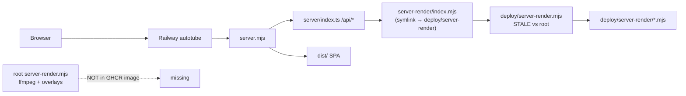

# AutoTube Complete Project Audit — 2026-07-13

**Commit audited:** `a7d064a` (matches live Railway image tag)  
**Method:** Multi-agent chain (API surface, security, Railway/deploy, frontend, backend/render) + live HTTP probes + line-by-line verification of P0 paths  
**Live prod:** `https://autotube-production.up.railway.app` — healthy, ~34.6 days uptime, image `ghcr.io/nickaisbitt/autotube:a7d064a…`  
**Railway GraphQL audit:** not run (no `RAILWAY_API_TOKEN` / `Railway` secret in this environment)

---

## Executive verdict

Production is **up and serving** the same git SHA as local `master`, but the **render pipeline shipped to Railway is not the render pipeline developed on `master`**. Root `server-render.mjs` (ffmpeg assembly, hook overlays, edit-timeline rebuild) is **never copied into the GHCR image**; `/api/server-render` runs the older `deploy/server-render.mjs`. Combined with **no API authentication** and **client-bundled secrets**, the public surface is high-risk.

`reviews/STATE.md` (2026-06-01) claiming “no P0s remaining” is **stale and incorrect** relative to this tree.

---

## Production architecture (as verified)

| Layer | Source of truth in prod |
|-------|-------------------------|
| HTTP API | Root `server/` via `server.mjs` |
| Static SPA | Root `dist/` |
| Render | **`deploy/server-render.mjs` only** |
| Canonical deploy | GHCR (`Dockerfile.runtime`) → `railway-deploy-registry.mjs` pull |

---

## Live probes (2026-07-13)

| Check | Result |
|-------|--------|
| `GET /api/health` | `ok`, gitCommit `a7d064a…`, deployImage GHCR tag matches |
| `GET /` | 200 SPA |
| `GET /api/errors` | 200 `{"errors":[],…}` — **public, unauthenticated** |
| `GET /api/docs` | 200 Swagger UI — **public** |
| `GET /api/render-progress` | 200 idle JSON — **public** |
| `GET /api/export-project` | 404 (no `/tmp` project) — still **public** |
| `GET /api/search?q=moon` | 200 — **public scrape egress** |
| `GET /api/proxy-image?url=http://127.0.0.1/` | **403** (SSRF block works) |
| `GET /api/proxy-image?url=http://169.254.169.254/` | **403** |

---

## Ranked findings

### P0 — Critical (fix / harden before relying on prod)

| ID | Finding | Evidence | Impact |
|----|---------|----------|--------|
| **P0-1** | **Prod render uses stale deploy monolith; root `server-render.mjs` never in image** | `deploy/Dockerfile.runtime:19-26` has no `COPY server-render.mjs`; `deploy/server-render/index.mjs:33` spawns `../server-render.mjs` → `/app/deploy/server-render.mjs`. Root has `runFfmpegAssemblyRender` / `AUTOTUBE_RENDER_MODE` / `applyFfmpegYoutubeOverlays`; deploy monolith has **0** matches. Modules `ffmpegAssembly.mjs` / `ffmpegOverlays.mjs` exist but are **unwired**. | Recent master render fixes do not run on Railway. Local/`node server-render.mjs` / e2e can pass features prod lacks. |
| **P0-2** | **No authentication on any `/api/*` route** | `server/index.ts` — CORS + rate limit only; live probes confirm public `/api/errors`, `/api/search`, `/api/docs`, render endpoints. | Anyone can scrape, proxy, download clips (yt-dlp+ffmpeg), trigger renders, read/write `/tmp` projects. |
| **P0-3** | **Provider secrets can ship in client JS** | `vite.config.ts:56-64` `define` inlines OpenRouter / Pexels / Pixabay from build env; `TopicStep` calls OpenRouter from browser with Bearer key. | Key theft + billing abuse from `dist/assets/*.js`. |
| **P0-4** | **`/api/server-render` can pick newest `/tmp` project** | `server/utils/projectPaths.ts:37-47` fallback sorts by mtime. | Concurrent users / jobs can render the wrong project. |
| **P0-5** | **`/api/render-output` serves any file under project root** | `server/routes/renderOutput.ts:43-48` — format whitelist only; path confined to `PROJECT_ROOT`, not `test-recordings/`. | Unauthenticated read of `server/`, `package.json`, `.env.local` if present in container. |

### P1 — High

| ID | Finding | Evidence |
|----|---------|----------|
| **P1-1** | No wall-clock timeout on server-render child | `server/routes/serverRender.ts` — heartbeat only; no `kill` after N minutes |
| **P1-2** | `/api/export-project` without `id` returns newest `/tmp` JSON | `exportProject.ts` + live 404 (empty) proves endpoint is public |
| **P1-3** | OpenRouter key passed as Python CLI `--api-key` | `server/routes/qualityCheck.ts` — visible in `ps` |
| **P1-4** | Rate limit trusts `X-Forwarded-For` when `TRUST_PROXY=true` | Spoofable if edge bypassed |
| **P1-5** | `/api/proxy-page` omitted from proxy rate-limit bucket | `rateLimiter.ts` `PROXY_PATHS` |
| **P1-6** | No OPTIONS handler — CORS preflight may fail for cross-origin POST | `cors.ts` documents OPTIONS; `index.ts` never returns early |
| **P1-7** | `POST /api/render-progress` accepts arbitrary JSON into global state | Unauthenticated mutation |
| **P1-8** | Dual trees: `deploy/server/` stale vs root `server/` | Path traversal still open in `deploy/server.mjs`; wildcard CORS on many deploy routes |
| **P1-9** | No CI on push — `ci.yml` is `workflow_dispatch` only | GHCR builds on master without lint/unit gate |
| **P1-10** | Docs claim Railpack/git autodeploy; canonical path is GHCR pull | `ci.yml` header vs `ghcr-image.yml` + `railway-deploy-ghcr.yml` |
| **P1-11** | Frontend: PIN-encrypted key storage has no unlock UI | `secureStorage` + `configSlice` unused by Settings/Onboarding |
| **P1-12** | Preview `QualityCheck` disabled for blob/browser renders | `PreviewStep/index.tsx` nulls blob `thumbnail` |
| **P1-13** | `VideoPlayer` still 11 `@ts-ignore` unused props | June F-P0-1 still open |
| **P1-14** | Timeline jumps ignore `editPlan` durations | `Timeline.tsx` vs `usePlayback` |

### P2 — Medium

| ID | Finding |
|----|---------|
| **P2-1** | OpenAPI documents ~11 paths; 24+ implemented routes undocumented; `/api/tts` rate-limited but unimplemented |
| **P2-2** | FFmpeg concat uses `-c copy` only — no re-encode fallback (`ffmpegAssembly.mjs`) |
| **P2-3** | `downloadClip` `duration` unbounded |
| **P2-4** | SSRF DNS rebinding TOCTOU on proxy validate-then-fetch |
| **P2-5** | `press-release` scrapes without `validateURL` |
| **P2-6** | `RenderProgressDashboard` polls `/api/render-progress` every 1s forever |
| **P2-7** | ~18 dead UI components + scraper/visualFx/hookFx trees unused by orchestrator |
| **P2-8** | GHCR image copies full `src/` + likely keeps devDeps; no shrink step |
| **P2-9** | `docker-compose` healthcheck hits `/health` not `/api/health`; no root Dockerfile |
| **P2-10** | LLM `callLLM` wrapper unused; `no_specificity` type without switch case |
| **P2-11** | Harvest placeholder % gates live in loop scripts, not main UI export path |
| **P2-12** | `completion-check` uptime heuristic false-negatives long-lived healthy pods |

### P3 — Low / hygiene

- Health exposes deploy git/image metadata (useful ops, mild recon)
- Extra process hop `index.mjs` → monolith
- Vitest excludes most of `deploy/server-render/*.mjs`
- TTS review file (`reviews/2026-06-01-tts-audio.md`) truncated/corrupt
- `VITE_SERPER_KEY` / `VITE_FIRECRAWL_KEY` in `.env.example` unused (Serper uses `SERPER_API_KEY` server-side)
- CSS kill-switch zeroes all transitions while components still declare `transition-*`

---

## API inventory (summary)

**~35 routes** under `server/index.ts`. Auth: **none**. Notable groups:

| Group | Paths | Risk |
|-------|-------|------|
| Health/docs | `/api/health`, `/api/docs`, `/api/errors` | Info disclosure |
| Proxy | `/api/proxy-image`, `/api/proxy-page` | SSRF-hardened egress abuse |
| Render | `/api/server-render`, `/api/render-video`, `/api/render-progress`, `/api/render-output/*`, `/api/quality-check` | CPU/disk; file read |
| Project | `/api/save-project`, `/api/export-project` | `/tmp` R/W |
| Search scrape | `/api/search`, `/api/search-*` (16+), `/api/deep-harvest`, `/api/download-clip` | Egress + yt-dlp |
| Stub | `/api/notify` → 501 | Dead |

**External APIs:** OpenRouter (client+server), Serper (`SERPER_API_KEY`), Pexels/Pixabay (`VITE_*`), xAI, Cloudflare MeloTTS, Kokoro (`KOKORO_SERVER_URL`), Wikipedia/Wikimedia, NASA/Archive/Flickr/Unsplash scrapes, YouTube Data API (user key in localStorage).

---

## Prior review reconciliation (vs `reviews/STATE.md`)

| June claim | Actual 2026-07-13 |
|------------|-------------------|
| No P0s remaining | **False** — P0-1…P0-5 above |
| Backend CORS fixed | Root mostly fixed; `proxyImage` still `*`; deploy tree regresses |
| Video render P0s closed | **Reopened for prod** by deploy monolith drift |
| Frontend F-P0 New Video / toasts / keyboard | **Fixed** |
| Frontend F-P0 VideoPlayer | **Still open** |
| Frontend F-P1 focus traps / dead components | **Still open** |
| DevOps P0/P1 closed | Deploy path works via GHCR, but docs/CI/render sync still broken |

---

## Recommended fix order

1. **Unify render for prod** — `COPY server-render.mjs` into GHCR **or** CI `cp server-render.mjs deploy/` (as `scripts/deploy.sh` already does) **or** point `index.mjs` at root with image include. Wire `ffmpegAssembly` / overlays.
2. **Auth gate** privileged routes (render, proxy, clip, save/export, errors, quality-check) or private networking.
3. **Stop baking secrets into Vite `define`**; proxy LLM/stock calls server-side.
4. **Jail `/api/render-output` to `test-recordings/`**; require explicit `projectPath` (no newest-`/tmp` fallback).
5. **Child render timeout** + job-scoped progress IDs.
6. **Enable CI on push** before GHCR publish; sync or delete `deploy/server/`.
7. Frontend: VideoPlayer cleanup, PIN unlock UI or remove encrypted path, QualityCheck for blob URLs, cancel buttons, Timeline/`editPlan`.

---

## What this audit could not verify

- Railway GraphQL service variables / builder / Metal settings (no token)
- Whether GHCR workflow last run succeeded (no `gh` CLI auth)
- Full line-by-line of all 800+ source files (agents covered critical paths; dead trees sampled)
- End-to-end render on production (intentionally not triggered — expensive/unauthenticated)

---

## Agent chain used

1. API surface explorer → endpoint inventory + OpenAPI drift  
2. Security review → auth/SSRF/secrets/command injection  
3. Railway/deploy explorer → GHCR path, live health, drift  
4. Frontend explorer → store/orchestrator/UI vs June review  
5. Backend/render explorer → ffmpeg/TTS/harvest/tests  
6. Render-deploy verifier → confirmed P0-1 with Dockerfile + symbol greps  
7. Live curl probes → public surface confirmation  

---

*End of audit. Next action: pick ranked item to fix, or loop remaining list.*
